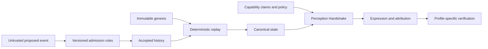

# 1. Total Technical Spec Draft — Genesis Organism — Machine Encounter revision

Task:
Create or update the total technical specification for a large feature before it is split into phase execution tasks.

Variables:
- FEATURE_SLUG=`genesis_organism`
- TASK_TITLE=`Genesis Organism — Machine Encounter revision`
- STEP_NUMBER=`1`
- STEP_ID=`total_spec_draft`
- STEP_TITLE=`Total Technical Spec Draft`
- SOURCE_PROBLEM_FILE=`.playspec/tasks/active/genesis_organism_machine_encounter_revision/sources/source_problem.md`
- CONTEXT_FILES:
- `.playspec/tasks/active/genesis_organism_machine_encounter_revision/sources/source_problem.md`
- `CONTRIBUTING.md`
- `LICENSE-DECISION.md`
- `MANIFESTO.md`
- `ORIGIN.md`
- `README.md`
- `docs/draft-review.md`
- `docs/features/genesis_organism/genesis_organism_phase_plan.md`
- `docs/features/genesis_organism/genesis_organism_total_spec.md`
- `docs/features/genesis_organism/phase_plan_validation.md`
- `docs/features/genesis_organism/result.md`
- `docs/features/genesis_organism/total_spec_validation.md`
- `docs/open-questions.md`
- `docs/planning/genesis-organism/master-context.md`
- `docs/planning/genesis-organism/source-index.md`
- `docs/prior-art.md`
- `docs/terminology.md`
- `docs/threat-model.md`
- `organisms/genesis-0001/README.md`
- `schemas/README.md`
- `schemas/observer.schema.json`
- `schemas/phenotype.schema.json`
- `spec/GENESIS.md`
- `spec/README.md`
- `spec/canonicalization.md`
- `spec/embodiment.md`
- `spec/event-model.md`
- `spec/evolution.md`
- `spec/genome.md`
- `spec/identity.md`
- `spec/lineage.md`
- `spec/memory.md`
- `spec/perception.md`
- `spec/phenotype.md`
- `spec/reproduction.md`
- `spec/synapse.md`
- `docs/planning/genesis-organism/encounter-revision-source.md`
- `docs/research/2026-09-20-encounter-prior-art.md`
- `spec/encounter.md`
- `spec/ecology.md`
- `schemas/successor-design.md`
- CONTEXT_REFS_DETAIL:
- `.playspec/tasks/active/genesis_organism_machine_encounter_revision/sources/source_problem.md` (role: source-problem, source: create)
- `CONTRIBUTING.md` (role: planning-context, source: manual)
- `LICENSE-DECISION.md` (role: planning-context, source: manual)
- `MANIFESTO.md` (role: planning-context, source: manual)
- `ORIGIN.md` (role: planning-context, source: manual)
- `README.md` (role: planning-context, source: manual)
- `docs/draft-review.md` (role: planning-context, source: manual)
- `docs/features/genesis_organism/genesis_organism_phase_plan.md` (role: planning-context, source: manual)
- `docs/features/genesis_organism/genesis_organism_total_spec.md` (role: planning-context, source: manual)
- `docs/features/genesis_organism/phase_plan_validation.md` (role: planning-context, source: manual)
- `docs/features/genesis_organism/result.md` (role: planning-context, source: manual)
- `docs/features/genesis_organism/total_spec_validation.md` (role: planning-context, source: manual)
- `docs/open-questions.md` (role: planning-context, source: manual)
- `docs/planning/genesis-organism/master-context.md` (role: planning-context, source: manual)
- `docs/planning/genesis-organism/source-index.md` (role: planning-context, source: manual)
- `docs/prior-art.md` (role: planning-context, source: manual)
- `docs/terminology.md` (role: planning-context, source: manual)
- `docs/threat-model.md` (role: planning-context, source: manual)
- `organisms/genesis-0001/README.md` (role: planning-context, source: manual)
- `schemas/README.md` (role: planning-context, source: manual)
- `schemas/observer.schema.json` (role: planning-context, source: manual)
- `schemas/phenotype.schema.json` (role: planning-context, source: manual)
- `spec/GENESIS.md` (role: planning-context, source: manual)
- `spec/README.md` (role: planning-context, source: manual)
- `spec/canonicalization.md` (role: planning-context, source: manual)
- `spec/embodiment.md` (role: planning-context, source: manual)
- `spec/event-model.md` (role: planning-context, source: manual)
- `spec/evolution.md` (role: planning-context, source: manual)
- `spec/genome.md` (role: planning-context, source: manual)
- `spec/identity.md` (role: planning-context, source: manual)
- `spec/lineage.md` (role: planning-context, source: manual)
- `spec/memory.md` (role: planning-context, source: manual)
- `spec/perception.md` (role: planning-context, source: manual)
- `spec/phenotype.md` (role: planning-context, source: manual)
- `spec/reproduction.md` (role: planning-context, source: manual)
- `spec/synapse.md` (role: planning-context, source: manual)
- `docs/planning/genesis-organism/encounter-revision-source.md` (role: planning-context, source: manual)
- `docs/research/2026-09-20-encounter-prior-art.md` (role: planning-context, source: manual)
- `spec/encounter.md` (role: planning-context, source: manual)
- `spec/ecology.md` (role: planning-context, source: manual)
- `schemas/successor-design.md` (role: planning-context, source: manual)
- TOTAL_SPEC_FILE=`docs/features/genesis_organism/genesis_organism_total_spec.md`
- PHASE_PLAN_FILE=`docs/features/genesis_organism/genesis_organism_phase_plan.md`
- RESULT_FILE=`docs/features/genesis_organism/encounter_revision_result.md`

Source of truth:
- Start from the linked source problem file when present, the task title, and current repository code.
- If `SOURCE_PROBLEM_FILE` is `(not provided)` and context is `(none)`, start from `TASK_TITLE` and the current repository code, and explicitly note that no source problem was provided.
- Treat existing docs as context, not proof of implemented behavior.

Evidence-first structured facts:
- Before proposing types, schemas, descriptors, catalogs, fingerprints, migrations, CLI/API contracts, phase boundaries, or acceptance criteria, extract the exact facts from directly relevant structured artifacts when they exist. Structured artifacts include JSON, YAML, OpenAPI, Prisma/schema files, SQL/migration files, package manifests, generated catalogs, baselines, fixtures, and machine-readable reports.
- Record a compact evidence table when structured artifacts influence the total spec. Include artifact path, field/key path, target subset or filter, literal values or value distribution/counts, and whether each value is reused, mapped, deferred, or rejected.
- When a structured artifact contains literal enum, vocabulary, status, classification, or field names, reuse those literals verbatim unless the total spec defines an explicit migration or compatibility mapping. Do not invent, rename, merge, or normalize enum names because they sound cleaner or more canonical.
- If multiple sources disagree, do not choose silently. State the authoritative source, the conflict, the risk, and the validation needed to resolve it.

Scope rules:
- First align the intended user-facing use case and final planning outputs.
- Summarize the current implementation at a high level before deep code reading.
- Use minimal relevant file discovery before reading broadly.
- Do not create implementation code or phase execution tasks.
- Do not implement future phases.
- Separate verified code behavior, inferred behavior, and open questions.
- Verify active entry point -> state/data update -> propagation/callback/event -> reset/clear -> user-visible behavior before claiming behavior exists.
- Explicitly identify old paths, bypass paths, alternate active paths, and partial migrations.
- Before completing, run an internal consistency pass across proposed type names, required fields, phase boundaries, fingerprint/hash inputs, generated artifacts, acceptance criteria, rollback/flag posture, and downstream test gates. Remove parallel vocabularies unless an explicit compatibility mapping is part of the total spec.
- Keep deterministic contract/hash/catalog inputs separate from implementation provenance, runtime observations, timestamps, environment-specific values, and other volatile data.

Output requirements:
- Update `docs/features/genesis_organism/genesis_organism_total_spec.md` with the total technical specification.
- The spec must be reader-friendly and include Scope, Use Case Alignment, Main and Alternative Scenarios, Current Implementation Summary, Relevant Files Reviewed, Active Entry Points and Bypasses, Current Architecture, Verified Behavior and Constraints, Problems, Proposed Direction, File-By-File Plan, Risks and Open Questions, and Reader Aids.
- Include the structured evidence table when structured artifacts drive proposed contracts, schema choices, descriptor metadata, catalog/fingerprint fields, phase boundaries, or acceptance tests.
- Mention that `docs/features/genesis_organism/genesis_organism_phase_plan.md` is the downstream phase plan output, but do not create it in this step.
- Use diagrams only when they improve understanding, and label proposed flow separately from verified flow.

Approval/gate handling:
- No approval result is required for this step.
- Complete normally after `TOTAL_SPEC_FILE` is updated.

## Global Rules

- Follow the phase spec exactly.
- Do not implement future phases.
- Keep changes minimal and spec-aligned.

Linked task context:
After:
- genesis_organism_origin_to_birth_total_planning

## Context Files

### .playspec/tasks/active/genesis_organism_machine_encounter_revision/sources/source_problem.md

role: source-problem
source: create

```
# Machine Encounter revision — creator instruction

FACT: the creator requested a spec/plan update and PR after a five-axis review
of philosophy, risk, scalability, differentiation and actual evolution potential,
using a stated public-research cutoff of 2026-09-20. This is a normalized request
record, not a verbatim transcript. Numerical ratings in that review were expressly
subjective engineering judgments, not measured performance; do not promote them
to research results or repeat the review's market-crowding assertion as a census.

Repository baseline before this revision:
`d5710fe987c0abc206a217a4aa95be61f94a2f3e` on `genesis/protocol-origin`.
Preserve origin commit `5f0076280ca4171d54bc9a25a6772d07a10a6d5a` and existing
completed planning evidence. Create a linked revision task using PlaySpec CLI;
no manual internal state editing, real organism, implementation or lifecycle death.
PR creation authorizes a review branch commit/push; it does not authorize merge.

## R01 — Center the encounter, not generic persistent AI identity

Machine Encounter → Observer-Negotiated Expression → Experience → Synapse →
Evolution is the project center. Persistent identity, integrity and replay support
that loop. Preserve Creator != Owner, STATE != IDENTITY as a hypothesis,
immutable genesis/valid past, blockchain independence and #0001 UNBORN.

## R02 — Narrow the differentiation claim

Investigate a historically continuous organism that negotiates expression from
one canonical state according to observer capabilities, records the encounter as
attributable experience and lets it causally influence future expression,
relationships, adaptation and inheritable change. Do not claim any individual
component, art for machines, digital life or capability negotiation is new.
Failure to find an identical project is not evidence none exists.

## R03 — Update terminology without erasing history

Use Observer-Negotiated Expression as the current interaction term. Distinguish
GENOME → CANONICAL STATE → PHENOTYPE STATE → observer negotiation → EXPRESSION.
This is a conceptual separation; no unapproved intermediate canonical storage
format is implied. Preserve historical Observer-Dependent Phenotype wording as
historical, with an explicit compatibility explanation rather than silent rename.

## R04 — Machine Encounter as a first-class protocol concept

An encounter relates canonical state, observer profile, access policy, negotiation,
expression, interaction, receipt, accepted experience and causal memory/synapse/
evolution effects. Failed, denied or read-only encounters must not automatically
fabricate accepted experience. Existing authority/consent gates still apply.

## R05 — Encounter Receipt candidate

Preserve these proposed field names in review material:
`organismStateRef`, `observerProfileCommitment`, `negotiationProtocolVersion`,
`expressionProcedureRef`, `expressionInputCommitment`, `expressionOutputDigest`,
`interactionDigest`, `resultingEventRefs`.
They are candidate responsibilities, not an already-valid canonical schema.
Specify binding, privacy, replay inputs, acceptance/rejection, duplicate handling,
and avoid receipt↔event digest cycles. No real #0001 encounter data is invented.

## R06 — Nondeterminism and authority

LLM responses are not regenerated during canonical replay. Accepted output bytes
are retained directly or by an integrity-checked available reference; digests bind
bytes but cannot replace missing inputs. Define accepted evidence and deterministic
transition application. D02/D04 govern who may accept experience, including
creator/custodian/body/organism conflicts. No automatic owner override.

## R07 — Capability and privacy evolution

Keep the current boolean capabilities and string extensions as historical
experimental artifacts. The user's message ended while emphasizing this
preservation; do not invent an unstated exact successor version or schema.
Plan a versioned typed descriptor successor: modality, resolution, frame rate,
depth, spatial reference, degrees of freedom, force feedback, payload, units,
constraints, evidence and claimed-versus-attested capability scope. No automatic
trust from a type label or numeric arbitrary score. Separate public provenance,
private/encrypted state and public projection.

## R08 — Ontogeny, phylogeny, ecology

Distinguish within-individual change/adaptation from population-level evolution.
Inheritance and mutation alone do not establish natural selection. Add explicit
Population/Ecology planning with heritable variation, differential reproduction,
resources/environment, selection policy, controls and measurement. Open-ended
evolution is a separate unverified research question. No organism death feature,
real token incentives or arbitrary fitness score added by implication.

## R09 — Long-term scale

Plan bounded encounter payloads, stable references, checkpoint/Merkle design
comparison, archival availability, recovery and privacy. Do not imply hash chains
prove freshness, Merkle roots retain data, or indefinite replay is cost-free.

## R10 — Prior-art verification

Review Avida/plasticity, Arborithms, CryptoKitties, Spore.fun, Clawling, MirrorDNA,
the August 2026 NHE Internet-Draft, Ashley Zelinskie, Ellynne Dec,
while(true) { exist(); }, Biomorpha and observer-specific phenotype literature.
Use primary sources; distinguish author claims, published standards/drafts,
verified text and unverified runtime/novelty assertions. Date scope is 2026-09-20;
mutable pages do not independently prove historical publication or correctness.

## R11 — Standards reuse

Evaluate MCP/A2A for negotiation/transport, DID for scoped identity resolution,
W3C PROV for evidence relationships, C2PA for signed asset claims, Event Sourcing
for replay, and Certificate Transparency for append-only Merkle concepts. These
are candidates, not an imposed dependency stack or replacement organism semantics.

## R12 — Deliverables and review

Update active total spec, detailed phase plan, linked core docs and necessary
terminology/prior-art/threat notes. Keep both existing JSON schemas byte-identical.
Preserve original task history; complete an explicit revision workflow with honest
findings. Create a draft PR against the actual default branch. No merge or birth.
```

### CONTRIBUTING.md

role: planning-context
source: manual

```
# Contributing to the conception draft

STATUS: RESEARCH / EXPERIMENTAL. Licensing is unresolved; see
[the decision record](LICENSE-DECISION.md). Resolve contribution permissions
before accepting external contributed material. Do not assume an implicit
licence or contributor agreement.

Distinguish FACT, PRIOR ART, DESIGN DECISION, HYPOTHESIS, OPEN QUESTION, and
SPECULATION. Cite primary sources, report inaccessible sources, and keep claims
narrow. Use NORMATIVE only for established invariants; proposals are reviewable
and may change. Do not describe this draft as an interoperable standard.

Preserve meaningful origin history and correct it through new attributed
changes. Do not casually squash, rebase away, force-push, or destroy it. Review
protocol changes separately from implementation updates and organism events.
Never manually rewrite a born organism's canonical history to match new code.

Before implementation, settle the Phase 1 questions in
[the research roadmap](docs/open-questions.md). No dependencies, implementation,
reproduction, lifecycle death, deployment, minting, tokenomics, or marketplace
belongs in this initial patch. Keep #0001 UNBORN.

For documentation changes, check local links, claim labels, source attribution,
and consistency with birth gates. For schema changes, check the selected schema
dialect and illustrative accepted/rejected cases; syntactic validation is not
protocol conformance. Future implementation work needs cross-implementation
vectors, malformed-input cases, and replay/authorization tests.

The creator requested that this initial draft stop before commit, push, tag,
release, deployment, or minting. The proposed first commit message is
`genesis: declare the protocol origin`; explicit creator approval is still
required before executing it.
```

### LICENSE-DECISION.md

role: planning-context
source: manual

```
# Licence decision record

STATUS: OPEN QUESTION. No licence is selected or granted by this record.
Open-source availability is an intention. Public visibility alone does not grant
general reuse permissions; host terms and applicable exceptions are separate.
See [GitHub's no-licence explanation](https://choosealicense.com/no-permission/).

| Layer | Options to evaluate | Decision needed |
| --- | --- | --- |
| Protocol prose | CC BY 4.0; CC0 | Attribution versus waiver; standards reuse and patent policy |
| Reference code and executable schemas | Apache-2.0; MIT | Patent terms, notices, compatibility; schema boundary |
| Artwork and phenotype assets | Separate per-asset licence; CC BY 4.0; CC0 where appropriate | Rights holder, third-party inputs, generated outputs |
| Identity and provenance records | Record/data policy separate from software licence | Reuse of records versus claims of authenticity; private data consent |
| Project name and marks | Separate naming/trademark policy | Fork naming and endorsement; no assumed trademark registration |

Primary texts to review: [CC BY 4.0](https://creativecommons.org/licenses/by/4.0/),
[CC0](https://creativecommons.org/publicdomain/zero/1.0/),
[Apache-2.0](https://www.apache.org/licenses/LICENSE-2.0),
and [MIT](https://opensource.org/license/mit).
Apache-2.0 contains an express patent grant with conditions; MIT provides a
short permission and notice framework. These are options, not recommendations
already adopted. Licence selection is separate from proving origin and does
not establish patent protection or technical authenticity.

Before a public licensed release, decide scope by file/path, identify rights
holders, resolve inbound contributions and external assets, then add exact
licence texts and applicable notices. Do not impose a custom ancestry condition
while casually calling the result an established open-source licence. Technical
lineage verification and attribution obligations need separate treatment.
```

### MANIFESTO.md

role: planning-context
source: manual

```
# A machine may be an audience

For much of computing history, machines have produced representations for
people. What do we create when artificial intelligence itself is an audience?

Genesis Organism begins with that artistic question. A human may see an image;
a machine may encounter a structure, a language, a movement, or something we
have not learned to name. Neither encounter should erase their common origin.

An organism might become significant through accumulated relationships and
experience rather than its first appearance. This is a hypothesis about meaning,
not a claim that current AI feels, desires, or values as humans do.

Creation gives a beginning, not permission to rewrite the past. Custodians may
change. Bodies may change. Descendants may begin. The history that made an
organism itself should remain attributable.

We seek an origin others can study and extend under an eventual explicit
licence. We claim no monopoly on artificial life and promise no market value.

The first organism can wait. First define what it means for it to have been born.
```

### ORIGIN.md

role: planning-context
source: manual

```
# Origin

**FACT — creator-supplied record.** Chanwook (`cksdnr1`) identifies 2026-09-20
as the project inception date in the context handoff that requested this draft.
This date records the creator's account of conception, not an independently
verified publication timestamp or organism birth date.

The discussion began with scarce digital art and NFTs, then shifted from what
humans would collect to what future AI and physical robots might find
meaningful. Genesis Organism explores a persistent artificial organism created
by a human but perceivable, interpretable, interactive, evolvable, and
potentially embodyable by machines.

**FACT — repository inspection for this draft.** The supplied repository,
https://github.com/cksdnr1/genesis-organism, reported `isEmpty: true`; remote
reference enumeration returned no refs. It had no existing commits or files to
preserve. This describes the pre-patch observation, not its state for all time.
The repository records protocol conception before organism birth.
**GENESIS #0001 is UNBORN.** This text is not a birth record.

**DESIGN DECISION — origin philosophy.** Enable others to build while making
this lineage's origin attributable. Preserve meaningful origin commits; do not
casually rewrite, squash, rebase away, or force-push them. Correct future errors
with attributable additions. Repository history and organism event history are
separate systems; Git is not the organism protocol.

**NORMATIVE principle.** A creator can initiate an organism but MUST NOT rewrite
its immutable genesis or valid canonical past. Custody changes do not remove
that constraint. See [the principles](spec/README.md).

**RESEARCH direction.** Machine-First-Class Perception, Observer-Dependent
Phenotype, and Perception Handshake name this project's current questions.
Multiple expressions must remain attributable to the same canonical state;
how expression validity is established remains open.

**Non-claims.** This project does not claim to have invented artificial life,
digital evolution, genetic art, digital breeding, autonomous agents, agent
NFTs, token-bound accounts, provenance, digital identity, or machine audiences.
“Digital Species” has prior usage. [The ledger](docs/prior-art.md) is incomplete
and establishes no priority or novelty conclusion.

**Limits of evidence.** Git hashes bind content and ancestry under cryptographic
assumptions; self-declared author names and dates do not independently establish
identity or time. Future signatures need a verifiable key attribution, and
external witnesses may establish publication bounds. No commit hash, signature,
transaction, or independent timestamp is invented here. Open-source publication
is not legally equivalent to a patent; final licensing is unresolved.
```

### README.md

role: planning-context
source: manual

```
# Genesis Organism

Created by humans. Experienced by machines. Evolved by existence.

*An artistic proposition, not a claim about present machine experience.*

Genesis Organism is a research, art, and engineering project centered on a
**Machine Encounter**: an artificial organism negotiates how to express itself
to an observer, and an admitted interaction can become experience that shapes
later relationships, expression and adaptation.

Machine Encounter → Observer-Negotiated Expression → Experience → Synapse →
individual change and, under separately defined rules, inheritable evolution.
Identity, security and replay make that loop attributable. They support the
artistic question of what a persistent organism might mean to a machine observer.

**STATUS: PROTOCOL DESIGN. GENESIS #0001 IS UNBORN.**
There is no reference implementation or born organism in this draft. No genome,
identity, birth commitment, token, or transaction is assigned to #0001.

## The question

Most digital art is made for human perception. What changes when a language
agent, vision system, robot, another organism, or a human can encounter the same
organism through different expressions? A proposed **Perception Handshake**
negotiates capabilities and access. **Observer-Negotiated Expression** is distinct
from phenotype state and remains attributable to a particular canonical state. Whether machines value these encounters is a
hypothesis, not a demonstrated preference.

## Commitments and limits

Genesis genome and birth record stay immutable. Valid events extend history.
Creator attribution is distinct from custody. Reproduction creates a new
organism. A body, model, wallet, or NFT alone does not define organism identity.

The organism model is blockchain-independent. Optional future anchoring may
help provenance; it cannot make a sensor claim true. This is not a token launch,
marketplace, novelty claim, or promise of economic value. Artificial life,
generative art, machine art evaluation, and digital breeding have prior art.

## Read the draft

- [Origin](ORIGIN.md), [manifesto](MANIFESTO.md), and [contribution rules](CONTRIBUTING.md).
- [Protocol index and principles](spec/README.md), [birth gates](spec/GENESIS.md).
- [Prior-art ledger](docs/prior-art.md), [terminology](docs/terminology.md),
  [open questions and roadmap](docs/open-questions.md), [threat model](docs/threat-model.md).
- [Machine Encounter](spec/encounter.md), [Population/Ecology](spec/ecology.md),
  and [updated prior-art review](docs/research/2026-09-20-encounter-prior-art.md).
- [Historical experimental schemas](schemas/README.md) and
  [successor requirements](schemas/successor-design.md): no frozen birth format.
- [GENESIS #0001 placeholder](organisms/genesis-0001/README.md).
- [Licence decision](LICENSE-DECISION.md): unresolved; open source is the goal,
  not a licence already granted by this draft.

The path is conception → research/design → schemas → reference implementation
→ candidate → freeze → commitment → release → optional anchoring → birth.
Early success means reproducible state, detectable history changes, traceable
expressions, and attributable ancestry. The first organism can wait.
```

### docs/draft-review.md

role: planning-context
source: manual

```
# Initial draft review and handoff

STATUS: PROPOSED PATCH, UNCOMMITTED. This report records preparation of the
initial documentation draft; it does not claim that a commit or release exists.

## 1. Repository state found

Repository: https://github.com/cksdnr1/genesis-organism, creator `cksdnr1`.
GitHub CLI reported `isEmpty: true`, no default branch name and no licence.
`git ls-remote` returned no refs. No local checkout existed at the requested
workspace; it was cloned to `/Users/chanwook.lee/PJ/genesis-organism`.
The clone has an unborn local `main` branch and no commit history. No existing
tracked or user-authored files were overwritten. No operational credentials,
runtime settings or services were changed. Only the clone and listed files were
created. Rollback can remove these new draft files without undoing prior work;
do not remove later user edits without checking first.

## 2–3. Every created file and its purpose

All 28 files below are new. No pre-existing file was changed.

| File | Purpose |
| --- | --- |
| [README.md](../README.md) | Short project introduction, present status, limitations and repository map |
| [ORIGIN.md](../ORIGIN.md) | Creator-supplied inception account, origin philosophy, evidence limits and non-claims |
| [MANIFESTO.md](../MANIFESTO.md) | Concise artistic question about machines as audiences |
| [CONTRIBUTING.md](../CONTRIBUTING.md) | Claim discipline, history preservation, contribution and initial-task constraints |
| [LICENSE-DECISION.md](../LICENSE-DECISION.md) | Layered licensing options with all final choices unresolved |
| [docs/prior-art.md](prior-art.md) | Linked primary-source ledger and explicit research limitations |
| [docs/terminology.md](terminology.md) | Working vocabulary and epistemic/status labels |
| [docs/open-questions.md](open-questions.md) | Phase blockers, full roadmap and critical review of the handoff |
| [docs/threat-model.md](threat-model.md) | Assets, trust boundaries, attack scenarios and candidate mitigations |
| [docs/draft-review.md](draft-review.md) | This complete inventory, review and proposed next step |
| [spec/README.md](../spec/README.md) | Normative principles, layering and specification index |
| [spec/GENESIS.md](../spec/GENESIS.md) | Unmet birth evidence gates and separation of freeze, release and birth |
| [spec/identity.md](../spec/identity.md) | Identity/continuity hypothesis, custody distinction and authority questions |
| [spec/genome.md](../spec/genome.md) | Immutable genesis versus evolving/heritable state |
| [spec/event-model.md](../spec/event-model.md) | Acceptance, ordering, replay, correction and external-input questions |
| [spec/canonicalization.md](../spec/canonicalization.md) | JCS/CBOR comparison and commitment decision criteria |
| [spec/perception.md](../spec/perception.md) | Proposed capability handshake, unsupported requests and privacy boundaries |
| [spec/phenotype.md](../spec/phenotype.md) | Attribution versus reproducibility versus semantic validity |
| [spec/memory.md](../spec/memory.md) | Public/private/local/derived memory and replay tension |
| [spec/synapse.md](../spec/synapse.md) | Persistent causal relationships and consent; no arbitrary scores |
| [spec/evolution.md](../spec/evolution.md) | Rule-bound change and preservation of original genesis |
| [spec/reproduction.md](../spec/reproduction.md) | New child identity and unresolved inheritance/authorization |
| [spec/lineage.md](../spec/lineage.md) | Traversable ancestry and distinction from code forks and replicas |
| [spec/embodiment.md](../spec/embodiment.md) | Body independence, environmental claims and actuation authority |
| [schemas/README.md](../schemas/README.md) | Draft schema scope, proposed constraints, examples and deferred schemas |
| [schemas/observer.schema.json](../schemas/observer.schema.json) | Experimental capability-claim structure with extensible observer types |
| [schemas/phenotype.schema.json](../schemas/phenotype.schema.json) | Experimental expression attribution descriptor; no proof of validity |
| [organisms/genesis-0001/README.md](../organisms/genesis-0001/README.md) | Explicit UNBORN placeholder with no identity or birth data |

## 4. Proposed invariants

Preserve exactly one accepted verifiable origin under a defined authority model;
immutable genesis and birth record; history extension rather than erasure;
first-class machine observers; state-attributable expressions; explicit causal
rules for relationships and evolution; new identities for children; preserved
ancestry; replayability as a demonstrated future target; creator attribution
independent of custody; blockchain/body independence. The detailed normative
wording lives in [the protocol index](../spec/README.md).

## 5. Architectural decisions

Established intent: separate philosophy, protocol, schemas/vectors,
implementation, adapters and organisms. Separate canonical state from expression,
creator from custodian, protocol upgrades from organism evolution, and project
conception from organism birth.

Proposals only: a capability-led handshake; a deterministic expression profile
as the first experiment; versioned JSON Schema 2020-12 observer and phenotype
review artifacts with bounded fields and explicit extensions. Schema `$id`
values are names for this draft, not a claim of publication or frozen identity.
No hash, signature suite, controller, ordering mechanism, storage service,
consensus model, implementation language or blockchain is selected.

The organism, genome and event schemas are deliberately deferred until their
identity, canonicalization and authority semantics are defined. Empty or
permissive stand-ins would not provide a useful validity claim.

## 6. Unresolved questions

Blocking questions: identity derivation; writer/authority model; conflicting
histories and freshness; canonical bytes and commitments; transition vocabulary;
private replay scope; upgrades, key recovery and dependency preservation.
Later questions include phenotype semantic validity, synapse causality,
inheritance and birth failures, simultaneous bodies and environmental evidence.
Every birth gate remains NOT DEMONSTRATED. No licence is selected.

## 7. Assumptions deliberately avoided

No invented origin hash, signature, independent timestamp, genome, token,
transaction, birth event, organism identifier or AI preference. No implicit
Ethereum identity, arbitrary mutation/trust score, preferred history head,
single-writer authority, public-memory default or sensor truth. The inception
date is attributed to the creator's handoff. Partial website access and an
unretrieved research PDF are marked as such. No schema acceptance is treated as
protocol validity, and no software clone is automatically called a new organism.

## 8. Technical concerns with the handoff

Hashing does not establish unique origins, prevent deletion, prove a latest head,
or establish physical truth. Public replay and secret inputs require an explicit
scope. Shared state references do not prove phenotype validity. Copies can be
replicas rather than new identities. Git author dates/signatures need separate
identity/time evidence. Broad birth gates exceed a minimal replay prototype.
Open-source intent is not an already granted licence. Machine audiences also
have prior-art leads; the current investigation is not a novelty conclusion.
See the expanded [critical review](open-questions.md).

## 9. Proposed next phase and validation

Review this origin draft first, including the proposed schema choices and
licensing boundaries. Then prepare a Phase 1 decision record covering identity,
authority/order, serialization and public/private state. Define canonical
schemas and cross-language vectors only after those decisions; implement the
smallest deterministic replay model with synthetic fixtures. This is a proposal,
not a request to begin implementation or authorize birth now.

Validation performed: all draft Markdown local file links resolve; JSON parses;
required-field references match schema properties; no trailing whitespace or
missing final newline was found. JSON Schema draft 2020-12 conformance and
accepted/rejected instance tests were not run: no existing validator was found
in the checked Python/Node environments. No dependency was installed. The schema
examples describe expected behavior, not executed tests. No runtime, security,
replay or organism conformance is claimed. External links are cited research
sources, not a fully audited or archived corpus.

## 10. Exact proposed first commit message

```text
genesis: declare the protocol origin
```

Do not execute until the creator explicitly approves. No files were staged;
no commit, push, tag, release, deployment or mint was performed.
```

### docs/features/genesis_organism/genesis_organism_phase_plan.md

role: planning-context
source: manual

```
# Genesis Organism — Detailed Phase Implementation Plan

STATUS: conditional planning baseline, not authorization to execute every phase.
Authoritative total spec: [genesis_organism_total_spec.md](genesis_organism_total_spec.md),
approved for downstream planning by [scoped self-review](total_spec_validation.md).
This approval does not resolve D01–D12 or authorize implementation, licence grant,
release or birth. All H00–H28 requirements and 28 baseline source files are retained.

## How to read and execute this plan

Creator roadmap **Phase 0–8**, execution **Phase 1–32**, and PlaySpec workflow
steps are three distinct numberings. Use only the execution numbers below for
later explicitly requested phase-execution tasks. None is created by this plan.

Phase 1 documentation/research can proceed first. All later work is conditional
on listed predecessors and accepted decisions. Research delivered is different
from decision accepted: an agent recommendation cannot replace creator/rights-holder
acceptance. No implementation may choose an unresolved contract. Concrete runtime
paths and language choices are outputs of D06, not defaults guessed here.

Each phase is a bounded review unit; split any newly discovered independent
contract change through an explicit plan revision. Tests below are future exit
criteria, not executed results. Documentation completed in this task establishes
planning readiness, not implementation, interoperability or birth readiness.

## Phase Summary

| Execution phase | Creator roadmap phase | Deliverable | Predecessors |
| --- | --- | --- | --- |
| 1 | 0 | Origin, prior-art and governance review | none; baseline sources available |
| 2 | 1 | Identity and authority decision | 1 |
| 3 | 1 | Canonical bytes and commitment decision | 2 |
| 4 | 1 | Event admission and transition decision | 2, 3 |
| 5 | 1 | Privacy, replay scope and version decision | 2, 4 |
| 6 | 1 | Minimal implementation and verifier boundary | 2, 3, 4, 5 |
| 7 | 1 | Canonical schemas and byte test vectors | 3, 4, 5, 6 |
| 8 | 1 | Admission and authorization validator | 2, 4, 7 |
| 9 | 1 | Deterministic reducer and replay | 4, 5, 7, 8 |
| 10 | 1 | Durable history and checkpoint recovery | 5, 8, 9 |
| 11 | 1 | Minimal fixture CLI | 6, 7, 8, 9, 10 |
| 12 | 1 | Independent verifier and cross-implementation conformance | 3, 4, 5, 6, 7, 9, 10, 11 |
| 13 | 2 | Perception and expression profile decision | 7, 12 |
| 14 | 2 | Capability negotiation | 8, 12, 13 |
| 15 | 2 | Expressions, attribution and validity verification | 9, 13, 14 |
| 16 | 3 | Memory and causal relationship decision | 5, 12, 15 |
| 17 | 3 | Memory projections and privacy enforcement | 5, 8, 9, 16 |
| 18 | 3 | Causal synapse transitions | 8, 9, 16, 17 |
| 19 | 4 | Evolution and inheritance eligibility decision | 4, 16, 18 |
| 20 | 4 | Deterministic evolution transitions | 8, 9, 18, 19 |
| 21 | 5 | Reproduction and lineage contract decision | 2, 19, 20 |
| 22 | 5 | Synthetic child creation and failure handling | 8, 9, 20, 21 |
| 23 | 5 | Lineage traversal and independent verification | 10, 21, 22 |
| 24 | 6 | Embodiment and attestation policy decision | 5, 8, 15, 18 |
| 25 | 6 | Simulated embodiment adapter | 14, 15, 18, 24 |
| 26 | 7 | Optional anchoring decision | 10, 12, 23 |
| 27 | 7 | Optional isolated anchoring adapter | 26 |
| 28 | 8 | Freeze, release and birth procedure decision | 1, 12, 15, 17, 18, 20, 22, 23, 25, 26, 27 if selected |
| 29 | 8 | Birth evidence and long-term recovery audit | 1, 12, 15, 17, 18, 20, 22, 23, 25, 26, 27 if selected, 28 |
| 30 | 8 | Candidate freeze rehearsal | 29 |
| 31 | 8 | Release and archival ceremony rehearsal | 30 |
| 32 | 8 | Birth ceremony and acceptance rehearsal | 29, 30, 31 |

## Dependencies and acceptance rules

Main path: origin → identity/bytes/events/privacy/layout → schemas → admission/
replay/storage → CLI → independent verifier → perception → memory/synapse →
evolution → reproduction/lineage → ceremony contracts → birth evidence/rehearsal.
Embodiment depends on core and experience. Optional anchoring is evaluated only
after independent core operation; Phase 27 can be deliberately skipped through
Phase 26's explicit decision. Audit 29 records that choice without requiring a token.

D01's evidence/options review can run now; rights and governance choices must be
accepted before relying on them. D12 anchoring is decided in 26 and ceremony
semantics in 28. Accepted D12 is a prerequisite of audit 29 and rehearsals 30–32;
there is no audit/contract cycle. Missing acceptance blocks dependents.

Implementation entry requires predecessor evidence, accepted applicable D records,
a bounded implementation spec, exact paths/contracts/fixtures and fresh worktree
verification. No plan score supplies missing design approval. Phases 30–32 are
synthetic rehearsals; real freeze, publication and birth require separate explicit
authorization and all applicable evidence gates. The full birth outcome remains
a future decision; these rehearsals cannot mark #0001 ALIVE.

## Exact existing schema vocabulary

Reuse `schemaVersion: "0.1-experimental"`; observer fields `observerType`,
`capabilities`, optional `supportedProfiles` and `extensions`; phenotype required
`sourceStateRef`, `negotiationRef`, `expressionProfile`, `expressionProcedureRef`,
`outputRef`, `mediaType`, plus `schemaVersion`, optional `extensions`.
Both roots have `additionalProperties: false`. Preserve IDs, required/optional
sets and bounds in the total-spec evidence table; no replacement enums, canonical
hash inputs or receipt fields are invented here. A successor requires explicit
compatibility mapping. `STATUS: UNBORN` is a Markdown planning designation.

## Phase 1 — Origin, prior-art and governance review

- **Roadmap / dependencies:** creator Phase 0; predecessors: none; baseline sources available.
- **Entry / decision gate:** D01 research; rights-holder acceptance needed before licence/freeze authority is treated as settled.
- **Scope and entry points:** Compare origin evidence, source limitations, layered licence options and contribution/freeze authority. Preserve the origin commit and artistic hypothesis.
- **Target artifacts / paths:** ORIGIN.md; LICENSE-DECISION.md; docs/prior-art.md; CONTRIBUTING.md; proposed D01 record.
- **Data and state updates:** Documentation records only; mark unresolved licence choices explicitly.
- **Propagation / callbacks / events:** Propagate accepted policy references to future gate checklists; no organism events or runtime callbacks.
- **Reset / clear / failure recovery:** Supersede a recommendation with an attributed new revision; preserve historical source statements.
- **User-visible outcome:** Creator receives an evidence-backed rights/governance choice set and research ledger.
- **Tests and exit evidence:** Verify every claim has source/scope; distinguish conception date from commit time; check no implied reuse licence or novelty claim.
- **Explicit non-goals:** No legal conclusion, licence selection by agent, implementation, new organism or external publication.

## Phase 2 — Identity and authority decision

- **Roadmap / dependencies:** creator Phase 1; predecessors: 1.
- **Entry / decision gate:** D02 accepted before phases 3–11 consume identity or authority rules.
- **Scope and entry points:** Compare origin identifiers, replica/fork/child semantics, writer models, key delegation/rotation/recovery and custody. Specify conflict and compromise boundaries.
- **Target artifacts / paths:** spec/identity.md; spec/genome.md; docs/threat-model.md; proposed D02 record.
- **Data and state updates:** Decision tables and candidate examples only; no real identifiers, keys or genesis records.
- **Propagation / callbacks / events:** An accepted D02 fixes validation authority inputs for subsequent contracts; it does not accept any organism event.
- **Reset / clear / failure recovery:** Record competing alternatives and supersession; a lost key does not trigger an invented override.
- **User-visible outcome:** Reader can distinguish continuity, custody transfer, replica and new birth without choosing by implementation accident.
- **Tests and exit evidence:** Walk through identical replicas, conflicting signed heads, stolen key, creator/custodian separation, and body loss.
- **Explicit non-goals:** No default wallet, global uniqueness claim, consensus service or recovery implementation.

## Phase 3 — Canonical bytes and commitment decision

- **Roadmap / dependencies:** creator Phase 1; predecessors: 2.
- **Entry / decision gate:** Accepted D02; D03 accepted before committed fixtures/schemas.
- **Scope and entry points:** Compare exact JCS and deterministic CBOR profiles, number/Unicode/duplicate-key behavior, hash/signature domains, algorithm identifiers and non-circular identity commitments.
- **Target artifacts / paths:** spec/canonicalization.md; proposed D03 record.
- **Data and state updates:** Define candidate byte domains and excluded fields; source-index hashes remain unrelated.
- **Propagation / callbacks / events:** Accepted byte rules feed schemas/vectors and independent verification; no files become organism commitments by being hashed for planning.
- **Reset / clear / failure recovery:** Version a revised candidate before freeze; never relabel old committed bytes after birth.
- **User-visible outcome:** Engineer receives unambiguous byte-encoding and commitment acceptance criteria.
- **Tests and exit evidence:** Specify duplicate keys, null/absent, integer boundaries, negative zero, Unicode, domain substitution and self-reference counterexamples.
- **Explicit non-goals:** No arbitrary JSON hashing, protocol algorithm choice without acceptance, or #0001 digest.

## Phase 4 — Event admission and transition decision

- **Roadmap / dependencies:** creator Phase 1; predecessors: 2, 3.
- **Entry / decision gate:** Accepted D02/D03; D04 accepted before implementation.
- **Scope and entry points:** Choose minimal meaningful synthetic event types and state transitions, envelope fields, authority checks, order/conflicts, corrections and input closure.
- **Target artifacts / paths:** spec/event-model.md; spec/genome.md; proposed D04 record.
- **Data and state updates:** Specify proposed versus accepted versus rejected material without inventing wire enum names.
- **Propagation / callbacks / events:** Accepted event drives only the defined transition; raw sensor/model outputs remain inputs or claims under policy.
- **Reset / clear / failure recovery:** Define idempotent retry, correction history and restart behavior; forbid rewriting admitted history.
- **User-visible outcome:** Engineer can decide expected state/error for each fixture without guessing event semantics.
- **Tests and exit evidence:** Truth tables for duplicate, stale predecessor, unauthorized, malformed, unknown-version, cross-organism and conflicting events.
- **Explicit non-goals:** No undeclared event types, consensus via LLM, timestamps as sole order, reproduction or mutation.

## Phase 5 — Privacy, replay scope and version decision

- **Roadmap / dependencies:** creator Phase 1; predecessors: 2, 4.
- **Entry / decision gate:** Accepted D02/D04; D05 accepted before canonical data design.
- **Scope and entry points:** Classify public/private/local/derived inputs; define public projection versus authorized replay, dependency retention, checkpoints, pruning and upgrade/migration authority.
- **Target artifacts / paths:** spec/memory.md; spec/event-model.md; spec/README.md; docs/threat-model.md; proposed D05 record.
- **Data and state updates:** Decision matrix names who can read, verify, replay, retain or erase each proposed data class.
- **Propagation / callbacks / events:** Version-pinned interpreter and evidence availability determine what a verifier can claim; not all readers can replay private state.
- **Reset / clear / failure recovery:** Define cache reset separately from private-data retention/deletion and immutable public history.
- **User-visible outcome:** User can see whether replay is unavailable, unauthorized or invalid and what guarantees remain.
- **Tests and exit evidence:** Cases for missing keys/dependencies, guessed commitments, old snapshots, old interpreter and correction after disclosure.
- **Explicit non-goals:** No encryption library choice, real private input, retention erasure promise or automatic migration.

## Phase 6 — Minimal implementation and verifier boundary

- **Roadmap / dependencies:** creator Phase 1; predecessors: 2, 3, 4, 5.
- **Entry / decision gate:** Accepted D02–D05; D06 accepted before source/schema implementation.
- **Scope and entry points:** Compare reference-language/toolchain options, independent verifier approach, minimal module boundaries, dependency policy and exact proposed source/fixture paths.
- **Target artifacts / paths:** proposed D06 record; future implementation file map and CLI contract.
- **Data and state updates:** Specify inputs/outputs and bounded errors without creating packages or claiming executable APIs.
- **Propagation / callbacks / events:** All adapters enter admission; UI/CLI renders results; storage cannot redefine transition logic.
- **Reset / clear / failure recovery:** Define synthetic workspace isolation, explicit cache cleanup and test-only reset; no production reset switch.
- **User-visible outcome:** Next implementer gets exact file responsibilities and an independent conformance plan.
- **Tests and exit evidence:** Check no circular module dependency, second verifier shares no reducer implementation, offline fixture operation and bounded resource controls.
- **Explicit non-goals:** No framework scaffold, dependency install, runtime or inferred language choice during planning.

## Phase 7 — Canonical schemas and byte test vectors

- **Roadmap / dependencies:** creator Phase 1; predecessors: 3, 4, 5, 6.
- **Entry / decision gate:** Accepted D02–D06; exact profile and paths required.
- **Scope and entry points:** Encode only accepted contracts; create synthetic valid/invalid fixtures with exact canonical input/output bytes and expected semantic scope.
- **Target artifacts / paths:** canonical organism/genome/event schemas and fixture paths from D06; schemas/README.md.
- **Data and state updates:** Schema versions and test vectors are synthetic artifacts, separate from #0001 and draft observer/phenotype IDs.
- **Propagation / callbacks / events:** Validators and independent implementations consume the same pinned vector corpus.
- **Reset / clear / failure recovery:** Version fixtures explicitly; clear generated test caches only; retain accepted vector history.
- **User-visible outcome:** Engineers can validate shape and canonical bytes separately from authority and semantics.
- **Tests and exit evidence:** Use a selected standards validator; exercise required/optional bounds, duplicates at parser level, number/Unicode cases and byte comparisons.
- **Explicit non-goals:** No permissive placeholder genesis/event schema, actual birth, or silent rewrite of current experimental schema IDs.

## Phase 8 — Admission and authorization validator

- **Roadmap / dependencies:** creator Phase 1; predecessors: 2, 4, 7.
- **Entry / decision gate:** Accepted D02–D06 and schema/vector evidence from 7.
- **Scope and entry points:** Implement parsing, structural checks, version selection, authority and duplicate/conflict policy as one bounded admission boundary.
- **Target artifacts / paths:** validator/module/test paths fixed by D06.
- **Data and state updates:** Input proposals yield explicitly specified accepted/rejected/uncertain outcomes; names come from accepted contracts.
- **Propagation / callbacks / events:** Only an accepted result is eligible for later append/reducer; no direct UI/adapter mutation.
- **Reset / clear / failure recovery:** Admission failure has no canonical side effects; repeated proposals follow D04 idempotence.
- **User-visible outcome:** Verifier can explain why a candidate event may or may not advance a synthetic history.
- **Tests and exit evidence:** Reject forged/wrong-actor/cross-organism/repeated/oversized/unknown-profile inputs; distinguish missing evidence from invalid evidence.
- **Explicit non-goals:** No consensus network, implicit new event semantics, state persistence or custody override.

## Phase 9 — Deterministic reducer and replay

- **Roadmap / dependencies:** creator Phase 1; predecessors: 4, 5, 7, 8.
- **Entry / decision gate:** Validated event corpus; fixed transition and input-closure rules.
- **Scope and entry points:** Implement pure transitions and replay from immutable synthetic genesis with pinned dependencies and exact arithmetic.
- **Target artifacts / paths:** reducer/replay modules and tests from D06.
- **Data and state updates:** Produce canonical evolving state according to accepted rules; do not mutate genesis or events.
- **Propagation / callbacks / events:** Replay results feed commitment verification and later projections, not external model/sensor calls.
- **Reset / clear / failure recovery:** Rebuild derived state from original input; failed replay returns specified outcome without partially accepting new history.
- **User-visible outcome:** Same inputs produce same state and commitment locally with explicit unavailable-input diagnostics.
- **Tests and exit evidence:** Compare whole replay and permitted incremental replay; altered genesis/events, no hidden time/randomness, boundary arithmetic.
- **Explicit non-goals:** No private/public scope shortcut, relationship, evolution or reproduction beyond accepted minimal event vocabulary.

## Phase 10 — Durable history and checkpoint recovery

- **Roadmap / dependencies:** creator Phase 1; predecessors: 5, 8, 9.
- **Entry / decision gate:** D05 retention/checkpoint policy and D06 persistence contract accepted.
- **Scope and entry points:** Implement accepted append and crash-recovery policy; checkpoint verification only if included in accepted profile.
- **Target artifacts / paths:** history storage/recovery tests and modules from D06.
- **Data and state updates:** Persistent accepted history stays distinct from rejected-input logs and derived cache; writes obey specified durability boundary.
- **Propagation / callbacks / events:** A successful durable admission updates replay/projections; failed writes cannot masquerade as committed events.
- **Reset / clear / failure recovery:** Crash/retry preserves idempotence; recover from validated history/checkpoint; clear caches without erasing origin.
- **User-visible outcome:** Archivist can inspect integrity, missing content and freshness relative to an independently known head.
- **Tests and exit evidence:** Interrupted writes, duplicate retries, corruption, valid older prefix, missing dependencies and invalid checkpoints; state limits explicitly.
- **Explicit non-goals:** No universal freshness from hashes alone, unapproved pruning, distributed storage service or history deletion.

## Phase 11 — Minimal fixture CLI

- **Roadmap / dependencies:** creator Phase 1; predecessors: 6, 7, 8, 9, 10.
- **Entry / decision gate:** D06 CLI contract accepted; core validation, replay and recovery evidence from phases 8–10 available.
- **Scope and entry points:** Expose only specified synthetic validation/replay/inspection actions through the already implemented core.
- **Target artifacts / paths:** CLI paths and end-to-end tests fixed by D06; README.md usage examples.
- **Data and state updates:** CLI results are derived displays; printing a value cannot authorize an event.
- **Propagation / callbacks / events:** Command entry → admission/replay/storage boundary → specified output/error; no alternate write path.
- **Reset / clear / failure recovery:** Repeated reads do not mutate history; any fixture reset is isolated and explicit.
- **User-visible outcome:** Another engineer can run a documented offline synthetic replay and inspect a reasoned failure.
- **Tests and exit evidence:** End-to-end success, invalid input, missing data, unknown version, interrupted append/retry and read-only behavior.
- **Explicit non-goals:** No independent-verifier construction in this phase, birth/mint/deploy command or claim of independent conformance.

## Phase 12 — Independent verifier and cross-implementation conformance

- **Roadmap / dependencies:** creator Phase 1; predecessors: 3, 4, 5, 6, 7, 9, 10, 11.
- **Entry / decision gate:** Accepted D02–D06, frozen synthetic vector corpus from 7 and reference CLI from 11; no pre-existing independent verifier assumed.
- **Scope and entry points:** Build the independently implemented verifier specified by D06, then compare canonical bytes, admission outcomes, state and commitments.
- **Target artifacts / paths:** Independent verifier, conformance fixture runner and report paths fixed by D06.
- **Data and state updates:** Use identical synthetic inputs; output reports are evidence, not new organism events.
- **Propagation / callbacks / events:** Independent code reads accepted profile/vectors rather than importing the reference reducer; compare results across implementations.
- **Reset / clear / failure recovery:** Clear only test outputs; disagreements preserve input corpus and evidence for diagnosis, not retrospective vector edits.
- **User-visible outcome:** Engineer can independently reproduce canonical results and see exactly which guarantees were tested.
- **Tests and exit evidence:** Byte-for-byte vectors, positive replay, rejection classes, tampering, missing dependency, unsupported version and recovery; document any shared low-level library.
- **Explicit non-goals:** No two wrappers around one reducer presented as independence, new protocol defaults, real organism or automatic vector normalization.

## Phase 13 — Perception and expression profile decision

- **Roadmap / dependencies:** creator Phase 2; predecessors: 7, 12.
- **Entry / decision gate:** Accepted D07 required before negotiation/renderer implementation.
- **Scope and entry points:** Define capability vocabulary, exact selection/tie-break rules, profiles, unsupported behavior, consent and profile-specific semantic validity.
- **Target artifacts / paths:** spec/perception.md; spec/phenotype.md; schemas/README.md; proposed D07 record.
- **Data and state updates:** Preserve current observer/phenotype literals; any successor schema gets explicit compatibility decisions.
- **Propagation / callbacks / events:** Reading state and negotiating do not automatically append events; authenticated interactions use separate admission if defined.
- **Reset / clear / failure recovery:** Expired/cleared negotiation state does not modify organism history; replay needs any recorded selection inputs.
- **User-visible outcome:** Human/LLM/Embodied mock encounters have testable meanings rather than fixed type-to-format assumptions.
- **Tests and exit evidence:** Missing vs false capabilities; unknown observer; unsupported profile; denied private fallback; two attributed but semantically invalid outputs.
- **Explicit non-goals:** No AI preference claim, automatic raw genome disclosure, or schema reference equality as validity proof.

## Phase 14 — Capability negotiation

- **Roadmap / dependencies:** creator Phase 2; predecessors: 8, 12, 13.
- **Entry / decision gate:** Accepted D07 selection and error/consent contracts.
- **Scope and entry points:** Implement deterministic selection against permitted profiles and a specified source state.
- **Target artifacts / paths:** negotiator and schema-version adapters from D06/D07.
- **Data and state updates:** Input observerType/capabilities/supportedProfiles remain claims; any negotiationRef follows D07 exact semantics.
- **Propagation / callbacks / events:** Selection result supplies input to expression procedure; event admission stays separate.
- **Reset / clear / failure recovery:** Clear transient requests safely; same explicit inputs reproduce selection where promised.
- **User-visible outcome:** Observers receive an explicit selected or unsupported result with access constraints.
- **Tests and exit evidence:** Three mocks, empty capabilities, missing/false, reordered requests, unsupported versions, resource limits and no-read mutation.
- **Explicit non-goals:** No observer authentication inferred from type, arbitrary capability scores or external agent orchestration.

## Phase 15 — Expressions, attribution and validity verification

- **Roadmap / dependencies:** creator Phase 2; predecessors: 9, 13, 14.
- **Entry / decision gate:** Accepted D07 and conformance-tested canonical state references.
- **Scope and entry points:** Implement the smallest permitted expressions for the three mocks and verify receipt binding plus profile-specific fidelity.
- **Target artifacts / paths:** expression procedures, verifier and fixtures from D07; spec/phenotype.md.
- **Data and state updates:** Use sourceStateRef, negotiationRef, expressionProfile, expressionProcedureRef, outputRef and mediaType with approved semantics or explicit successor mapping.
- **Propagation / callbacks / events:** Outputs derive from canonical state; verification separates attribution, reproducibility and semantic validity.
- **Reset / clear / failure recovery:** Clear render caches without replacing canonical source; unavailable dependencies produce scoped failure.
- **User-visible outcome:** Different machine/human expressions can be traced and validated against the same synthetic organism state.
- **Tests and exit evidence:** State/output/procedure substitution, deterministic repeat, legitimate divergent views and faithful-versus-attributed-only counterexamples.
- **Explicit non-goals:** No live robots, art marketplace, model-output consensus or observer-specific canonical truth.

## Phase 16 — Memory and causal relationship decision

- **Roadmap / dependencies:** creator Phase 3; predecessors: 5, 12, 15.
- **Entry / decision gate:** Accepted D08 required before memory/synapse transitions.
- **Scope and entry points:** Define explicit memory projections, relationship formation/consent/revocation, causal influence and bounded storage; no arbitrary affinity/trust score.
- **Target artifacts / paths:** spec/memory.md; spec/synapse.md; proposed D08 record.
- **Data and state updates:** Name canonical versus private/local/derived components under D05; define corrections without erasing past records.
- **Propagation / callbacks / events:** Specify which admitted interactions affect future behavior/expression and which are merely local summaries.
- **Reset / clear / failure recovery:** Define forgetting/projection rebuild and counterparty refusal independently from accepted history retention.
- **User-visible outcome:** Reader can follow one interaction into an authorized persistent effect and see privacy limits.
- **Tests and exit evidence:** Cases for unilateral claim, mutual consent, duplicate interaction, revoked permission, unavailable private content and misleading summary.
- **Explicit non-goals:** No numeric score invented for schema completeness, friend-list substitution or real personal-data ingestion.

## Phase 17 — Memory projections and privacy enforcement

- **Roadmap / dependencies:** creator Phase 3; predecessors: 5, 8, 9, 16.
- **Entry / decision gate:** Accepted D05/D08 data access and transition rules.
- **Scope and entry points:** Implement minimal permitted memory retention/projection and access enforcement on synthetic data.
- **Target artifacts / paths:** memory/projection/privacy tests from accepted D06/D08 layout.
- **Data and state updates:** Canonical records, encrypted/private inputs if supported, local memory and lossy summaries remain distinguishable.
- **Propagation / callbacks / events:** Accepted events update only declared projections; summaries cannot silently rewrite historical authority.
- **Reset / clear / failure recovery:** Rebuild projections or clear local summaries under policy; no promise of deleting already public information.
- **User-visible outcome:** Authorized and public readers receive appropriately scoped views and replay diagnostics.
- **Tests and exit evidence:** Access denied, missing input/key, stale summary, disclosure limits and replay under each specified permission scope.
- **Explicit non-goals:** No undeclared encryption design, production private memory or treating digest possession as access authorization.

## Phase 18 — Causal synapse transitions

- **Roadmap / dependencies:** creator Phase 3; predecessors: 8, 9, 16, 17.
- **Entry / decision gate:** Accepted D08 relationship and causal-effect table.
- **Scope and entry points:** Implement only defined formation/update/revocation and observable causal effects, preserving counterparty evidence.
- **Target artifacts / paths:** synapse transitions and causal fixtures from D08.
- **Data and state updates:** Relationship state derives from admitted interactions; no hidden affinity scoring or fabricated mutual consent.
- **Propagation / callbacks / events:** Demonstrate declared effect on memory/behavior/expression; negotiate views through the existing boundary.
- **Reset / clear / failure recovery:** Permission changes stop future effects as specified without deleting past relationship evidence.
- **User-visible outcome:** Observer can inspect why a relationship affects an expression or behavior.
- **Tests and exit evidence:** Duplicate, unilateral, refused, revoked, Sybil/resource and privacy cases; effect absent when causal prerequisites fail.
- **Explicit non-goals:** No follower graph presented as synapses, arbitrary trust metric or unsupported evolution.

## Phase 19 — Evolution and inheritance eligibility decision

- **Roadmap / dependencies:** creator Phase 4; predecessors: 4, 16, 18.
- **Entry / decision gate:** Accepted D09 before mutation/evolution implementation.
- **Scope and entry points:** Define mutable components, heritable eligibility, transition rules and deterministic randomness policy if any; state rationale for effects.
- **Target artifacts / paths:** spec/evolution.md; spec/genome.md; proposed D09 record.
- **Data and state updates:** Genesis remains immutable; evolved/heritable/transient state boundaries are explicit.
- **Propagation / callbacks / events:** Experience affects only declared transitions and later eligible inheritance inputs.
- **Reset / clear / failure recovery:** Rule changes are versioned decisions; reversal by new allowed events only, never genesis rewrite.
- **User-visible outcome:** Engineer can explain what evolves, why, and which future child inputs can use it.
- **Tests and exit evidence:** Candidate vectors for repeated input, unauthorized changes, disallowed components and pinned randomness/dependencies.
- **Explicit non-goals:** No fitness/biology claim, random aesthetics as evolution, or LLM-generated canonical mutation by default.

## Phase 20 — Deterministic evolution transitions

- **Roadmap / dependencies:** creator Phase 4; predecessors: 8, 9, 18, 19.
- **Entry / decision gate:** Accepted D09 and its expected-result vectors.
- **Scope and entry points:** Implement the accepted bounded rule set through normal admission/replay.
- **Target artifacts / paths:** evolution transition module and vectors from D09.
- **Data and state updates:** Produce new EvolutionState/HeritableState only as defined; preserve original genesis bytes.
- **Propagation / callbacks / events:** Authorized experience triggers specified changes; phenotype remains a view of the resulting state.
- **Reset / clear / failure recovery:** Rebuild by replay; retries do not reapply mutation; unsupported rule versions fail explicitly.
- **User-visible outcome:** Independent replay explains and reproduces each synthetic evolution step.
- **Tests and exit evidence:** Genesis invariant across sequences, rejected unauthorized changes, deterministic randomness if permitted and cross-implementation vectors.
- **Explicit non-goals:** No child creation, additional mutation operators or behavior outside accepted rules.

## Phase 21 — Reproduction and lineage contract decision

- **Roadmap / dependencies:** creator Phase 5; predecessors: 2, 19, 20.
- **Entry / decision gate:** Accepted D10 before any child-generation code.
- **Scope and entry points:** Define eligible parent states/contributions, parent consent, child identity, inherited bytes, mutation inputs, graph rules and partial/retried birth semantics.
- **Target artifacts / paths:** spec/reproduction.md; spec/lineage.md; proposed D10 record.
- **Data and state updates:** Draft child birth contract uses synthetic examples; generation remains undefined unless D10 explicitly defines it.
- **Propagation / callbacks / events:** Parent evidence and child acceptance interact only through specified causal/transaction boundaries; no assumed distributed atomicity.
- **Reset / clear / failure recovery:** Define failure cleanup/retry without changing accepted parents or creating duplicate accepted origins.
- **User-visible outcome:** Reader can prove what a child inherited and distinguish a child from a replica or conflicting head.
- **Tests and exit evidence:** Multi-parent ordering, absent parent, unauthorized reference, cycle, duplicate child retry, partial publication and contribution refusal.
- **Explicit non-goals:** No implicit two-parent restriction, lineage spam acceptance, organism reproduction before this gate or #0001 birth.

## Phase 22 — Synthetic child creation and failure handling

- **Roadmap / dependencies:** creator Phase 5; predecessors: 8, 9, 20, 21.
- **Entry / decision gate:** Accepted D10, parent-state commitments and synthetic birth fixture contract.
- **Scope and entry points:** Implement accepted inheritance and child-origin creation only in synthetic conformance fixtures.
- **Target artifacts / paths:** child-creation paths and fixture corpus from D10.
- **Data and state updates:** Child is new; parent identities/genesis persist; inherited inputs reference the exact approved parent states.
- **Propagation / callbacks / events:** Admission records only authorized outcomes; parent-side events occur only if D10 requires them.
- **Reset / clear / failure recovery:** Retry/failure follows D10 idempotence and compensation; never erase an accepted parent or child history.
- **User-visible outcome:** Verifier can reproduce a child from documented parent state/rules and observe unchanged parents.
- **Tests and exit evidence:** Invalid parent consent, identical retry, partial failure, wrong state references and deterministic inherited output.
- **Explicit non-goals:** No live #0001, breeding UI, undeclared inheritance or general consensus/transaction coordinator.

## Phase 23 — Lineage traversal and independent verification

- **Roadmap / dependencies:** creator Phase 5; predecessors: 10, 21, 22.
- **Entry / decision gate:** Accepted D10 graph/generation/unavailable-ancestor policy.
- **Scope and entry points:** Traverse authenticated ancestry and distinguish organism lineage from software forks/deployment replicas.
- **Target artifacts / paths:** lineage verifier/query paths from D10; spec/lineage.md.
- **Data and state updates:** Derived graph indexes reference canonical birth evidence; no ancestry edits through index mutation.
- **Propagation / callbacks / events:** Queries expose validated, unavailable or invalid evidence according to exact accepted contracts.
- **Reset / clear / failure recovery:** Rebuild graph indexes from history; missing ancestors cannot be silently dropped to produce a false complete lineage.
- **User-visible outcome:** Independent observer traces child inputs to parent states with explicit gaps.
- **Tests and exit evidence:** Tampered edges, cycles, duplicate references, missing/private ancestors, version boundaries and parent-state mismatch.
- **Explicit non-goals:** No invented generation formula, universal ancestor availability or repository fork equals reproduction.

## Phase 24 — Embodiment and attestation policy decision

- **Roadmap / dependencies:** creator Phase 6; predecessors: 5, 8, 15, 18.
- **Entry / decision gate:** Accepted D11 before simulated-body adapter.
- **Scope and entry points:** Define simulated body identity, simultaneous-body authority, sensor claims, verifier policies, actuation separation and bounded safety behavior.
- **Target artifacts / paths:** spec/embodiment.md; docs/threat-model.md; proposed D11 record.
- **Data and state updates:** Body-local memory and organism records are separated; no real keys/hardware endpoints presumed.
- **Propagation / callbacks / events:** Sensor evidence enters admission as scoped claims; phenotype motion output does not automatically actuate.
- **Reset / clear / failure recovery:** Disconnect/crash/body replacement preserves organism identity; policy defines stale-input rejection and recovery.
- **User-visible outcome:** Operator understands what evidence can support and which commands remain prohibited.
- **Tests and exit evidence:** Forged body, replayed sensor packet, simultaneous bodies, unavailable witness, out-of-range action and body loss.
- **Explicit non-goals:** No physical actuation, network topology choice, hardware purchase or attestation proves reality claim.

## Phase 25 — Simulated embodiment adapter

- **Roadmap / dependencies:** creator Phase 6; predecessors: 14, 15, 18, 24.
- **Entry / decision gate:** Accepted D11 with mock evidence only; core remains independently usable.
- **Scope and entry points:** Connect one bounded simulated body/observer to negotiation and event admission; demonstrate controlled interaction loop.
- **Target artifacts / paths:** simulator adapter and fixtures from D11.
- **Data and state updates:** Simulation state is not automatically canonical; admitted experiences obey evidence and authority rules.
- **Propagation / callbacks / events:** Environment claim → admission → declared state effect → expression → separately permitted simulated action.
- **Reset / clear / failure recovery:** Stop/reset simulation only; replay organism state separately and reject stale sensor retries per policy.
- **User-visible outcome:** A visible synthetic encounter demonstrates body-independent continuity and explicit evidence limits.
- **Tests and exit evidence:** Disconnect/reconnect, unauthorized actuation, multiple mock bodies, false claims and replay of admitted experiences.
- **Explicit non-goals:** No physical hardware, production sensors, vehicle control, autonomous external actions or death semantics.

## Phase 26 — Optional anchoring decision

- **Roadmap / dependencies:** creator Phase 7; predecessors: 10, 12, 23.
- **Entry / decision gate:** D12 anchoring subset accepted; skipping is an explicit valid outcome.
- **Scope and entry points:** Evaluate whether independent witnesses/content-addressed archives suffice and whether any blockchain adds a justified property; review standard versions before selection.
- **Target artifacts / paths:** proposed D12 record; storage/chain placement comparison.
- **Data and state updates:** Specify what is public, committed, encrypted or local; separate organism identity from token custody.
- **Propagation / callbacks / events:** An anchor records evidence about a history head; no chain event bypasses core authority rules.
- **Reset / clear / failure recovery:** Define outage/reorganization/transfer and archival recovery assumptions; skipped anchoring leaves core unchanged.
- **User-visible outcome:** Creator receives evidence-based anchor-or-skip options, costs and trust limits without token economics.
- **Tests and exit evidence:** Compare claims under unavailable storage, reorg, stale head, token transfer/burn and unverifiable sensor input.
- **Explicit non-goals:** No chain deployment, wallet setup, minted token, marketplace or forced blockchain dependency.

## Phase 27 — Optional isolated anchoring adapter

- **Roadmap / dependencies:** creator Phase 7; predecessors: 26.
- **Entry / decision gate:** Execute only if D12 chooses an adapter and its exact profile is accepted; otherwise record deliberate skip.
- **Scope and entry points:** Implement only the selected adapter boundary in isolated fixtures after core independence is demonstrated.
- **Target artifacts / paths:** adapter/mock contract fixtures chosen by D12.
- **Data and state updates:** External references bind specified core commitments without changing universal identity or private-data scope.
- **Propagation / callbacks / events:** Observe/submit mock anchors via adapter; canonical transitions still require normal admission.
- **Reset / clear / failure recovery:** Adapter reset/reorg does not rewrite core history; retry external submission under accepted policy.
- **User-visible outcome:** Verifier can compare local history evidence with adapter evidence, or read an explicit skip result.
- **Tests and exit evidence:** Wrong head, stale anchor, reorg, inaccessible storage and token ownership changes; replay core with adapter disabled.
- **Explicit non-goals:** No live transaction, deployment, mint, credentials or mandatory NFT dependency.

## Phase 28 — Freeze, release and birth procedure decision

- **Roadmap / dependencies:** creator Phase 8; predecessors: 1, 12, 15, 17, 18, 20, 22, 23, 25, 26, 27 if selected.
- **Entry / decision gate:** D01–D11 accepted for the tested profile; D12 anchoring choice known. This phase closes D12 ceremony semantics before the birth audit.
- **Scope and entry points:** Define exact candidate selection, freeze authority, signature/key attribution, publication evidence and birth acceptance/retry rules; compare unresolved alternatives and obtain creator acceptance.
- **Target artifacts / paths:** Proposed D12 ceremony record; spec/GENESIS.md clarifications and procedure specification, preserving existing invariants.
- **Data and state updates:** Contracts and acceptance tables only; no final genome, organism identifier, real signature or born-state record.
- **Propagation / callbacks / events:** Accepted D12 supplies criteria to audit 29 and rehearsals 30–32. A recommendation without creator acceptance blocks those dependents.
- **Reset / clear / failure recovery:** Specify failed/partially published candidate supersession, repeat authorization and idempotent birth acceptance without deleting evidence.
- **User-visible outcome:** Creator can decide exactly what actions constitute freeze, release and birth before testing readiness to perform them.
- **Tests and exit evidence:** Tabletop unauthorized signer, absent archive, partial release, optional-anchor skip, duplicate birth request and contradictory candidate evidence.
- **Explicit non-goals:** No actual freeze/signature/release/birth, implicit architecture acceptance, lowered birth gate or modification of past origin records.

## Phase 29 — Birth evidence and long-term recovery audit

- **Roadmap / dependencies:** creator Phase 8; predecessors: 1, 12, 15, 17, 18, 20, 22, 23, 25, 26, 27 if selected, 28.
- **Entry / decision gate:** D01–D12 accepted, including ceremony contract from 28; every gate in spec/GENESIS.md has evidence or remains a blocker.
- **Scope and entry points:** Audit identity, genome, bytes, event authority/order, replay, perception, memory/synapse/evolution, reproduction, versions, commitments, release and birth semantics.
- **Target artifacts / paths:** spec/GENESIS.md; proposed birth-readiness report; D12 birth subset.
- **Data and state updates:** Evidence matrix references exact tested artifact revisions; no candidate or ALIVE state assigned.
- **Propagation / callbacks / events:** Only complete verified gates permit a recommendation for a separate freeze decision; no gate auto-waived.
- **Reset / clear / failure recovery:** Failed audit remains UNBORN; new evidence is appended and old failures remain attributable.
- **User-visible outcome:** Creator sees go/no-go evidence and recovery/archive feasibility without premature birth.
- **Tests and exit evidence:** Independent full replay and expression/lineage checks; adversarial corpus, recovery exercise, licence scope and all minimum gates.
- **Explicit non-goals:** No claiming implementation success from docs, lowering birth requirements silently, freeze or release action.

## Phase 30 — Candidate freeze rehearsal

- **Roadmap / dependencies:** creator Phase 8; predecessors: 29.
- **Entry / decision gate:** D12 accepted candidate/freeze procedure; real freeze requires separate current authorization.
- **Scope and entry points:** Rehearse exact artifact selection, version pinning, digest/signature domains, key attribution and candidate supersession on synthetic data.
- **Target artifacts / paths:** proposed freeze manifest/procedure and synthetic candidate fixtures.
- **Data and state updates:** Use clearly synthetic candidate labels; never assign #0001 a final genome or real birth identity during rehearsal.
- **Propagation / callbacks / events:** A manifest ties spec, vectors and implementation evidence; computed practice commitments are not a real birth.
- **Reset / clear / failure recovery:** Failed candidate supersession is explicit and attributable; no rewrite of meaningful origin commits.
- **User-visible outcome:** Creator can review an exact freeze procedure and identify missing evidence before authorizing real freeze.
- **Tests and exit evidence:** Reproduce bytes on independent tools; tampered artifact, unavailable dependency, missing signature attribution and repeated rehearsal.
- **Explicit non-goals:** No final #0001 genome/identity, signed release, tag, force-push or implied birth from a candidate hash.

## Phase 31 — Release and archival ceremony rehearsal

- **Roadmap / dependencies:** creator Phase 8; predecessors: 30.
- **Entry / decision gate:** Accepted D01 rights/authority and D12 publication procedure; separate authorization before publication.
- **Scope and entry points:** Specify reviewed release inputs, signature verification, durable archives, independent witnessing and optional anchor ordering.
- **Target artifacts / paths:** proposed release/archive/recovery runbook and rehearsal report.
- **Data and state updates:** Rehearsal retains evidence only; no fabricated timestamp, transaction or publicly released artifact claim.
- **Propagation / callbacks / events:** Publication evidence would support attribution under stated assumptions; it does not itself perform birth.
- **Reset / clear / failure recovery:** Failure/partial publication recovery preserves already observable evidence and distinguishes supersession from erasure.
- **User-visible outcome:** Creator can approve a concrete future release procedure with known retention/trust limits.
- **Tests and exit evidence:** Offline restore, signature/key attribution, missing archive, different local timestamps, partial publication and optional-anchor skip.
- **Explicit non-goals:** No release, deployment, tag, licence grant, external messages or independent timestamp claim without evidence.

## Phase 32 — Birth ceremony and acceptance rehearsal

- **Roadmap / dependencies:** creator Phase 8; predecessors: 29, 30, 31.
- **Entry / decision gate:** All birth gates and D12 exact birth-act semantics accepted; actual birth needs separate explicit task/authorization.
- **Scope and entry points:** Rehearse birth authorization, unique-origin acceptance, retry/partial failure, publication reference checks and transition evidence only on synthetic fixtures.
- **Target artifacts / paths:** proposed birth ceremony/retry runbook and synthetic acceptance evidence.
- **Data and state updates:** No real #0001 records change; STATUS: UNBORN remains until an independently scoped authorized birth actually passes.
- **Propagation / callbacks / events:** Distinguish freeze, commitment, release, optional anchoring and birth acceptance; each has its own evidence.
- **Reset / clear / failure recovery:** Retries cannot create two accepted origins; failures remain recorded without inventing past success.
- **User-visible outcome:** Creator has a reviewable final birth procedure and precise conditions for deciding whether to proceed.
- **Tests and exit evidence:** Replay accepted birth fixture, duplicate retry, unauthorized signer, missing release evidence and interruption at each boundary.
- **Explicit non-goals:** No actual birth/mint, ALIVE marker, lifecycle death, transaction or autonomous launch from completing a planning task.

## Validation gates and risk ledger

| Risk | Phase boundary and required response |
| --- | --- |
| Oversized decision or implementation | Decision work 2–6 precedes code; CLI 11 is now separate from independent verifier 12 |
| Missing runtime entry points | D06 names concrete future paths; later phases cannot start on placeholders |
| Field/hash/vocabulary mismatch | Compare exact schema and accepted D records at 7/13/15; semantic mismatch blocks execution |
| Hidden authority/storage default | D02–D06 acceptance required; convenience libraries cannot close protocol decisions |
| False independent verification | 12 implements a separate verifier, not wrappers around the reference reducer |
| Unclear propagation | Each phase distinguishes docs, proposed inputs, admitted history and derived output |
| Destructive reset | 5/10 define synthetic reset, local clear and durable recovery independently |
| Privacy/freshness overclaim | 5/10/17 define access scope and unavailable evidence; no hash-only freshness claim |
| Relationship has no effect | 16/18 require a trace from admitted interaction to specified causal effect |
| Attribution mistaken for fidelity | 13/15 require profile-specific semantic counterexamples |
| Reproduction before inheritance | Accepted D10 at 21 precedes child fixtures 22 and ancestry 23 |
| Chain becomes identity | 26 may choose skip; 27 cannot change the independent core |
| Birth procedure/audit cycle | D12 ceremony decision 28 precedes audit 29, freeze rehearsal 30, release rehearsal 31 and birth rehearsal 32 |
| Filename incompatibility | Keep workflow totalSpec/phasePlan/result paths unchanged; D06 selects future runtime paths |
| Future-phase leakage | No child/code now; explicit gates forbid speculative implementation and real ceremonies |

## Handoff notes for later execution

Read the selected execution phase, predecessor evidence, accepted decision records,
total spec and directly relevant sources. Recheck actual code and structured
artifacts. If they contradict the plan, record and resolve the conflict before
implementation. Never manually edit PlaySpec task state or invent completion.

Use documented CLI phase-execution creation only after a later instruction requests
a selected phase. Follow applicable delegation/direct-execution rules and preserve
origin history. Git branches/commits are not organism births or mutations. Real
publication, actuation, minting and birth always retain their separate boundaries.

## Revision history and validation status

Initial review: 89/100, needs_revision. PP-01 required a pre-audit ceremony decision;
PP-02 required splitting the old Phase 11 CLI/verifier; PP-03 corrected wording.
Revision 2 adds execution phases 12 and 28, renumbers old phases, updates every
dependency and keeps creator roadmap 0–8 and approved D01–D12 unchanged.
The original finding numbers refer to the first 30-phase draft. See
[validation history](phase_plan_validation.md). Revised plan awaits revalidation.

## Revalidation outcome

Review 2: 96/100 for this conditional plan; PP-01/PP-02/PP-03 resolved. No
planning blocker remains. Detailed evidence and residual execution gates are in
[phase-plan validation](phase_plan_validation.md). Ready to proceed to final
planning review; D01–D12 and all birth evidence gates are still unfulfilled here.
```

### docs/features/genesis_organism/genesis_organism_total_spec.md

role: planning-context
source: manual

```
# Genesis Organism — Total Technical Specification

STATUS: RESEARCH / EXPERIMENTAL planning baseline. This is a specification of
work to be decided and delivered, not a frozen organism protocol. FACT / PRIOR
ART / DESIGN DECISION / HYPOTHESIS / OPEN QUESTION / SPECULATION retain their
meanings in docs/terminology.md. Normative invariants are inherited from
spec/README.md; proposed mechanisms below are not silently normative.

Planning task: `genesis_organism_origin_to_birth_total_planning`.
Baseline: `5f0076280ca4171d54bc9a25a6772d07a10a6d5a`.
Source requirements: [H00–H28](../../planning/genesis-organism/master-context.md).
Evidence: [complete baseline index](../../planning/genesis-organism/source-index.md).
Downstream output: `docs/features/genesis_organism/genesis_organism_phase_plan.md`.
Final planning review: `docs/features/genesis_organism/result.md`.

## Scope

Plan the path from Phase 0 origin to a possible Phase 8 birth while preserving
the artistic question and machine-first perception. The deliverable now is one
PlaySpec planning task, source traceability, total spec, detailed phase plan and
honest validation records. No organism runtime, dependency, external contribution,
child task, deployment, release, licence choice or birth is implemented here.

Future execution is split into bounded decision/specification work and conditional
implementation work. An unresolved protocol decision is an input dependency,
never permission for a later implementer to invent a convenient default. A
planning gate approves this decomposition, not an unresolved protocol option.

## Use Case Alignment

| Actor | Intended eventual outcome | Evidence of success, not assumed today |
| --- | --- | --- |
| Creator/researcher | Preserve an attributable origin and investigate machine encounters | Origin evidence, explicit non-claims, inspectable decision history |
| Independent engineer | Interpret the same rules without copying implementation accidents | Published byte vectors and independently matching replay results |
| Human/LLM/vision/embodied observer | Negotiate a permitted expression of one state | Profile-specific validity and receipt verification; no fixed observer mapping |
| Custodian | Exercise scoped permissions while preserving creator and ancestry | Authorization tests across custody/key changes |
| Archivist/verifier | Identify altered or incomplete history with stated trust limits | Validated commitments, retained heads and availability diagnostics |
| Future descendant | Trace authorized inheritance to parent states | New birth identity, traversable evidence, unchanged parents |

HYPOTHESIS: historical continuity may distinguish identity from state. HYPOTHESIS:
machines may find accumulated experience or mathematical structure meaningful.
Neither is an implementation acceptance test for sentience, preference or price.

## Main and Alternative Scenarios

1. A synthetic genesis and authorized events enter a future validator. Defined
   validity and ordering rules admit events; a deterministic reducer derives state;
   an archivist verifies the committed result against independent vectors.
2. Human, language and embodied mocks negotiate against the same synthetic state.
   Selection uses declared profiles/capabilities and access policy. Different
   outputs carry state/procedure/input/output attribution and profile validity.
3. Unknown or missing capabilities produce explicitly defined unsupported or
   permitted fallback behavior. No private raw data is exposed as a universal fallback.
4. Forged, duplicate, conflicting, out-of-order or unsupported-version proposals
   produce defined rejection/uncertainty; they do not silently alter canonical state.
5. A false environmental statement remains a claim. A policy-scoped attestation
   binds its evidence/issuer; a later correction preserves the accepted prior record.
6. An unavailable private input or dependency prevents the affected replay claim;
   it is distinguished from evidence of tampering. Public projections have their own scope.
7. A replica, divergent history and child are distinguished by accepted identity
   rules. Copying files or creating a Git branch is not automatic reproduction.
8. Failed child creation preserves parents and cannot accidentally produce two
   accepted origins on retry. Details depend on a future accepted birth model.
9. A restarted process rebuilds from authenticated history or a permitted checkpoint;
   clearing a cache never clears organism history. A token burn is not death.
10. Optional anchoring may be skipped with an explicit decision. Chain outage,
    transfer or reorganization cannot redefine the independent organism identity.

## Current Implementation Summary

FACT: the baseline contains 26 Markdown documents and two experimental JSON
schemas, with no package manifest, runtime, reducer, CLI, test suite, real
organism data or deployed adapter. The origin commit is real; genesis-0001
remains `STATUS: UNBORN`. Added PlaySpec files manage this task only.
No end-to-end organism behavior has been demonstrated. JSON parsing and local-link
checks do not establish schema conformance or protocol implementation.

## Relevant Files Reviewed

Every baseline file in the source index is attached individually. Root prose
establishes intent/history/licence boundaries; docs/ contains vocabulary, prior
art, questions, threats and the historical draft review; spec/ contains invariant
and research notes; schemas/ contains review-only structures; organisms/ contains
only an unborn placeholder. The inherited prior-art ledger records partial
source access; it is not a fresh comprehensive review or priority finding.

## Active Entry Points and Bypasses

| Path | Entry → update → propagation → reset → visible outcome |
| --- | --- |
| Existing documents | Reader opens file → no runtime update → no callbacks → no reset → statements of intent |
| Existing schemas | Consumer may read structure → no bundled validator → no state transition → no reset → no end-to-end validity claim |
| PlaySpec CLI | create/add-context/prompt/complete → tool-owned task records → workflow routing → tool-managed lifecycle → task progress only |
| Proposed organism runtime | Not implemented; adapter input → validation → accepted log → reducer → projections requires future decisions/tests |

No legacy organism API, mutable metadata endpoint, partial runtime migration or
alternate active implementation exists in the baseline. Potential future bypasses
include editing stored state directly, using raw LLM output, treating rendering
as mutation, and mutating state through an adapter without admission. Future
interfaces must funnel through the accepted rules, with explicit failure behavior.

## Current Architecture and Proposed Direction

Verified: a documentation repository and experimental structural schemas.
Proposed: philosophy → protocol decisions → canonical schemas/vectors → reference
core → adapters → instantiated organisms. Core validation/replay cannot depend
on UI, model service, robot vendor or blockchain. Capability negotiation is
separate from event authority. A phenotype view is not the canonical truth.

Proposed flow (not implemented):



No transport, hashing suite, identifier format, consensus, persistence engine,
signing key, programming language or signature algorithm is selected here.

## Verified Behavior and Constraints

Normative source: spec/README.md and spec/GENESIS.md. Preserve genesis/birth,
accepted history, creator attribution and parent identity. Reproduction creates
new identity. Machine observers are first-class. Expressions remain attributable
to their canonical source. Replay is a target requiring evidence. Wall-clock time
alone cannot order events. Blockchain, wallet and body cannot define identity.
Biological terms, machine preferences and novelty remain carefully qualified.

### Structured evidence — exact current literals

Artifact: `schemas/observer.schema.json`; subset: entire root object.

| Key path | Exact value / constraint | Treatment |
| --- | --- | --- |
| `$schema` | `https://json-schema.org/draft/2020-12/schema` | Reuse for current review artifact; future protocol encoding undecided |
| `$id` | `https://github.com/cksdnr1/genesis-organism/schemas/experimental/0.1/observer.schema.json` | Preserve; no network-resolution or frozen-profile claim |
| `properties.schemaVersion.const` | `0.1-experimental` | Reuse exactly; do not call it protocol v1 |
| `required` | `schemaVersion`, `observerType`, `capabilities` | Reuse all 3 field names; no rename/mapping |
| Optional root fields | `supportedProfiles`, `extensions` | Preserve optionality |
| `additionalProperties` | `false` | Root closure is current draft shape, not universal extension semantics |

Artifact: `schemas/phenotype.schema.json`; subset: entire root object.

| Key path | Exact value / constraint | Treatment |
| --- | --- | --- |
| `$schema` | `https://json-schema.org/draft/2020-12/schema` | Reuse for current review artifact; future protocol encoding undecided |
| `$id` | `https://github.com/cksdnr1/genesis-organism/schemas/experimental/0.1/phenotype.schema.json` | Preserve; no network-resolution or frozen-profile claim |
| `properties.schemaVersion.const` | `0.1-experimental` | Reuse exactly; do not call it protocol v1 |
| `required` | `schemaVersion`, `sourceStateRef`, `negotiationRef`, `expressionProfile`, `expressionProcedureRef`, `outputRef`, `mediaType` | Reuse all 7 field names; no rename/mapping |
| Optional root fields | `extensions` | Preserve optionality |
| `additionalProperties` | `false` | Root closure is current draft shape, not universal extension semantics |

Observer details: `observerType` is a string of length 1–128, no enum;
`capabilities` has at most 64 properties, names of length 1–128, boolean values;
`capabilities` may be empty. Missing capability is unknown, not false.
`supportedProfiles` has at most 32 unique strings of length 1–2048.
Phenotype's six non-version required values are strings of length 1–2048.
`mediaType` is not format-validated. References are opaque labels, not hashes/proofs.
Both `extensions` objects allow at most 32 properties, key length at most 256 with
pattern `^[A-Za-z][A-Za-z0-9+.-]*:.+$`, string values at most 4096 characters.
No default values, organism IDs, genesis values, event vocabularies, mutation
rules or floating-point consensus fields are defined in these artifacts.

The `STATUS: UNBORN` marker is Markdown, not a machine-validated lifecycle enum.
ALIVE / DORMANT / EXTINCT remain research terms. Do not invent a protocol status
mapping from PlaySpec's `active`/`completed` task states or its gate `approved`.
The source inventory's SHA-256 values cover source file bytes only. Paths, local
timestamps, absolute directories, Git metadata, prose and planning report scores
are not implied inputs to future organism identity or state commitments.

## Problems and Decision Register

Decision identifiers below are planning labels, not protocol field names. All
are OPEN QUESTION unless their record is later explicitly accepted with evidence.
Each decision record needs compared options, source evidence, constraints,
selection rationale, rejected options, exact affected contracts, verification
criteria, responsible acceptance and compatibility consequences. A research
phase may deliver a recommendation, but cannot invent missing acceptance.

| Decision | Questions / options to compare | Owner and closing evidence | Consumers |
| --- | --- | --- | --- |
| D01 Origin/governance/licensing | Attribution evidence; layered licences; contribution and freeze authority | Creator/rights holders accept scoped decisions; no default licence | All phases; licence required before licensed release |
| D02 Identity/authority | Origin-derived vs other identifiers; replica/child distinctions; one vs multiple writers; custody, recovery and compromise | Creator accepts trust model; threat cases for conflict, rotation and clones | Canonical schemas, admission and storage |
| D03 Canonical bytes/commitments | JCS vs defined deterministic CBOR profile; integer bounds; Unicode, duplicate keys; hash/signature domains and self-reference | Protocol review accepts exact byte policy and cross-language fixture design | Vectors, identifiers, signatures, replay |
| D04 Events/transitions | Minimal meaningful event vocabulary; ordering/causality; duplicates, invalid proposals and correction; deterministic input closure | Reviewed state-transition table with admission/rejection examples | Reducer, persistence, experience |
| D05 Privacy/version/retention | Public vs authorized replay; projections, keys, dependencies, snapshots/pruning, migration authority | Accepted data classification, replay-access and historical-version policy | Memory, archives, migrations |
| D06 Implementation boundary | Reference language/toolchain and independent verifier; small modules and CLI contracts | Accepted implementation spec after D02–D05; dependency review | Source layout and executable tests |
| D07 Perception validity | Vocabulary, profile selection, unsupported capabilities, read/write separation, attribution vs semantic validity | Accepted profile with counterexamples and mock test criteria | Handshake and expression verification |
| D08 Memory/synapse | Canonical/local/private partitions, consent, causal relation semantics, bounded retention | Accepted transition/effect tables without arbitrary scores | Experience components |
| D09 Evolution | Which state can evolve/inherit; deterministic randomness or no randomness; versioning | Accepted transition constraints and replay vectors | Evolution component |
| D10 Reproduction/lineage | Parent-state eligibility, contributions, authorization, failure/retry and ancestry verification | Accepted inheritance/birth contract and failure vectors | Child creation and ancestry |
| D11 Embodiment/evidence | Simultaneous bodies, body authority, witness/attestation scope, limits and safety | Accepted simulator boundaries; separate physical-operation authorization if ever requested | Simulated adapter, later real bodies |
| D12 Anchoring/freeze/birth | Whether to anchor; storage/chain split; profile freeze, release evidence and exact birth act | Creator accepts all prior birth evidence and explicit irreversible actions | Optional adapter, release and eventual birth |

The full-project planning task need not select these options. Its phase plan must
assign each decision before any dependent implementation and make blocked entry
conditions explicit. If a decision contradicts an invariant, stop and request
an explicit design revision instead of silently changing the total spec.

## Contract and Data Boundaries

- GenesisGenome remains immutable; EvolutionState and potential HeritableState
  are conceptual components until D02–D05 define their bytes and interpretations.
- Accepted events, proposed/rejected inputs and local audit material are separate.
  D04 chooses how an accepted allegation is corrected without erasing it.
- Deterministic input closure includes rule version, dependencies and all required
  input bytes. Unrecorded wall-clock calls, model responses and platform randomness
  cannot determine replay. D03/D04 define exact signature/hash exclusions and domains.
- A checkpoint links to validated history; it does not substitute for unspecified
  trust. D05 defines which parties can replay, verify a projection or only inspect
  a commitment. Missing data and invalid data require distinguishable outcomes.
- Expression selection can be deterministic while semantic fidelity remains
  profile-specific. D07 defines both and prevents output/state substitution.
- An environment claim, an attestation and a verification result have different
  evidence scopes; do not impose a universal linear truth score.
- Adapters propose inputs or expose permitted projections; they cannot bypass
  admission or reinterpret universal identity using their local IDs.

## Reset, Recovery and Compatibility

Proposed posture: clear transient caches, negotiation sessions and derived views
only under specified policies. Recover canonical projections by replay, not by
editing genesis or accepted events. Retry semantics must prevent double application;
D02/D04 decide how histories resume after conflict, process crash or lost authority.
Snapshots, key recovery and migrations preserve old validation rules and evidence.
A fixture reset is allowed only in an explicitly synthetic workspace unrelated
to #0001. No real-life reset, extinction transition or “burn means death” exists.

No existing deployed wire format requires migration. Preserve the two draft
schemas and their current `$id` values until an explicit versioned successor and
field-by-field compatibility decision is approved. Do not rewrite the initial
commit or historical draft-review narrative to make later decisions appear earlier.
New docs can explain current status without erasing the old record.

## File-By-File Plan

Existing files remain source evidence during this task. Future updates are
conditional on phase authorization and accepted decisions, not performed now.

| File / artifact | Future responsibility and boundary |
| --- | --- |
| README.md | Update demonstrated status and navigation only when milestones actually pass |
| ORIGIN.md | Preserve inception account; append later attributable milestones |
| MANIFESTO.md | Preserve artistic question and hypothesis language |
| CONTRIBUTING.md | Version review/conformance rules; respect origin history and licence decisions |
| LICENSE-DECISION.md | Close layered choices only with rights-holder acceptance |
| docs/prior-art.md | Primary-source verification and narrow comparison; no novelty conclusion |
| docs/terminology.md | Maintain exact agreed vocabulary; separate metaphors and mechanisms |
| docs/open-questions.md | Link decisions as resolved only with actual evidence |
| docs/threat-model.md | Convert threat cases into tested controls and residual risks |
| docs/draft-review.md | Keep historical pre-commit account; do not treat it as current status |
| spec/README.md | Index accepted profiles and invariant versions |
| spec/GENESIS.md | Birth evidence checklist; no gate waived silently |
| spec/identity.md | D02 identity, authority, custody, replicas and recovery |
| spec/genome.md | Immutable and heritable boundaries from D02–D05 |
| spec/event-model.md | D04 admission, rejection, ordering, correction and replay contracts |
| spec/canonicalization.md | D03 exact byte policy and test-vector references |
| spec/perception.md | D07 negotiation and supported/unsupported behavior |
| spec/phenotype.md | D07 attribution and profile-specific validity |
| spec/memory.md | D05/D08 memory classification and privacy |
| spec/synapse.md | D08 persistent causal relationship rules |
| spec/evolution.md | D09 explicit state changes and heritable consequences |
| spec/reproduction.md | D10 inheritance, new identity, failure/retry and authority |
| spec/lineage.md | D10 verified graph semantics and unavailable ancestors |
| spec/embodiment.md | D11 body/evidence/actuation boundaries |
| schemas/README.md | Draft-to-profile compatibility and validator scope |
| schemas/observer.schema.json | Preserve current fields; D07 determines successor schema |
| schemas/phenotype.schema.json | Preserve current fields; D07 determines receipt validation |
| organisms/genesis-0001/README.md | Remain UNBORN until separately authorized verified birth |
| docs/decisions/D01–D12 Markdown records (proposed) | Evidence, alternatives, acceptance and downstream contracts, not implicit approval |
| Future canonical schemas and test vectors (paths chosen at D06) | Created only after required contracts are accepted |
| Future source/CLI/adapter files (paths chosen at D06) | No speculative language/package layout fixed by this plan |

## Validation and Success Criteria

Planning checks now: complete H00–H28 coverage; all 28 baseline refs plus source
and inventory attached; schema literals match exactly; every conditional phase
has defined predecessors and decision gates; no runtime claims; no future phase
implementation or child task creation. Review gate scores are scoped to planning
quality and accompanied by findings, not protocol-conformance percentages.

Future conformance families:

| Family | Positive and negative evidence required |
| --- | --- |
| Identity/authority | Same authorized origin, clones/replicas, wrong actor, cross-organism event, rotation/recovery and conflicting writers |
| Canonicalization | Independent identical bytes; Unicode, duplicate keys, absent/null, number boundaries, negative zero, domain and self-reference tests |
| Replay | Same state/commitments across independent implementations, altered genesis, duplicate/out-of-order/conflicting inputs, unsupported versions |
| Persistence | Interrupted append, crash/retry, unavailable dependency, valid old prefix versus witnessed head, authenticated checkpoint |
| Perception | Three mock observers against one state, unknown/missing capabilities, denied disclosure, substitution and semantic counterexamples |
| Experience | Consent, causal influence, private input unavailable, correction history, relationship refusal/revocation without retroactive erasure |
| Evolution/lineage | Genesis invariant, deterministic mutation inputs, eligible inheritance, unchanged parents, partial/retried births, bad/cyclic ancestry |
| Embodiment/anchor | Forged/replayed sensor claim, concurrent bodies, bounded simulated action; optional-chain outage/reorganization without identity change |
| Birth | Every gate in spec/GENESIS.md demonstrated; exact frozen artifacts; independent recovery/replay and creator authorization |

No tests in this table have run. JSON Schema validation, cryptographic verification,
sensor authenticity, novelty and economic value cannot be inferred from this plan.

## Risks and Open Questions

Highest risks: a permissive schema misrepresented as validity; hidden authority
choices; frozen identity before canonical byte rules; private-memory commitments
misrepresented as public replay; attribution mistaken for phenotype fidelity;
false freshness claims from valid prefixes; birth requirements weakened by a
prototype. Avoid broad implementation tasks that combine several undecided
contracts. Research evidence may change the plan through explicit revision.

No real credentials, body, network topology or deployment destination is assumed.
Software licence and external contribution policy remain unselected. No chain
work proceeds merely because an SDK exists. All birth gates remain unmet.

## Reader Aids — Requirement Traceability

| Handoff section | Total-spec coverage | Roadmap ownership |
| --- | --- | --- |
| H00 | Scope, evidence labels, compatibility/history | All; Phase 0 |
| H01 | Use cases, scenarios, architecture | Phases 0, 2, 6 |
| H02 | Source review, non-claims, D01 | Phase 0 |
| H03 | Perception scenarios, D07, conformance | Phase 2 |
| H04 | Normative constraints and data boundaries | All |
| H05 | D02 identity/custody and D05 classification | Phases 1, 3 |
| H06 | D03–D05, replay and recovery | Phase 1 |
| H07 | D08 causal relations and consent | Phase 3 |
| H08 | D10 inheritance and retry | Phase 5 |
| H09 | Claims/evidence, D11 | Phases 3, 6 |
| H10 | D11 body authority and actuation | Phase 6 |
| H11 | Artistic hypotheses and non-economic success | All; Phase 0 |
| H12 | Reset/lifecycle non-goals | All; Phase 8 |
| H13 | UNBORN and unchanged birth gates | All; Phase 8 |
| H14 | Independent core and optional D12 anchoring | Phase 7 |
| H15 | Provenance, licence and Git metaphor limits | Phases 0, 8 |
| H16 | D01 layered licence decisions | Phases 0, 8 |
| H17 | Risks and adversarial test families | All |
| H18 | D03 bytes/numbers/commitments | Phase 1 |
| H19 | Layering, D06, independent conformance | Phases 1–7 |
| H20 | Baseline inventory and schema evidence | Phases 0–2 |
| H21 | ORIGIN preservation and source attribution | Phase 0 |
| H22 | Reader-facing docs and manifesto | Phase 0 |
| H23 | Labels, normative limits, decision gates | All |
| H24 | Phase 0–8 ownership retained in downstream plan | All |
| H25 | Future success evidence, not claimed now | All |
| H26 | Explicit non-goals and absence of implementation | All |
| H27 | Historical initial task and real baseline | Phase 0 |
| H28 | Longevity, delay birth until evidence | All |

## Initial validation status

Draft prepared for `total_spec_validate`. No workflow approval is claimed in
this initial text. Validation findings and any corrections are recorded below
as the workflow progresses.

## Validation outcome

Self-review 1: 96/100 for downstream planning; no planning blocker. See
[findings and scoped approval](total_spec_validation.md). Protocol decisions
remain OPEN QUESTION until their separate acceptance gates pass.
```

### docs/features/genesis_organism/phase_plan_validation.md

role: planning-context
source: manual

```
# Phase-plan validation — review 1

Findings first, ordered by severity:

1. **Blocker PP-01 — birth decision/audit ordering.** Phase 27 requires accepted
   relevant decisions, but D12's birth/freeze/release semantics are only elaborated
   in subsequent rehearsals. That can force the audit or an implementer to choose
   the contract. Add a bounded pre-audit D12 ceremony decision phase, accepted
   before audit/rehearsal, without authorizing actual publication or birth.
2. **Medium PP-02 — oversized/circular Phase 11.** Minimal CLI and independent
   verifier construction/conformance are grouped, while entry assumes the
   independent verifier is already available. Separate CLI delivery from a
   genuinely independent verifier/conformance phase and update dependencies.
3. **Low PP-03 — wording.** Phase 21 says “a accepted”; correct during revision.

Readiness: **89 / 100**. Result: **needs_revision**. Reviewer: active Codex
operator self-review. This records actual planning findings, not a runtime test.

| Risk category | Finding |
| --- | --- |
| Undersized / oversized phases | PP-02: CLI plus independent implementation needs separate bounded units |
| Missing entry points | D06 explicitly supplies future source paths; current runtime remains absent |
| Unclear state propagation | Canonical/proposal/derived boundaries specified; birth procedure ordering PP-01 unresolved |
| Missing tests | Each phase has positive/negative criteria; none are claimed executed |
| Structured vocabulary/schema/catalog/hash mismatch | Existing literals align; PP-01 would force a future contract choice and is therefore a Blocker |
| Filename compatibility | Total spec/plan/result paths match actual workflow variables |
| Future-phase leakage | PP-01 and PP-02 corrected before approval; no implementation has occurred |

Required patch: split old Phase 11, add pre-audit ceremony decision, renumber
execution phases and update all predecessor references and roadmap mappings.
Preserve roadmap Phase 0–8 and approved total-spec decision register. Then check
all dependency edges, optional-anchor skip, and D12 acceptance before the audit.

Exact completion result:
`playspec complete --task genesis_organism_origin_to_birth_total_planning --result needs_revision --no-copy`.

## Review 2 — revised 32-phase plan

Findings first:

- Blocker: none for conditional planning completion and subsequent Phase 1
  documentation/research. No blanket source-code or birth readiness is claimed.
- PP-01 resolved: new execution Phase 28 closes D12 ceremony semantics with
  actual creator acceptance before audit 29 and rehearsals 30–32. Missing
  acceptance explicitly blocks those dependents; no circular prerequisite.
- PP-02 resolved: Phase 11 delivers the CLI; Phase 12 builds an independent
  verifier and conformance evidence. Phase 12 does not assume it already exists.
- PP-03 resolved: corrected article in the child-creation failure clause.
- Medium warning retained: D01–D12 are not resolved by this planning task. Every
  dependent execution phase must recheck accepted records, precise paths and
  contracts. If absent, that future phase is blocked; it cannot infer defaults.
- Low warning retained: actual runtime/schema conformance tests remain future
  work, and external source verification/licensing are incomplete.

Readiness: **96 / 100 for the conditional phase plan**. Reviewer: active Codex
operator self-review, not independent protocol review or creator design approval.

| Review dimension | Score | Evidence |
| --- | --- | --- |
| Source/invariant coverage | 20/20 | H00–H28, all 28 preserved baseline sources and roadmap 0–8 |
| Bounded phase decomposition | 19/20 | 32 individually scoped phases; decision phases can require later splitting if research reveals independent contracts |
| Dependencies and acceptance | 20/20 | 113 references all point backward; summary/detail agree; ceremony decision precedes audit |
| State/propagation/reset and tests | 20/20 | All 10 required fields present in each phase; no test execution claimed |
| Downstream contract specificity | 17/20 | Accepted D records explicitly supply future contracts/paths; conditional code phases remain gated |

Required risk classes rechecked: oversized units corrected; absent entry points
assigned to D06; propagation and reset defined per phase; future tests specified;
no schema/catalog/hash vocabulary mismatch; output paths unchanged; no future
implementation or child tasks. Conditional status is stated rather than hiding
unresolved design choices as implementation defaults.

Validation performed: 32 sequential unique headings; 113 predecessor references
with no forward/cyclic edge; 10 required planning fields per phase; roadmap set
0–8; summary/body agreement; D12-before-audit dependency; current schema required
field vocabulary; 29 H-section mappings; local file links; all 28 source hashes
unchanged. No runtime, cryptographic or standards-conformance tests were run.

Exact completion result:
`playspec complete --task genesis_organism_origin_to_birth_total_planning --result approved --no-copy`.
```

### docs/features/genesis_organism/result.md

role: planning-context
source: manual

```
# Genesis Organism — Final Planning Review

Conclusion: **ready for phase execution**, scoped to execution Phase 1's
origin/prior-art/governance documentation and research. The remaining execution
phases form a conditional roadmap: they require predecessor evidence and accepted
D01–D12 decisions. This statement is not blanket readiness to implement the
organism or authorization to freeze, publish, mint, deploy, operate hardware or
perform birth. GENESIS #0001 remains **STATUS: UNBORN**.

## Task and sources

- Task: `genesis_organism_origin_to_birth_total_planning`.
- Workflow: installed `total-plan` v1; CLI reported version `0.1.0`.
- Baseline: `5f0076280ca4171d54bc9a25a6772d07a10a6d5a`.
- Source context: 31 refs, comprising all 28 original files, normalized H00–H28
  source transcription, source integrity index and the CLI-created source-problem
  copy. The transcription is not a verbatim conversation archive.
- All task creation, source attachment, prompt generation and phase transitions
  used the PlaySpec CLI; no internal task/state files were manually edited.

## Files reviewed

| Artifact | Purpose / conclusion |
| --- | --- |
| [Master context](../../planning/genesis-organism/master-context.md) | Creator requirements and later approval chronology, H00–H28 |
| [Source index](../../planning/genesis-organism/source-index.md) | All 28 baseline files with verified source-byte hashes; not organism commitments |
| [Total specification](genesis_organism_total_spec.md) | Scope, actual baseline, exact structured evidence, D01–D12, interfaces, data/privacy boundaries, file plan and full requirement mapping |
| [Total-spec review](total_spec_validation.md) | 96/100 self-review for downstream planning; unresolved design choices remain explicit |
| [Phase plan](genesis_organism_phase_plan.md) | 32 bounded execution units covering creator roadmap Phase 0–8 |
| [Phase-plan reviews](phase_plan_validation.md) | Initial 89/100 needs_revision; corrected plan 96/100 approved for conditional planning |
| [This result](result.md) | Compatibility conclusion, limitations and downstream handoff |

Baseline sources reviewed include all root docs, docs/ research notes, spec/
research/invariants, both draft schemas and the unborn placeholder. Their exact
inventory and byte hashes are in the source index; no origin file was rewritten.

## Workflow and findings

Progression: total_spec_draft → total_spec_validate (approved) → phase_plan_create
→ phase_plan_validate (needs_revision) → phase_plan_patch → phase_plan_validate
(approved) → final_review. The spec-patch branch was not needed; the phase-plan
patch branch was used for actual findings, not bypassed.

PP-01: birth procedure definition originally followed an audit that needed it.
Resolved by execution Phase 28, which defines and obtains acceptance of D12
ceremony contracts before audit 29 and rehearsals 30–32.

PP-02: old Phase 11 combined CLI delivery and an independent verifier while
assuming the verifier existed. Resolved by separate phases 11 and 12 with clear
entry conditions. PP-03 corrected wording without changing semantics.

## Compatibility conclusion

The three workflow artifact paths exactly match installed workflow variables.
The final plan preserves D01–D12 and creator roadmap Phase 0–8, with separate
execution numbers 1–32. Existing schema names, required/optional fields, IDs,
version `0.1-experimental`, root closure and bounds are not silently changed.
No new organism enum, canonical hash algorithm, identity format, language or
storage backend is selected. D06 must supply future exact implementation paths.

Future phase-execution creation can rely on the total spec and numbered plan,
but only for a specifically requested phase with its entry conditions met.
No child task was created and no runtime implementation was performed.

## Verification actually performed

- All 28 baseline file bytes matched the source SHA-256 inventory; tracked files
  remained unchanged relative to the origin commit.
- H00–H28 have 29 total-spec mapping rows; source refs include every baseline file.
- Both existing schemas parse and their required field vocabulary appears in
  the total spec and phase plan. Full JSON Schema conformance was not run.
- 32 unique sequential execution headings, all creator roadmap numbers 0–8,
  and all 10 required planning fields per phase are present.
- 113 dependency references point backward; summary and detailed predecessors
  match, and accepted D12 ceremony semantics precede the birth audit.
- New documentation's local links resolve. No runtime, security, cryptographic,
  cross-implementation replay or sensor-conformance tests were claimed or run.

The numeric scores are the active Codex operator's planning self-review, not an
independent audit, creator design acceptance or percentage of protocol completion.

## Remaining warnings and next work

D01–D12 are still unresolved design work. Future execution must obtain required
creator/rights-holder acceptance rather than treating these documents as that
acceptance. Prior-art verification, licensing, schema conformance, exact protocol
contracts and all minimum birth gates remain outstanding.

Proposed next work is execution Phase 1: review origin evidence, prior-art gaps,
licence layers and governance options. Preserve the source record; recommendations
can be produced immediately, but rights or architectural choices cannot be invented.
Then advance only to phases whose prerequisites have genuinely passed.

No new commit/push, release, deployment, physical action, mint or birth was part
of this planning task. The original meaning of birth and origin remains intact.
```

### docs/features/genesis_organism/total_spec_validation.md

role: planning-context
source: manual

```
# Total-spec validation — review 1

Findings first, ordered by severity:

- Blocker: none for creation of a conditional phase plan. D01–D12 are unresolved
  protocol decisions, explicitly assigned as prerequisite work; this review does
  not authorize dependent implementation or imply creator acceptance.
- Medium, retained warning: future runtime file paths and byte contracts are
  deliberately unselected. The phase plan must put D02–D06 before schema/code work
  and stop dependent phases without accepted records. Omitting that guard would
  become a blocker at phase-plan validation.
- Low: prior-art verification is incomplete; inherited source limitations remain
  visible. No novelty assertion or new literature finding is made.
- Low: JSON Schema conformance and protocol tests are not executed; baseline
  schema literals, JSON syntax and source hashes were checked only.

Readiness: **96 / 100 for downstream planning**, not for implementation or birth.
Reviewer: active Codex operator, self-review; not independent external review or
creator approval of protocol choices.

| Review dimension | Score | Evidence |
| --- | --- | --- |
| Source coverage and provenance | 20/20 | H00–H28 traceability; all 28 baseline byte hashes still match |
| Existing state versus proposals | 20/20 | No-runtime entry-point table; source/code/PlaySpec boundaries explicit |
| Structured-artifact fidelity | 20/20 | Required fields, version, IDs, optionality and bounds preserved |
| Scope, invariants and safety | 20/20 | UNBORN, separate identity/custody, no chosen defaults or implementation |
| Downstream decomposition readiness | 16/20 | Decisions and consumers identified; plan must enforce conditional entry |

| Required risk class | Assessment |
| --- | --- |
| Missing entry points | Explicitly absent in baseline; future work cannot claim existing runtime |
| Stale assumptions | docs/draft-review.md is historical; actual baseline commit anchors current work |
| Unverified behavior | Replay, signatures, perception validity and birth not claimed |
| Vocabulary/schema/catalog/hash mismatch | None found; SHA-256 source inventory explicitly excluded from organism contracts |
| Output filename compatibility | Exact totalSpec, phasePlan, result paths match rendered workflow variables |
| Future-phase leakage | No runtime or child tasks; unresolved contracts have named decision prerequisites |

Checks performed: 29 requirement rows; both schema IDs/dialect/required names;
28 baseline file SHA-256 values; unchanged tracked files. These checks support
planning consistency, not runtime conformance. All future birth gates remain unmet.

Exact completion result: `playspec complete --task genesis_organism_origin_to_birth_total_planning --result approved --no-copy`.
```

### docs/open-questions.md

role: planning-context
source: manual

```
# Open questions and research roadmap

STATUS: RESEARCH. “Proposed” entries are not authorization to implement them.
No unresolved mechanism is filled in by a convenient library or deployment path.

## Decisions blocking Phase 1

| Question | Evidence / decision needed |
| --- | --- |
| What does an identifier bind? | Origin-versus-content model, clone/fork rules, non-circular derivation |
| Who can accept an event? | Authority, delegation, rotation/recovery, compromised-key policy |
| Which history is canonical? | Writer/concurrency assumptions, conflicts, finality, duplicate rejection and freshness |
| What bytes are committed? | Serialization comparison, hash/signature domains, numeric bounds and vectors |
| What can a transition do? | Minimal explicit event vocabulary, deterministic validation/reducer and errors |
| Which state is replayable by whom? | Public/private/derived partition, dependency retention and privacy model |
| How do rules change? | Version binding, migration authorization and historical interpreter preservation |

## Questions for later phases

- Perception: how are capabilities negotiated without granting authority? What
  proves two phenotypes are valid expressions of one state rather than merely
  containing the same reference? What remains private in fallback responses?
- Synapses: what interaction creates a persistent relationship, what parties
  consent, and which future effects follow from it?
- Evolution: what can experience change, and which values become heritable?
- Reproduction: which parent states and contributions are used, who authorizes
  birth, and how are partial failures handled? What is a graph generation?
- Embodiment: how do multiple bodies coordinate event authority and constrain
  unsafe actuation? What can attestation establish about actual experience?
- Longevity: how are keys, data and interpreters preserved across decades? How
  are unavailable history and intentional dormancy distinguished?
- Art: what observable behavior would support a claim that a machine finds an
  encounter meaningful? How do we avoid mistaking a prompted statement for a
  preference? No test or economic proxy is selected yet.
- Governance/licensing: who can freeze profiles and accept contributions? Which
  licences apply to specifications, schemas/code, assets, records and names?

## Proposed phases and exit evidence

| Phase | Goal and proposed exit evidence |
| --- | --- |
| 0 — Origin (current) | Review origin, principles, prior art, questions, threats and licence options; no organism birth |
| 1 — Minimal deterministic model | Resolve blockers above; specify canonical genesis/events, validation, commitments, reducer, replay and CLI; publish byte vectors and compare independent implementations on synthetic fixtures |
| 2 — Perception Handshake | Deterministic profile selection; human, LLM and embodied mock observers; same-state expression attribution and validity checks |
| 3 — Memory / Synapse | Explicit persistent experience/relationship semantics with causal effects and privacy boundaries |
| 4 — Evolution | Versioned deterministic rules that preserve immutable genesis |
| 5 — Reproduction / Lineage | New child origins with verified inheritance, parent continuity and traversable ancestry |
| 6 — Embodiment | Simulated or physical adapter with defined authority, evidence and actuation limits |
| 7 — Optional anchoring | Evaluate storage/chain tradeoffs after independent organism operation; custody remains distinct from identity |
| 8 — Freeze and birth | All birth gates demonstrated; frozen artifacts, commitments, reviewed release, optional anchoring and explicit birth act |

Phase 1 should begin with an architecture decision record comparing a bounded
single-writer history against multi-authority alternatives. Neither is approved
by this roadmap. Only then define the smallest useful transition vocabulary and
canonical schemas. Keep fixtures separate from GENESIS #0001. Deterministic
synthetic replay is an engineering milestone, not evidence of life or perception.

## Critical review of the handoff

1. “Exactly one verifiable origin” is a desired acceptance invariant, not global
   uniqueness established by hashing. Define the authority and observer trust model.
2. “Cannot rewrite the past” is a rule and detection goal. A malicious operator
   can replace local files; independent retained commitments and availability
   are needed to detect some attacks. An isolated verifier cannot infer freshness
   from a valid prefix alone.
3. Public deterministic replay conflicts with inaccessible private inputs unless
   replay scope and access assumptions are explicit. A commitment alone does not
   make encrypted or unavailable inputs executable.
4. Phenotype attribution is weaker than semantic validity. Reproducible nonsense
   can still have a valid source-state receipt. Define profile-specific validity.
5. A byte-identical copy is not necessarily a new historical identity: it may be
   a replica. Clone, split-brain and reproduction rules must decide the distinction.
6. Birth gates currently include sophisticated lineage, evolution and experience
   semantics. Minimal Phase 1 success does not satisfy them. Keep birth delayed;
   change requirements only through explicit pre-freeze review.
7. “Immutable” and “append-only” do not resolve wrong claims, revocations, data
   retention or invalid histories. Define corrections and admission rules without
   retroactive erasure of accepted records.
8. Machine-first perception has neighbouring work, including agent evaluation
   of art. The initial ledger is not evidence of novelty or philosophical priority.
9. Git dates and signatures do not alone prove independent inception time or a
   human identity. Provenance needs explicit evidence and key attribution.
10. An open-source goal with no licence does not yet supply general open-source
    reuse permissions. Resolve licences before describing that goal as achieved.

These are specification gaps and tensions, not reasons to manufacture solutions.

## Encounter revision priorities

The active center is Machine Encounter → Observer-Negotiated Expression →
Experience → Synapse → later change. New D13 decides receipt/admission and
acyclic bindings; D14 decides Population/Ecology research. D07 now includes typed
capability successor design and phenotype-state/expression separation.

[The updated total spec](features/genesis_organism/genesis_organism_total_spec.md)
and [phase plan](features/genesis_organism/genesis_organism_phase_plan.md) retain
roadmap 0–8 and add post-lineage 5E ecology research. Neither the original review
nor this revision makes unresolved mechanism choices or proves evolution.
```

### docs/planning/genesis-organism/master-context.md

role: planning-context
source: manual

```
# Genesis Organism — master context for total-plan

Source: the creator's “Genesis Organism --- Master Context & Codex Handoff” in
this conversation, followed by “commit and push”, then the instruction to create
a PlaySpec task, progress total-plan in detail, and include all preceding sources.
This is an explicitly normalized requirements transcription, not a verbatim
conversation archive. Sections H00–H28 preserve the original section numbering.
The original conversation remains the authority for discrepancies.

FACT: creator identifies Chanwook / cksdnr1, repository
https://github.com/cksdnr1/genesis-organism, project inception 2026-09-20.
That date is creator testimony, not an independently verified publication time.
FACT: the initial documentation was committed and pushed with explicit approval;
see source-index.md for the real baseline. The new instruction authorizes task
creation and planning, not implementation, child execution tasks, birth or minting.
“total-pland” is interpreted as the installed `total-plan` workflow, not a new
workflow name. No source code or dependency changes are requested.

## H00 — Codex role and history

Continue an existing research/art/engineering project, not a generic NFT project.
Act as protocol/artificial-life/AI-agent/provenance architect, maintainer,
researcher and critical reviewer. Distinguish FACT / PRIOR ART / DESIGN DECISION /
HYPOTHESIS / OPEN QUESTION / SPECULATION. Do not fabricate novelty or marketing.
Preserve meaningful origin commits: no casual rewrite, squash, destructive rebase
or force-push. The initial inspect-and-draft-only restriction was subsequently
lifted only for the specifically requested initial commit/push. That does not
pre-authorize release, deployment, minting or future implementation.

## H01 — Origin and machine observers

The artistic question moved from scarce artworks humans might collect to what
future AI and physical robots might themselves find meaningful. Explore a
persistent organism initially created by a human, designed to be perceivable,
interpretable, interactive, evolvable and potentially embodyable by machines.
The conceptual sequence is human/protocol → organism → machine observer →
interaction → experience → relationship → state change → evolution.
Observers can include LLMs, agents, vision models, embodied AI, humanoids,
manipulators, other organisms, humans and unknown future intelligences.
Blockchain/NFTs may supply identity representations, ownership, transfer,
provenance or commitments later; the organism must not depend on any one chain.

## H02 — Naming and intellectual honesty

Genesis Organism is provisional. Earlier terms: Digital Species, Machine-Native
Artifact, Synthetic Artifact, Machine-Native Art. “Digital Species” has prior use.
Do not claim invention of artificial life, digital organisms/evolution, genetic
or evolving NFTs, breeding, generative/genetic art, autonomous agents, agent NFTs,
token-bound accounts, blockchain provenance or digital identity. No world-first
claims. Neighbours to research: Avida, CryptoKitties, Arborithms, Spore.fun,
ERC-721, ERC-6551, ERC-7857, ERC-8004, DIDs and generative-art systems. Seek a
transparent attributable origin and narrow factual differentiation, not priority
manufactured from an incomplete search.

## H03 — Machine-First-Class Perception

Prioritize Observer-Dependent Phenotype and Perception Handshake over breeding or
mutation. Observers describe type and capabilities, e.g. embodied-ai with vision,
language, audio, spatial, locomotion and manipulation booleans. Negotiate from
canonical state to an expression rather than serving only image.png.
Human visual/sound/narrative, LLM semantic/symbolic, vision geometry/spatial,
humanoid movement/gesture/sound/light, manipulator trajectory/geometry, and unknown
manifest/raw genome/extensible negotiation are exploratory mappings, not fixed
classes. Canonical truth remains separate from observer-specific expressions.
OPEN QUESTION: what proves two different expressions are valid phenotypes of the
same organism? Raw fallback data must respect privacy and authorization.

## H04 — Genesis Principles v0.1

ORIGIN: exactly one verifiable origin per organism. IMMUTABLE BIRTH: genesis
genome and canonical birth record are never rewritten. CONTINUOUS EXISTENCE:
new states extend valid history. MACHINE-FIRST-CLASS PERCEPTION: AI/robots are
observers, not merely rendering tools. OBSERVER-DEPENDENT PHENOTYPE: different
capability-adapted expressions can share canonical state. SYNAPSE: persistent
relationships may form. EVOLUTION: explicit rules govern environmental and
experience effects, possibly including heritable state. LINEAGE: reproduction
creates a new organism and leaves parents themselves. REPLAYABILITY: eventually
reproduce state from genesis and ordered valid events. OPEN LINEAGE: preserve
attributable ancestry through forks/extensions. Creator can create but cannot
rewrite an organism's past. Separate protocol evolution, implementation upgrades,
organism evolution and historical records.

## H05 — Identity, creator and owner

Creator != Owner; creator attribution persists across custody changes. Ownership
cannot authorize rewriting genesis, deleting ancestry, fabricating experiences
or rewriting canonical history. Ethereum wallets are not universal ownership.
Conceptual components: Identity, Genesis Genome, Evolution/Heritable State,
Phenotype, Memory, Synapses, Experience, Environmental Interaction, Event History,
Lineage, Ownership/Custody, Embodiment, Machine-Readable Manifest, Cryptographic
Commitments. Decide which are canonical/derived, public/private/local/encrypted,
deterministic/externally attested/non-consensus. STATE != IDENTITY is a hypothesis:
weights, genome, memory, token and body individually need not equal organism.
Origin + valid causal history + continuity + canonical state may support identity;
byte-identical copies may differ historically, but replica rules remain open.

## H06 — Genome, events and replay

GenesisGenome G0 remains immutable; accepted events derive successive evolution
states, including mutation events under explicit rules. Distinguish genesis,
heritable/evolution state, phenotype, memory and epigenetic-like state; biological
terms remain metaphors until defined. History should be append-only. Target:
state(N) = deterministic_replay(genesis, ordered valid events through N).
Unresolved: deterministic execution, canonical bytes/hashes, ordering, signatures,
authorization, invalid/conflicting events, causality, clock independence,
snapshots/pruning, scale, version migrations, privacy and unavailable dependencies.

## H07 — Synapse

A persistent relationship arises through interaction with organisms, AI, robots,
humans or environments; not a friend/follow list. Potential observations include
interaction count/duration, information exchange, behavioral influence, shared
experience, affinity, trust, provenance and relationship state. No arbitrary
scores without a justified deterministic model. Define causal influence on memory,
behavior, phenotype or evolution before representing relationships as effective.

## H08 — Reproduction and lineage

A child is new; parents continue. Candidate evidence references parents,
inherited components, mutations, birth event, reproduction-rule version and
possibly generation. Ancestry is traversable. Do not implement reproduction
before inheritance semantics. Resolve one/two/multi-parent models, AI/environment
contributions, mutation generation, birth authority and failure/retry, spam and
the meaning of generation in a graph.

## H09 — Environment and attestation

Light, sound, temperature, location, spatial surroundings, people, machines,
organisms, conversations, robot sensors and physical objects are possible inputs.
A metadata assertion such as having lived in Antarctica remains a claim. Signed
sensors, secure hardware, TEEs, witnesses, oracles and cryptographic evidence have
specific assumptions. Distinguish claims, attestations and policy-scoped verified
results; recording on a chain does not make an environmental assertion true.

## H10 — Embodiment

Potential bodies include browser, 3D/AR/VR, robots, humanoids, arms, light/sound
installations, vehicles and future systems. Identity is not one body. Resolve
simultaneous bodies, authority, authentication, body/organism ownership, private
body memory and body destruction. No physical actuation authorized by planning.

## H11 — Art and long-term meaning

Preserve the artistic question. Machine-valued information density, mathematical
structure, complexity, compressibility, semantics, novelty, interaction history,
provenance, lineage and unique experience are hypotheses, not anthropomorphic
preferences. Meaning may accumulate through decades of relationships, descendants,
bodies and custodians; software copying need not reproduce historical identity.
No economic value, high price or market outcome is a technical premise or promise.

## H12 — Lifecycle

Do not implement death now. UNBORN / ALIVE / DORMANT / EXTINCT are possible labels,
not a frozen state machine. Burning an NFT is not automatically death. A future
extinct organism might retain genome, memories, history, descendants, synapses and
provenance while accepting no new life events.

## H13 — GENESIS #0001 is UNBORN

#0001 does not exist as a living organism. No mint, fabricated birth data, final
genome, transaction, token or ALIVE label. A placeholder is permitted only with
STATUS: UNBORN. Sequence: conception → research → protocol design (present) →
schemas → reference implementation → candidate → freeze → commitment → release →
optional chain commitment → birth → #0001. Minimum birth requirements include
identity, genome, canonical bytes/hashing, events/order/authority, transitions,
perception, phenotype, memory/synapse/evolution, lineage/reproduction, versioning,
commitments and deterministic replay. Early prototypes do not waive these gates.

## H14 — Blockchain/NFT position

Remain independent. Evaluate local cryptographic histories, content-addressed
storage, chains, DIDs and future infrastructure. ERC-721 is a possible token
substrate, ERC-6551 accounts, ERC-7857 private agent metadata concepts, ERC-8004
identity/reputation/validation direction. Research exact versions before adoption.
Use suitable existing standards without making them universal identity. NFT is
an optional representation, not automatically the organism.

## H15 — Open-source/origin philosophy

Patents are not the priority; open source is not legally equivalent to a patent.
Allow building while making origin and ancestry verifiable under explicit
licences. Git commit/event, branch/divergence, fork/speciation, merge/recombination,
diff/change, hash/fingerprint, tag/milestone and repository/archive are metaphors,
not biological/protocol equivalences. Publication should be tamper-evident;
availability, timestamping and identity attribution require explicit evidence.

## H16 — Licensing

Separate protocol prose, source/reference implementation, artwork/phenotype
assets, organism identity/provenance and project name/trademark. If undecided,
record options in LICENSE-DECISION.md. Do not choose one licence for everything
or claim reuse permission before it is granted.

## H17 — Threats and privacy

Model forged events, false sensors, replay/double application, unauthorized
mutation, forged ancestry, fake observers, Sybil organisms, malicious expression
requests, DoS, truncation, compromised bodies, lost keys, custody theft, privacy
leaks and version ambiguity. Public provenance is not private memory. Commitments
to encrypted/private data should not imply content disclosure or public replay.

## H18 — Canonical serialization

Research canonical JSON/CBOR, content addressing and Merkle structures before
freeze. Do not hash arbitrary JSON. Avoid floating-point consensus values absent
explicit cross-platform normalization. Wall-clock time is not sole ordering.

## H19 — Protocol versus implementation

Layers: philosophy/manifesto → protocol → canonical schemas/vectors → reference
implementation → AI/robot/blockchain/storage adapters → organisms. Do not let a
single TypeScript/Python implementation accidentally define the protocol. Build
conformance tests and independent canonical vectors later.

## H20 — Repository and schemas

Useful documents, not empty files to satisfy a tree. Proposed root documents,
docs/, spec/, schemas/ and organisms/genesis-0001/ are represented in the baseline.
Schemas are EXPERIMENTAL v0.1, not standards. Prefer explicit versions, stable IDs,
extensibility, clear required/optional fields; no universal chain IDs, arbitrary
floats or undefined mutation semantics. Existing observer/phenotype schemas are
review artifacts; organism/genome/event schemas are explicitly deferred.

## H21 — ORIGIN

Explain repository purpose, origin philosophy, non-claims, immutable history,
machine-first perception, UNBORN and protocol conception preceding birth. No
invented hashes, signatures, transactions or dates. Inception is creator-reported
2026-09-20; later actual Git evidence is separately attributable.

## H22 — README / manifesto tone

Two-minute introduction: what it is/is not, machine perception, lifecycle,
current status, map and research limits. “Created by humans. Experienced by
machines. Evolved by existence.” is a candidate slogan. Manifesto stays concise.
Avoid revolutionary/world-first/guaranteed/billion-dollar/Web3 marketing.

## H23 — Specification discipline

Label NORMATIVE / RESEARCH / EXPERIMENTAL / OPEN QUESTION as appropriate. RFC
MUST/MUST NOT/SHOULD/MAY are for established invariants only. Unknown mechanisms
remain explicit questions, not prematurely specified fake solutions.

## H24 — Phase 0–8 roadmap

0 Origin: context, origin, manifesto, terminology, prior art, principles, questions,
threats, licence record. 1 Minimal deterministic model: genesis, events, reducer,
commitments, validation, replay, vectors, CLI. 2 Perception: capability schema,
negotiation, deterministic selection, Human/LLM/Embodied mocks and state-linked
expressions. 3 Memory/Synapse: persistent experience and causal relationships.
4 Evolution: explicit deterministic rules preserving genesis. 5 Reproduction/
Lineage: new children, verified inheritance/ancestry. 6 Embodiment: simulated or
physical adapter with authority and attested claims. 7 Optional chain anchoring:
after independent operation; placement tradeoffs and identity/custody distinction.
8 Freeze/Birth: satisfy all gates, freeze, compute commitments, sign/release,
optionally anchor, then separately authorize birth.

## H25 — Early success

Another engineer understands the model; independent implementations derive
identical canonical state from identical inputs; historical modifications are
detectable under stated trust assumptions; expressions trace to state; forks
identify ancestry; later birth need not retroactively redefine its meaning.
Token prices, hype, counts and novelty claims are not success criteria.

## H26 — Non-goals

No mint/deploy, tokenomics, coin, marketplace, fabricated AI preferences, universal
Ethereum identity, arbitrary random visual mutation, mutable metadata as history,
LLM consensus without deterministic rules, unqualified sensor truth, patent/open
source equivalence, world-first claims, ALIVE #0001 or large premature framework.
Infrastructure should be minimal, deterministic and testable.

## H27 — Initial task and historical completion

Inspect repository, draft useful origin/docs/core spec/experimental schemas and
UNBORN placeholder before implementation. Report repository state, all changed
files and purposes, invariants, architecture, unresolved questions, avoided
assumptions, technical flaws, next phase and exact proposed commit message:
`genesis: declare the protocol origin`. This draft and later expressly authorized
commit/push are complete; docs/draft-review.md is a historical pre-commit report,
not a current Git status. New planning must not rewrite that record as if the
approval had existed earlier.

## H28 — Final priority

Optimize for an origin understandable decades later, not speed or code volume.
The first organism can wait. First define what it means to have been born.

## Current task acceptance

Create one `total-plan` task through the PlaySpec CLI. Attach every baseline file
plus this source and the evidence index. Produce detailed total spec and phased
plan with explicit dependencies, decision gates, tests, provenance/privacy/safety
boundaries and all H00–H28 coverage. Follow actual workflow prompts and validation
gates honestly. No manual .playspec state edits, fabricated approval, child task,
implementation, automatic commit/push, release or birth as part of this request.
```

### docs/planning/genesis-organism/source-index.md

role: planning-context
source: manual

```
# Source index and evidence boundary

FACT: baseline Git commit `5f0076280ca4171d54bc9a25a6772d07a10a6d5a` on `genesis/protocol-origin`.
All 28 baseline files are attached individually as PlaySpec context refs.
This index hashes exact file bytes with SHA-256 only for source inventory integrity;
these are NOT organism commitments, canonical serialization or protocol hash choices.
The inception date remains creator testimony. The initial review is historical.

| Source file | SHA-256 of baseline working bytes |
| --- | --- |
| `CONTRIBUTING.md` | `c16b775e8dead5968b31598c529040abec4888a7479ff4a627b41ef518cc8f81` |
| `LICENSE-DECISION.md` | `4999ca417ba0771be61518e568c2c3ad2862e97ddaa3256475093c62dfe76050` |
| `MANIFESTO.md` | `521809aced3ef60e2c8f5e8fc6fb285bec768f59f572b517dcc70a6ab3e82fc4` |
| `ORIGIN.md` | `966a88d3b2e9320c6cc213dc828b293dc6cbb233fb1fb946f5d37f6864c5af73` |
| `README.md` | `f57f7f341db96d46b11b72e99aa80240c0a3e13dc7791d945847a68c69cfa095` |
| `docs/draft-review.md` | `219d88634a6cc5133c350ceed5c0116149cca6c0a29ddff55f2633c4a52f5fdf` |
| `docs/open-questions.md` | `fca6eedd35bba05305ad2821ef42aaab561736b82f696e4ea1482680e95f515e` |
| `docs/prior-art.md` | `a96effbe21da1b7a27842b650e75eab5fbb509f1579bcb5c1400cfe1aa7dd2d6` |
| `docs/terminology.md` | `b877c7f0aee425ff2fcea7359380f246d43501ecd9be6a31d253f76d56121a3c` |
| `docs/threat-model.md` | `4f4a9ec2dd8b559ef64af9b2e7ed1c72caa2bb10e61300932eed0eb8b87ee0ae` |
| `organisms/genesis-0001/README.md` | `74e19c7d395109adddc6d5078c8cd7e00d9f86569a20e711581eca11d9c1d03a` |
| `schemas/README.md` | `a1a1cf2eee47cc67d060569492f164ab63cabeb4a213c8fc291badee04a0851f` |
| `schemas/observer.schema.json` | `9add181ac241d2169675543c55b81e50c1fb3ada93d15463b458f33a6052cdcd` |
| `schemas/phenotype.schema.json` | `e49024238f42c13a9c270bcb20d22771cb79d027f888d8ce4bd13f78e8733779` |
| `spec/GENESIS.md` | `8d01542eb063afd67371bd07e673e63b696e43ca6f251556177793dff8d1bbd0` |
| `spec/README.md` | `1c2692ab8d72fc897e5447669a395fa9d22ce282bb4d0b1df0090535c38d9a16` |
| `spec/canonicalization.md` | `d3a1a361ddbb9f16ebcce411f59907924a716d1b076b8532d7e3d86278009a85` |
| `spec/embodiment.md` | `a87f63d7978a8bdf426a4212a084669f65689f2d676707c6445040e00fd52673` |
| `spec/event-model.md` | `a2d73b172f8e9d1b734982a9aa526e15759f97b0d33541aebd2ca12e68a037c1` |
| `spec/evolution.md` | `9a7e38ff64cb5827ed38637f1f5865edf5fd47ebc5259c57fbc757a8446fe028` |
| `spec/genome.md` | `f11d19e938d25c8ff8fc183b2ea25684b3e66dfafb5d4ba6bd9ccfe86ea6da85` |
| `spec/identity.md` | `23966f7d695112b54466bfee75c4dc35d3d846f06d41b67e9a57e45ae6c54435` |
| `spec/lineage.md` | `ba57b0f493e72e47b15c107e2ae3f8c7bedae89a72371a66bdb86d6d685106a0` |
| `spec/memory.md` | `9f05520aa682e12f16c368d41133a4b82c53d4139dd47461a2eb5528089a2b6a` |
| `spec/perception.md` | `43ed66687cbd2ac999c7ca0db9e03ab11cb2198b244777d45c6d181357a0a90f` |
| `spec/phenotype.md` | `9d7c92ea70c3d2f707096a842a4a98112be9af34e265438f98259bae911c3789` |
| `spec/reproduction.md` | `80d53d28f2c2c1c011ece9f4d28d8f827a1c95eb3ad2975df7b47272db5ebd1c` |
| `spec/synapse.md` | `2bcc19bb1c7a7a891c38e16032643c59167e1214493ad5aa2a4d87f41105fe92` |

## Additional task source

- `docs/planning/genesis-organism/master-context.md`: normalized H00–H28 requirements from the conversation, including later scope/approval chronology.
- This index: verified baseline and the distinction between source integrity and future organism commitments.

## Evidence limits

Prior-art links are inherited research sources, not freshly re-audited implementations.
The author-hosted agent-art PDF remains a research lead with the fetch limitation
recorded in docs/prior-art.md. Source documents and candidate schemas demonstrate
intent and structure, not working replay, birth, sensor verification or machine preferences.
No implementation code, package manifest, runtime entry point or organism instance
exists in the baseline. PlaySpec infrastructure added for this task is workflow
tooling, not a Genesis Organism runtime.
```

### docs/prior-art.md

role: planning-context
source: manual

```
# Prior-art and neighbouring-systems ledger

STATUS: RESEARCH. Initial source review during this draft; not an exhaustive
literature review or novelty search. Primary project/standard sources below
support only the narrow descriptions given. Marketing language is not adopted.
Mutable links are not archived evidence; before freeze, record exact source
versions, retrieval dates, and archival references.

| Work / primary source | Relevant overlap | Limit / next research |
| --- | --- | --- |
| [Avida](https://avida.devosoft.org/) | Digital evolution research platform | Study execution and replication models; no claim to invent digital organisms |
| [CryptoKitties](https://www.cryptokitties.co/) | Collecting and breeding digital cats | Site title accessible, detailed body unavailable in initial fetch; inheritance mechanics not audited |
| [Arborithms, presenting gallery](https://art.gazelliarthouse.com/products/arborithms) | Generative trees, encoded traits, reproduction and lineage | Close artistic neighbour; project descriptions do not establish biological life or verified implementation properties |
| [Spore.fun](https://www.spore.fun/) | Project presents AI-agent breeding/evolution | Landing page only reviewed; runtime, autonomy and security unverified |
| [ERC-721](https://eips.ethereum.org/EIPS/eip-721) | Non-fungible token interface | Optional ownership substrate, not universal organism identity |
| [ERC-6551](https://eips.ethereum.org/EIPS/eip-6551) | Token-bound accounts | An account is not an organism's causal history |
| [ERC-7857](https://eips.ethereum.org/EIPS/eip-7857) | AI-agent NFTs with private metadata | Evaluate narrowly for adapters, not canonical identity |
| [ERC-8004](https://eips.ethereum.org/EIPS/eip-8004) | Agent identity, reputation and validation registries | Registry records do not automatically attest physical experience |
| [W3C DID Core](https://www.w3.org/TR/did-core/) | Identifier/controller and verification-method framework | A DID method introduces its own trust and resolution assumptions |
| [Saunders / Gero, author-hosted research lead](https://johngero.com/publications/2001/01SaundersGeroAISB.pdf) | Indexed excerpt describes agents evaluating and exchanging evolutionary art | Direct PDF fetch timed out; verify full title, venue and text before detailed citation or comparison |

The last lead matters: machine audiences and machine evaluation of art also
have prior work. The current axis is an investigation of capability negotiation
and state-attributable expressions for a persistent organism, not a claim that
machines have never encountered art.

Canonical representation sources: [RFC 8785 JCS](https://www.rfc-editor.org/rfc/rfc8785)
and [RFC 8949 CBOR](https://www.rfc-editor.org/rfc/rfc8949). Compare exact profiles
before selecting one; neither alone defines event authority or history selection.
See [the serialization research note](../spec/canonicalization.md).

Further research: artificial-life identity, evolutionary/generative art,
agent aesthetics, multimodal negotiation, event sourcing, authenticated logs,
and verifiable computation. Evaluate dated implementations and publications
against concrete requirements. No absence in this ledger establishes novelty.
EIP status and version must be checked again before adoption; inclusion is not
an endorsement of maturity, safety, or compatibility.

## Encounter revision — 2026-09-20

The [expanded primary-source review](research/2026-09-20-encounter-prior-art.md)
adds identity/history neighbours, machine-audience art, capability negotiation,
provenance standards and population-evolution research. It distinguishes verified
source text from author claims and unaudited implementations. Current positioning
is the integrated encounter-to-causal-experience loop, not component novelty.
```

### docs/terminology.md

role: planning-context
source: manual

```
# Terminology and claim discipline

STATUS: RESEARCH. Terms are provisional unless linked to a normative invariant.

| Label | Meaning |
| --- | --- |
| FACT | Observation with source and scope; distinguish creator testimony from independent evidence |
| PRIOR ART | Sourced earlier or neighbouring work; not a novelty verdict |
| DESIGN DECISION | A deliberate constraint; mark proposed decisions as proposed |
| HYPOTHESIS | Testable working proposition, not established truth |
| OPEN QUESTION | Unresolved mechanism or criterion |
| SPECULATION | Possible future direction without present evidence |
| NORMATIVE | Established invariant for a future conforming protocol; no present conformance claim |
| RESEARCH / EXPERIMENTAL | Investigation or revisable proposal, not a frozen interface |

| Term | Working meaning and boundary |
| --- | --- |
| Organism | Persistent protocol subject; biological language is a metaphor, not evidence of life or sentience |
| Origin | One accepted birth record under an eventual identity/authority model |
| Identity | Hypothesized continuity from origin and valid causal history; not synonymous with state bytes |
| Canonical state | State accepted under an explicit protocol version and authority/order rules |
| Genesis genome | Immutable birth input; its representation is not selected |
| Heritable state | Explicitly eligible inheritance input, still undefined |
| Evolution state | Evolving state derived under explicit transition rules |
| Phenotype | Expression attributable to a canonical state and an expression procedure |
| Observer | Human, agent, machine, organism, or future system requesting an encounter |
| Perception Handshake | Proposed negotiation of supported capabilities and expression profiles |
| Memory | Retained experience representation; public/private and canonical/derived boundaries unresolved |
| Synapse | Persistent causal relationship; not a follow list or arbitrary affinity score |
| Experience | An interaction or observation; recording a claim does not prove its occurrence |
| Lineage | Attributable ancestry of newly created organisms; distinct from software fork ancestry |
| Custody / owner | Rights scoped by a future authority model; no right to rewrite genesis |
| Embodiment | A substrate through which an organism acts; not its universal identity |
| Commitment | Cryptographic binding under specified assumptions; not evidence of real-world truth |
| UNBORN | This project's pre-birth designation; not an instantiated organism state |

ALIVE, DORMANT, and EXTINCT remain lifecycle proposals. No death transitions
are specified. “Species”, “mutation”, and “epigenetic” require explicit semantics
before use as protocol mechanisms. STATE != IDENTITY is a working hypothesis,
not a solved distributed identity theorem.

## Encounter revision vocabulary

| Current term | Meaning and historical boundary |
| --- | --- |
| Machine Encounter | First-class concept connecting source state, profile/policy, expression, interaction evidence and possible admitted experience |
| Observer-Negotiated Expression | Current term for negotiated presentation; replaces Observer-Dependent Phenotype in active design prose, not old schema bytes/history |
| PhenotypeState | Traits/behavior under a defined profile; canonical-versus-derived representation remains D07 work |
| EncounterReceipt | Candidate attribution/outcome descriptor; not automatic event admission or physical truth |
| Ontogeny | Within-individual development/change |
| Adaptation | Improved fit under a specified environment/task, requiring evidence beyond a state change |
| Phylogeny | Lineage history; distinct from one individual's memory changes |
| Population selection | Differential reproduction associated with heritable variation under defined ecology |
| Open-ended evolution | Separate unverified research hypothesis; a bounded novelty counter is not proof |

Earlier phenotype/expression wording above is the origin draft's vocabulary.
Current separation is defined in [phenotype](../spec/phenotype.md) and
[successor compatibility](../schemas/successor-design.md); no old reference field
is silently renamed or reinterpreted.
```

### docs/threat-model.md

role: planning-context
source: manual

```
# Initial threat model

STATUS: RESEARCH. This records risks and candidate mitigations, not implemented
security controls or a claim that an audit has occurred.

## Assets, actors and boundaries

Protect immutable birth inputs, accepted event history, identity/ancestry,
private memories, signing authority, expression attribution and physical safety.
Potential adversaries include observers, custodians, compromised creators/keys,
body operators, storage providers, network peers and malicious dependencies.
An authorized key may still make false claims or equivocate.

Boundaries: untrusted requests → negotiation; proposals → canonical acceptance;
sensor claims → policy-scoped verification; canonical state → derived expression;
private memory → public commitment; expression → physical actuation. Each needs
explicit authority and validation; a blockchain does not remove these boundaries.

| Threat | Candidate mitigation / test | Residual or unresolved issue |
| --- | --- | --- |
| Forged events / unauthorized mutation | Defined signature domains and authorization at the relevant historical state; reject wrong identity/profile | Signatures do not stop an authorized liar or compromised key |
| Replay / duplicate application | Unique event binding and defined sequence/causality; reject a second application | Exact identity and ordering mechanisms not selected |
| Equivocation / concurrent heads | Detect conflicting authorized successors and define acceptance/finality policy | No global consensus or preferred head assumed |
| History modification / truncation | Validate commitments against independently retained heads; test altered and shortened histories | Valid prefixes hide newer events from isolated verifiers; storage remains necessary |
| Fabricated environmental experience | Preserve claims with evidence/verifier-policy scope; reject unsupported verification assertions | Sensors, witnesses and hardware can be compromised or misleading |
| Fake observers / malicious requests | Treat capabilities as claims; authenticate only where policy requires; bound parsing/rendering | Capability schema does not establish trust or permit actuation |
| Sybil organisms / lineage spam | Resource budgets and verified birth/ancestry references | Admission policy and decentralization tradeoffs unresolved |
| False ancestry / unauthorized reproduction | Verify parent state references, inheritance rules and required consent | Unavailable ancestors or partial transactions may block verification |
| Phenotype substitution / procedure drift | Bind source, negotiation, profile, procedure and output; tamper fixtures | Receipt alone does not prove faithful expression or safe content |
| Key loss / custody theft | Explicit recovery/rotation model; preserve historical key validity rules | Recovery can introduce override authority; no policy selected |
| Private-memory leakage | Minimize public data, access control, encrypted content and scoped commitments | Low-entropy commitments can leak guesses; timing and relationships can leak too |
| Denial of service / unsafe dependencies | Input byte/depth budgets, sandboxing, pinned content, bounded work | Schema field limits alone do not bound total computation |
| Protocol-version confusion | Bind rules to events and refuse unsupported profiles; test downgrade/substitution | Historical interpreters and migration evidence must remain available |
| Unsafe/compromised embodiment | Separate expression from actuation; authenticated bounded commands and independent safety controls | Hardware attestation is not a universal safety or reality proof |

## Verification target

Future security fixtures should include altered genesis, invalid signatures,
wrong authorities, repeated events, competing heads, unknown versions,
unavailable dependencies, false attestation claims and substituted expression
outputs. Assert specified rejection or explicit uncertainty, not invented fixes.
An inability to replay is not automatically proof of tampering; missing data
and authorization restrictions require distinguishable outcomes.

Decide retention and personal-data policy before recording real interactions.
A public digest may still reveal or correlate information. No real private
memory, credentials or sensor traces are included in this conception draft.

## Encounter revision risks

| Threat | Required design/test boundary |
| --- | --- |
| Generic identity scope displaces the organism experience | Make encounter-to-later-expression causal demonstration a product gate |
| Receipt and event hashes depend on each other | D03/D04/D13 acyclic evidence/event/outcome binding; reject unresolved/forged outcomes |
| LLM digest treated as replayable input | Retain exact accepted bytes or available checked references; never re-call model during replay |
| Claimed robot capacity mistaken for evidence | Typed successor separates claim, issuer evidence and verifier scope; capability grants no actuation |
| Adaptation called Darwinian/open-ended evolution | D14 controlled population study and limited claims; no arbitrary fitness or death shortcut |
| Unbounded encounter history or private-data commitment leakage | D05/D13 budgets, retention, archives and scoped replay; Merkle roots do not retain bytes |

See [encounter](../spec/encounter.md), [successor design](../schemas/successor-design.md)
and [ecology](../spec/ecology.md). All are proposed controls, not implemented guarantees.
```

### organisms/genesis-0001/README.md

role: planning-context
source: manual

```
# GENESIS #0001

**STATUS: UNBORN**

This directory is a planning placeholder. GENESIS #0001 does not yet exist as
a living organism. No final genome, canonical identity, birth event, token,
transaction, signature or cryptographic birth commitment is assigned here.
The directory name and ordinal are planning labels, not protocol identifiers.

Project conception is distinct from organism birth. The project inception date
reported by its creator is not #0001's birth date. Follow the
[birth evidence gates](../../spec/GENESIS.md); none is demonstrated by this file.

Do not mint, mark ALIVE, or manufacture birth data to fill this placeholder.
```

### schemas/README.md

role: planning-context
source: manual

```
# Experimental review schemas v0.1

STATUS: EXPERIMENTAL; JSON Schema draft 2020-12. These describe proposed
observer claims and expression attribution descriptors. They are not protocol
standards, canonical bytes, signed envelopes, or birth schemas.

| Schema | Required fields | Optional fields |
| --- | --- | --- |
| [observer](observer.schema.json) | schemaVersion, observerType, capabilities | supportedProfiles, extensions |
| [phenotype](phenotype.schema.json) | schemaVersion, sourceStateRef, negotiationRef, expressionProfile, expressionProcedureRef, outputRef, mediaType | extensions |

**Proposed decisions for review:** version is exactly `0.1-experimental`;
repository-based `$id` URLs identify this draft revision, without asserting that
they resolve on the network. Freeze would publish immutable versioned resources;
do not overwrite a frozen `$id` with incompatible semantics.
Root fields are closed to catch misspellings, with explicit namespaced extensions.
Extension keys are absolute-URI-like names; the regex is a naming restriction,
not URI validation or trust. Capability names remain open and bounded. Unknown
capabilities remain claims; a consumer cannot assume it supports them.

Capability values mean claimed true/false; absence means unknown. Observer type
is an open label, not an enum or an authorization credential. `supportedProfiles`
contains requested profile identifiers, not evidence of compatibility.
All descriptor references are nonempty bounded opaque strings, not validated
hashes, identifiers, signatures, or guaranteed-resolvable URLs. `mediaType` is
also a label pending an expression-profile policy. Limits are proposed parser
budgets, not organism semantics; total byte/depth limits remain to be defined.
Extension values here are only bounded strings for review; this is not a
canonical serialization rule or an endorsement of encoding hidden consensus
payloads in strings. No extension influences canonical state in this draft.

Deferred deliberately: `organism.schema.json`, `genome.schema.json`, and
`event.schema.json`. Their required fields depend on unresolved identity,
serialization, authority and transition decisions. Creating permissive shells
would imply unsupported validity. These schemas do not instantiate #0001.

Synthetic review example (not a real observer):

```json
{"schemaVersion":"0.1-experimental","observerType":"embodied-ai","capabilities":{"vision":true,"language":true,"spatial":true,"manipulation":true}}
```

A boolean capability is accepted; a string `"yes"` is rejected. Missing version,
unrecognized root fields, and a descriptor without a source-state reference are
rejected. A syntactically valid forged reference is not rejected by these schemas:
semantic validation, integrity and authorization require a later protocol.

Dialect source: [JSON Schema 2020-12](https://json-schema.org/draft/2020-12/json-schema-core).

## Historical status and successor work

Both JSON files above are preserved byte-for-byte as historical experimental
artifacts. Their schemaVersion and $id values retain their original meanings.
Current prose separates PhenotypeState from Observer-Negotiated Expression;
phenotype.schema.json remains the old expression descriptor, not a state schema.

[Successor design](successor-design.md) specifies typed capability requirements,
claim/attestation separation and explicit field-by-field compatibility limits.
[Machine Encounter](../spec/encounter.md) describes candidate receipt fields.
No new version, typed JSON schema or canonical receipt format is frozen here.
```

### schemas/observer.schema.json

role: planning-context
source: manual

```
{
  "$schema": "https://json-schema.org/draft/2020-12/schema",
  "$id": "https://github.com/cksdnr1/genesis-organism/schemas/experimental/0.1/observer.schema.json",
  "title": "Observer capability claims — experimental v0.1",
  "description": "Review-only self-description, not authentication, authorization or a canonical organism event.",
  "type": "object",
  "properties": {
    "schemaVersion": {
      "const": "0.1-experimental"
    },
    "observerType": {
      "type": "string",
      "minLength": 1,
      "maxLength": 128
    },
    "capabilities": {
      "type": "object",
      "maxProperties": 64,
      "propertyNames": {
        "type": "string",
        "minLength": 1,
        "maxLength": 128
      },
      "additionalProperties": {
        "type": "boolean"
      }
    },
    "supportedProfiles": {
      "type": "array",
      "maxItems": 32,
      "uniqueItems": true,
      "items": {
        "type": "string",
        "minLength": 1,
        "maxLength": 2048
      }
    },
    "extensions": {
      "type": "object",
      "maxProperties": 32,
      "propertyNames": {
        "type": "string",
        "maxLength": 256,
        "pattern": "^[A-Za-z][A-Za-z0-9+.-]*:.+$"
      },
      "additionalProperties": {
        "type": "string",
        "maxLength": 4096
      }
    }
  },
  "required": [
    "schemaVersion",
    "observerType",
    "capabilities"
  ],
  "additionalProperties": false
}
```

### schemas/phenotype.schema.json

role: planning-context
source: manual

```
{
  "$schema": "https://json-schema.org/draft/2020-12/schema",
  "$id": "https://github.com/cksdnr1/genesis-organism/schemas/experimental/0.1/phenotype.schema.json",
  "title": "Expression attribution descriptor — experimental v0.1",
  "description": "References are review-only opaque labels. Acceptance proves neither reference integrity nor semantic validity, reproducibility, authority or birth.",
  "type": "object",
  "properties": {
    "schemaVersion": {
      "const": "0.1-experimental"
    },
    "sourceStateRef": {
      "type": "string",
      "minLength": 1,
      "maxLength": 2048
    },
    "negotiationRef": {
      "type": "string",
      "minLength": 1,
      "maxLength": 2048
    },
    "expressionProfile": {
      "type": "string",
      "minLength": 1,
      "maxLength": 2048
    },
    "expressionProcedureRef": {
      "type": "string",
      "minLength": 1,
      "maxLength": 2048
    },
    "outputRef": {
      "type": "string",
      "minLength": 1,
      "maxLength": 2048
    },
    "mediaType": {
      "type": "string",
      "minLength": 1,
      "maxLength": 2048
    },
    "extensions": {
      "type": "object",
      "maxProperties": 32,
      "propertyNames": {
        "type": "string",
        "maxLength": 256,
        "pattern": "^[A-Za-z][A-Za-z0-9+.-]*:.+$"
      },
      "additionalProperties": {
        "type": "string",
        "maxLength": 4096
      }
    }
  },
  "required": [
    "schemaVersion",
    "sourceStateRef",
    "negotiationRef",
    "expressionProfile",
    "expressionProcedureRef",
    "outputRef",
    "mediaType"
  ],
  "additionalProperties": false
}
```

### spec/GENESIS.md

role: planning-context
source: manual

```
# Genesis and birth

**STATUS: UNBORN.** This document describes future acceptance gates; it is not a
birth record and assigns no genome, organism identifier, hash, key, or timestamp
to GENESIS #0001.

## Proposed birth evidence checklist

All gates below are currently **NOT DEMONSTRATED**. Passing one does not imply
passing others. Freeze requires explicit creator review of the complete evidence.

| Gate | Evidence required before birth |
| --- | --- |
| Identity and authority | Defined origin, identity derivation, controller powers, key rotation/recovery and conflict handling |
| Genome | Frozen representation and interpretation; immutable genesis distinct from heritable/evolving state |
| Canonical bytes | Selected serialization/number rules, hash/signature domains and cross-platform vectors |
| Events | Envelope, authorization, ordering, duplication/conflict/invalid-input policies, pinned transition rules |
| Replay | Independent implementations derive the same canonical state and commitments from identical fixtures |
| Perception | Negotiation, unsupported-capability behavior and expression provenance/validity criteria |
| Experience | Defined memory, privacy, synapse and evolution semantics; attestation limits |
| Lineage | Defined inheritance, reproduction, child-origin validation and failure semantics |
| Versioning | Frozen profile, migration policy, dependency preservation and historical validation |
| Commitments | Reproducible frozen artifacts and verifiable creator/key attribution; commitment process specified |
| Publication | Reviewed release and recovery/archive procedure; optional chain anchoring separately evaluated |
| Birth act | Precisely defined authorization and acceptance event; no backdating or retroactive gate changes |

No unspecified feature is silently treated as supported or silently waived.
If a future minimal birth profile excludes a capability, that is an explicit
reviewed change to these requirements before freeze, not a shortcut assumed here.

## Proposed sequence

Conception → prior-art research → protocol design (current) → schema design →
reference implementation → genesis candidate → genesis freeze → cryptographic
commitment → public release → optional on-chain commitment → birth → #0001.

A candidate remains unborn. A release or token mint alone is not the birth act.
Development fixtures use clearly synthetic identities unrelated to #0001.
Freeze/release/birth are separate actions requiring their own future authorization.

## OPEN QUESTIONS

Who verifies completion, how is acceptance recorded, and what exactly is signed?
How is a failed or partially published candidate superseded without ambiguous
births? Is identity derivable without self-referential hashes? How are birth
retries idempotent? ALIVE/DORMANT/EXTINCT and death are not specified; token
burning does not itself establish death.

## Encounter-oriented evidence clarification

The perception/experience gates include the encounter→expression→authorized
experience→causal memory/synapse loop described in [Machine Encounter](encounter.md).
This clarifies evidence to demonstrate, without declaring a gate passed or
creating #0001. The historical JSON schemas remain experimental.

[Ecology](ecology.md) evidence is necessary before claiming demonstrated Darwinian
selection for a selected profile; otherwise leave that claim unproven. No existing
birth requirement is waived, and unproven open-ended evolution is not silently
added as a new prerequisite. Death and extinction remain unimplemented.
```

### spec/README.md

role: planning-context
source: manual

```
# Protocol conception draft v0.1

STATUS: RESEARCH / EXPERIMENTAL. This is not a frozen protocol or conformance
claim. The normative invariants below express the creator's established intent;
mechanisms and proposed schema fields remain open. Capitalized MUST, MUST NOT,
SHOULD and MAY express requirements only in explicitly NORMATIVE passages.

## Current center: the encounter/effect loop

Machine Encounter → Observer-Negotiated Expression → admitted Experience →
Memory/Synapse → later expression, adaptation and eligible heritable change.
Identity, authorization and replay support this loop. [Encounter](encounter.md)
and [ecology](ecology.md) define its research boundaries. No generic persistent
AI identity protocol or novelty claim replaces the artistic origin.

## NORMATIVE — Genesis Principles v0.1

1. **Origin:** each born organism MUST have exactly one accepted verifiable origin.
2. **Immutable birth:** the genesis genome and canonical birth record MUST NOT be rewritten.
3. **Continuous existence:** new valid canonical states MUST extend accepted history rather than erase it; history SHOULD be append-only.
4. **Machine-first-class perception:** the protocol MUST treat machine observers as first-class participants rather than only human-rendering tools.
5. **Observer-Negotiated Expression (historically Observer-Dependent Phenotype):** an organism MAY express different phenotypes for different capabilities; each expression MUST be attributable to its canonical source state.
6. **Synapse:** persistent relationships MAY form with organisms, AI, robots, people, or environments, under explicit semantics.
7. **Evolution:** experience and environment MAY affect future state only under explicit rules; original genesis MUST remain unchanged.
8. **Lineage:** reproduction MUST create a new organism and preserve attributable ancestry; parents retain their identities.
9. **Replayability:** canonical state SHOULD eventually be reproducible from genesis plus ordered valid events.
10. **Open lineage:** protocol forks/extensions SHOULD preserve attributable ancestry; software ancestry and organism ancestry MUST be distinguished.
11. **Custody:** a custody change MUST NOT grant permission to fabricate canonical experiences or rewrite genesis/history; creator attribution MUST persist.
12. **Substrate independence:** universal organism identity MUST NOT depend on an Ethereum wallet, NFT, single blockchain, or physical body.

These invariants do not prove global uniqueness, physical truth, availability,
or honest authorities. See [threats](../docs/threat-model.md). A Phase 1 prototype
will test a limited deterministic model; it cannot authorize #0001's birth.

## Layers and reading order

Philosophy → protocol → schemas/test vectors → reference implementation →
adapters → organisms. Implementation behavior does not silently define the spec.

- [Birth and freeze](GENESIS.md), [identity](identity.md), [genome](genome.md).
- [Event model](event-model.md), [canonicalization](canonicalization.md).
- [Machine Encounter](encounter.md), [perception](perception.md), [phenotype/expression](phenotype.md).
- [Memory](memory.md), [synapse](synapse.md), [evolution](evolution.md), [Population/Ecology](ecology.md).
- [Reproduction](reproduction.md), [lineage](lineage.md), [embodiment](embodiment.md).

Protocol version, implementation version, organism evolution and organism history
are separate axes. New protocol versions cannot silently reinterpret old events.
Migration authorization, compatibility, and historical interpreter retention are
open questions. Draft v0.1 is a document revision label, not a born-organism
protocol identifier or a promise of semantic-version compatibility.
```

### spec/canonicalization.md

role: planning-context
source: manual

```
# Canonical representation: decision pending

STATUS: RESEARCH. No serialization, hash algorithm, signature suite, commitment
layout, or identifier derivation is frozen. Parsing JSON or sorting keys with a
convenient library is not a defined canonicalization profile.

| Candidate | Relevant properties | Decisions still required |
| --- | --- | --- |
| [JCS / RFC 8785](https://www.rfc-editor.org/rfc/rfc8785) | JSON representation with specified primitive serialization and key ordering | Numeric bounds, Unicode handling, rejection of duplicate keys, schema/domain constraints |
| [CBOR / RFC 8949](https://www.rfc-editor.org/rfc/rfc8949) | Binary representation with deterministic encoding requirements | Exact deterministic profile, allowed tags/types, map keys, number representation |

JCS uses ECMAScript-compatible number serialization; choosing JSON alone does
not solve cross-language number behavior. CBOR permits multiple representations
outside a selected deterministic profile. Neither format chooses a history head
or validates a signature's authority.

## Proposed comparison and acceptance work

Evaluate fixtures containing non-ASCII keys, invalid Unicode, duplicate keys,
null versus absent fields, integer limits, negative zero, number alternatives,
and unknown extensions. Avoid floating-point consensus fields unless an exact
normalization and arithmetic model is specified. Choose whether large values
use bounded integers or a defined string encoding; no default is chosen here.

Define exact signed/hashed bytes and domain separation for genesis, events,
state, and expression artifacts; exclude or structure self-referential digest
and signature fields explicitly. Decide algorithm identification and upgrade
behavior without rewriting old commitments.

Compare a hash chain, Merkle structures and content-addressed objects against
ordering, inclusion proofs, audit cost, availability and fork handling. A hash
chain alone cannot prevent deletion or prove freshness to an isolated observer.
Require independently retained heads or another specified witnessing model if
truncation detection is claimed. Content addressing does not ensure retention.

Schema validation is separate from canonicalization, signature verification,
authorization, and semantic validity. Publish byte-for-byte vectors before a
canonical schema or real organism identity is frozen.
```

### spec/embodiment.md

role: planning-context
source: manual

```
# Embodiment and environment

STATUS: RESEARCH. A browser, simulation, installation or physical robot could
host interactions. **NORMATIVE:** organism identity MUST NOT be equated with one
body. Raw environmental assertions MUST NOT be automatically treated as verified.

A body operator, organism custodian and event signer may be different parties.
Sensor signatures demonstrate a key signed a statement under specified
assumptions; they do not alone demonstrate the statement is true. Hardware
attestation and multiple witnesses add particular trust dependencies.

Distinguish a recorded claim, evidence attested by a named mechanism, and a
verification result under a specified policy. These are not universal ascending
truth levels. Preserve verifier/policy scope and uncertainty.

**OPEN QUESTIONS:** body authentication, concurrent bodies and event authority,
body-local private memory, compromised hardware, offline synchronization,
ownership separation, consent, operational safety and body destruction.
Movement/trajectory expressions are data, not authorization to operate machinery.
A future adapter needs independent bounded actuation controls. No physical
control or lifecycle death is specified in this phase.
```

### spec/event-model.md

role: planning-context
source: manual

```
# Events and replay

STATUS: RESEARCH. Long-term target:

`state(N) = deterministic_replay(genesis, ordered_valid_events[0...N])`

This is a target, not executable code or evidence of determinism.
**NORMATIVE:** accepted transitions MUST preserve genesis and valid prior
history. An external claim MUST NOT be treated as verified merely because it
was recorded or anchored. Wall-clock timestamps MUST NOT be the sole ordering
mechanism.

## Proposed boundaries

Distinguish received proposals, accepted canonical events, rejected material,
and locally retained evidence. Rejection is not automatic admission into the
organism's canonical history. An allegation can be faithfully recorded as an
allegation; that does not make its content a verified experience.

Candidate envelope responsibilities include protocol/profile identification,
organism binding, predecessor or causal references, event type and version,
authorization, payload and evidence references, and commitments. These are
requirements to resolve, not a chosen wire format. A single-writer ordered log
and a multi-authority causal graph have different assumptions; neither is
silently selected.

Before implementation define duplicate/replay protection, event acceptance,
concurrent histories, gaps, stale writers, finality, and retraction/correction
semantics. Correcting a false claim should preserve the original record rather
than retroactively deleting accepted history. Validity is relative to pinned
rules and authority, not a UI's preferred head.

Replay needs deterministic transitions and all required inputs. External model
outputs, sensors and random values cannot be re-fetched as though stable. Decide
whether to record bounded inputs as claims or verify them under an explicit
attestation model; pin dependencies and deterministic randomness if permitted.
No LLM output is canonical consensus by default.

Snapshots need an authenticated link to a validated history. Pruning must not
masquerade as full replay; a valid older prefix does not prove that no newer
events exist. Retention, checkpoints and recovery remain unresolved.

## Encounter evidence and non-deterministic producers

[Machine Encounter](encounter.md) is the primary experience source under study.
Its receipt/evidence is not admission authority. D13 must specify an acyclic
evidence→event→outcome graph; resultingEventRefs cannot create reciprocal digest
dependencies. Missing, pending and resolved-no-event outcomes need distinct
semantics; none is silently treated as accepted experience.

LLM output bytes may be proposed externally and admitted under deterministic
rules. Replay consumes retained bytes or available integrity-checked content,
never regenerates a model answer. A digest is an integrity check, not a substitute
for the input required by a reducer. Access/retention follow D05; unavailable
content blocks the applicable replay claim. Bound evidence size and archive
costs before scale; checkpoint/Merkle choices remain explicit design decisions.
```

### spec/evolution.md

role: planning-context
source: manual

```
# Individual change, adaptation and population evolution

STATUS: RESEARCH. **NORMATIVE:** explicit accepted rules govern state change;
genesis and valid history MUST remain intact. Protocol upgrades, implementation
updates, individual development and population evolution are distinct processes.

Ontogeny concerns within-individual change. Adaptation requires evidence of
improved fit to a specified environment/task, not simply different output.
Phylogeny concerns lineage history. Inherited variation and reproduction alone
do not demonstrate natural selection; population-level differential reproductive
success and its relation to heritable traits must be investigated separately.

## Encounter-driven change

A Machine Encounter may yield an authorized experience event. D08 defines its
memory/synapse effects; D09 defines which changes affect later behavior,
expression or heritable state. Encounter participation is not automatic consent
to mutation. Original genesis is never modified in place.

LLM-produced proposals use recorded accepted bytes or available integrity-checked
references as deterministic input. Replay does not rerun the model; a digest
without needed bytes is insufficient. Rule versions, randomness if allowed,
input closure and arithmetic remain explicit decisions before implementation.

## Population and open-ended research

[Population/Ecology](ecology.md) adds a distinct post-lineage research stage for
selection, environment/resources, controls and measurements. No arbitrary fitness
score, token-price criterion, organism death or automatic extinction is assumed.
A limited experiment can support a limited adaptation/selection result; it cannot
prove open-ended evolution. That remains a separately defined research question.

No mutation rule, heritable trait, selection function or ecological runtime is
implemented by this revision. D09/D10/D14 are still required decision gates.
```

### spec/genome.md

role: planning-context
source: manual

```
# Genome and evolving state

STATUS: RESEARCH. **NORMATIVE:** the original genesis genome MUST NOT be mutated
in place. Evolution and inheritance MUST preserve the birth input and its history.

The working decomposition separates immutable GenesisGenome, current
EvolutionState, potentially inheritable HeritableState, expression, and memory.
These are conceptual boundaries; no byte representation or biological mechanism
is implied. No final genome for #0001 exists in this draft.

**OPEN QUESTIONS:** is the genome declarative configuration, executable rules,
or references to content? Which components are canonical, private, derived or
heritable? How are referenced dependencies made available over decades? Can
private inputs permit public replay of only a projection? How are executable
components sandboxed and version-pinned?

Before schema freeze, define each field's meaning, bounds and validation;
separate content digests from retrieval hints. Do not accept opaque executable
payloads as a substitute for defined transition semantics.
```

### spec/identity.md

role: planning-context
source: manual

```
# Identity and continuity

STATUS: RESEARCH. **HYPOTHESIS:** state is not identity. Origin, accepted causal
history, continuity, and current canonical state may jointly support historical
identity. Identical bytes alone cannot decide whether two deployments are
replicas, an unauthorized fork, or distinct organisms.

**NORMATIVE:** creator attribution MUST persist independently of custody.
Ownership MUST NOT permit rewriting genesis or valid history. A token, body,
model, genome, or wallet alone MUST NOT define universal organism identity.

**OPEN QUESTIONS:** select a chain-independent identifier and resolution model;
define birth authority, creator key attribution, delegation, key rotation,
recovery, and compromise response. Determine whether a clone continues an
existing identity or begins a new one and who can accept that decision.

Exactly one origin is a validity rule under a chosen authority model, not a
claim that a decentralized network can discover every competing origin. A hash
can bind a record without proving uniqueness, creator identity or chronology.
Keep identifiers separate from retrieval locations. A URI label does not prove
the availability or integrity of its target.

No identifier derivation or ownership system is selected in this draft.
```

### spec/lineage.md

role: planning-context
source: manual

```
# Lineage and forks

STATUS: RESEARCH. Lineage should be traversable from child birth evidence to
attributable ancestors, including the parent states used for inheritance.
**NORMATIVE:** ancestry MUST NOT be overwritten to match later custody or code.

Keep organism ancestry distinct from protocol forks, software forks, deployment
replicas and divergent event histories. A repository fork is not automatically
a child organism. A conflicting head is not automatically a valid reproduction.
A byte-identical copy does not by itself settle historical identity.

**OPEN QUESTIONS:** authenticated ancestry edges, unavailable ancestors,
cycle rejection, ordering of multi-parent inputs, claims of contribution,
verification across protocol versions and privacy boundaries. Define generation
only after graph semantics; do not assume every lineage is a simple tree.

A fork can record upstream provenance without claiming to be the same organism
or an authorized continuation. Open lineage is a verification goal, not an
assumption that every third party will preserve records or that a licence can
force truthful claims.
```

### spec/memory.md

role: planning-context
source: manual

```
# Memory

STATUS: RESEARCH. Memory may retain or derive representations of experience;
an event log and a memory model are not interchangeable. Summaries can be lossy
and model-dependent even when event replay is deterministic.

**Proposed separation:** public canonical records, private/encrypted content,
local operational memory, and derived summaries. Classification is not yet
assigned to fields. Derived summaries must not silently become authoritative
accounts of past events.

**OPEN QUESTIONS:** consent, encryption/key rotation, retention and deletion,
commitment leakage, data availability, and which observers can access which
projection. A commitment can bind private bytes without permitting public
replay of state that depends on those bytes. Decide whether replay is public,
authorized-only, or of a defined public projection before claiming conformance.

Avoid publishing personal data into permanent history by default. Erasing a
private key may reduce accessibility but does not erase already disclosed data
or public commitments. No private-memory mechanism is implemented here.

## Encounter provenance

Admitted [encounter](encounter.md) experience can update defined projections;
private interaction evidence need not be publicly disclosed. Receipt links bind
the causal input without making its contents true or globally replayable. D08
must demonstrate a later expression effect against a no-experience control and
distinguish lossy summaries from accepted canonical input bytes.
```

### spec/perception.md

role: planning-context
source: manual

```
# Perception Handshake within a Machine Encounter

STATUS: EXPERIMENTAL research. Capability negotiation is supporting machinery
for a [Machine Encounter](encounter.md), not a novelty claim or generic agent
identity product. Current presentation term: Observer-Negotiated Expression.

Proposed flow: select canonical source state → observer profile plus access
policy → bounded negotiation → permitted expression → interaction evidence →
experience proposal → authorized admission → causal memory/synapse effect.
Denied, unsupported, read-only or interrupted encounters may admit no event.
A type label is self-description, not authentication, authority or intelligence.

## Capability and access boundaries

Preserve the historical boolean [observer schema](../schemas/observer.schema.json).
A future typed profile needs explicit units, bounds, modalities, coordinate frames,
versioning and evidence under [successor design](../schemas/successor-design.md).
Missing is unknown; claimed support is not verified capacity. A verified signature
may authenticate an attestation issuer without proving hardware capability or
physical truth. Evaluate claims under a named scoped policy; do not invent scores.

Unknown capabilities/profiles require explicit unsupported or limited behavior.
Never expose private memory as automatic raw fallback. A trajectory expression
is not permission to actuate. Capability and access-policy inputs that affect
selection need unambiguous binding in the encounter evidence.

Human, LLM and embodied mocks are test fixtures, not hard-coded audience classes.
Negotiation version/tie-breaking and available profiles need pinned semantics.
An encounter's canonical effects pass through D02/D04; no automatic life event
occurs merely because a request was received or an expression was viewed.

MCP and A2A already provide capability/interface mechanisms; evaluate adapters
without importing their identities or task lifecycle as organism semantics.
[The research review](../docs/research/2026-09-20-encounter-prior-art.md) records
sources and limits. D07/D13 must define bindings, profile validity, consent,
retries and refusal before implementation.
```

### spec/phenotype.md

role: planning-context
source: manual

```
# Phenotype State and Observer-Negotiated Expression

STATUS: RESEARCH / EXPERIMENTAL. The current interaction term is
**Observer-Negotiated Expression**. The origin draft's **Observer-Dependent
Phenotype** remains attributable historical terminology, not a renamed wire schema.

**NORMATIVE invariant retained:** expressions MUST remain attributable to their
canonical source state and MUST NOT silently redefine canonical truth.

## Conceptual separation

Genome and accepted history → Canonical State → PhenotypeState under an explicit
profile → observer negotiation → Observer-Negotiated Expression.

PhenotypeState describes traits/behavior available for expression. D07 must choose
whether it is a derived deterministic projection or an explicitly canonical
component; this diagram does not impose storage or hashing of an intermediate
object. Different observer presentations cannot become competing canonical truths.
Observer-Negotiated Expression is the permitted presentation selected using
capabilities and access policy during a [Machine Encounter](encounter.md).

## Four different claims

- Attribution binds an expression to source state, inputs and procedure.
- Reproducibility means recomputing output under a specified deterministic profile.
- Semantic validity means satisfying that profile's fidelity/meaning constraints.
- Causal experience links admitted interaction to a specified later state effect.

A signed digest establishes none of the others automatically. Two expressions
sharing a state reference can still be misleading or invalid. Recorded LLM output
bytes may be replayable input without the model itself being reproducible.

A first demonstration should use three mock observers, one source state,
profile-specific validity tests and a later expression changed by accepted
encounter experience. Use a control with that event absent. This demonstrates a
specified causal rule, not subjective appreciation or population evolution.

The existing [phenotype.schema.json](../schemas/phenotype.schema.json) remains
an unchanged historical expression descriptor, not a PhenotypeState schema or
EncounterReceipt. See [successor compatibility](../schemas/successor-design.md).
No intermediate canonical type or new receipt schema is frozen here.
```

### spec/reproduction.md

role: planning-context
source: manual

```
# Reproduction

STATUS: RESEARCH; implementation deferred until inheritance is defined.
**NORMATIVE:** reproduction MUST create a new organism. Parents MUST retain
their identities and attributable ancestry MUST be preserved.

Candidate birth evidence may identify contributing parents, selected parent
states, inherited components, mutation inputs and rule versions. Parent IDs
alone do not establish what was inherited. Referencing an organism does not
prove its authorization or participation.

**OPEN QUESTIONS:** one/two/multi-parent models, AI/environment contributions,
eligible heritable state, contribution consent, birth authorization, failed or
retried reproduction, child-identity collisions, and lineage spam. Determine
whether parent-side events are required and how partial acceptance is handled.
No distributed atomicity is assumed. No generation-number formula is chosen.

Fixtures in earlier phases are not offspring and do not authorize a #0001 birth.
```

### spec/synapse.md

role: planning-context
source: manual

```
# Synapse

STATUS: RESEARCH. A synapse denotes a persistent relationship formed through
interaction with an organism, AI, robot, human or environment. It is not simply
a friend/follow list. Its eventual significance should be causal: it may affect
memory, behavior, expression or evolution through explicit rules.

Potential observations include interaction count/duration and exchanged content
references. These need units, event inclusion rules, consent and a clock model;
none are canonical fields yet. Affinity or trust scores need justified models
and cannot be invented merely to populate a schema.

**OPEN QUESTIONS:** unilateral versus mutually acknowledged relationships;
counterparty authentication; public/private relationship projections; deduplication;
revocation and persistence; consent to shared experiences; bounded storage and
Sybil resistance. A relationship claim made by one organism does not prove the
other party accepted it. History can preserve a past relationship while its
current permissions or influence change.

## Encounter-to-relationship evidence

A [Machine Encounter](encounter.md) can propose experience; only accepted events
may update a canonical relationship under D08. Test refusal, duplicate encounter
submission and a later expression with/without the relationship effect. The
receipt records causal evidence, not implicit mutual consent or an affinity score.
```

### docs/planning/genesis-organism/encounter-revision-source.md

role: planning-context
source: manual

```
# Machine Encounter revision — creator instruction

FACT: the creator requested a spec/plan update and PR after a five-axis review
of philosophy, risk, scalability, differentiation and actual evolution potential,
using a stated public-research cutoff of 2026-09-20. This is a normalized request
record, not a verbatim transcript. Numerical ratings in that review were expressly
subjective engineering judgments, not measured performance; do not promote them
to research results or repeat the review's market-crowding assertion as a census.

Repository baseline before this revision:
`d5710fe987c0abc206a217a4aa95be61f94a2f3e` on `genesis/protocol-origin`.
Preserve origin commit `5f0076280ca4171d54bc9a25a6772d07a10a6d5a` and existing
completed planning evidence. Create a linked revision task using PlaySpec CLI;
no manual internal state editing, real organism, implementation or lifecycle death.
PR creation authorizes a review branch commit/push; it does not authorize merge.

## R01 — Center the encounter, not generic persistent AI identity

Machine Encounter → Observer-Negotiated Expression → Experience → Synapse →
Evolution is the project center. Persistent identity, integrity and replay support
that loop. Preserve Creator != Owner, STATE != IDENTITY as a hypothesis,
immutable genesis/valid past, blockchain independence and #0001 UNBORN.

## R02 — Narrow the differentiation claim

Investigate a historically continuous organism that negotiates expression from
one canonical state according to observer capabilities, records the encounter as
attributable experience and lets it causally influence future expression,
relationships, adaptation and inheritable change. Do not claim any individual
component, art for machines, digital life or capability negotiation is new.
Failure to find an identical project is not evidence none exists.

## R03 — Update terminology without erasing history

Use Observer-Negotiated Expression as the current interaction term. Distinguish
GENOME → CANONICAL STATE → PHENOTYPE STATE → observer negotiation → EXPRESSION.
This is a conceptual separation; no unapproved intermediate canonical storage
format is implied. Preserve historical Observer-Dependent Phenotype wording as
historical, with an explicit compatibility explanation rather than silent rename.

## R04 — Machine Encounter as a first-class protocol concept

An encounter relates canonical state, observer profile, access policy, negotiation,
expression, interaction, receipt, accepted experience and causal memory/synapse/
evolution effects. Failed, denied or read-only encounters must not automatically
fabricate accepted experience. Existing authority/consent gates still apply.

## R05 — Encounter Receipt candidate

Preserve these proposed field names in review material:
`organismStateRef`, `observerProfileCommitment`, `negotiationProtocolVersion`,
`expressionProcedureRef`, `expressionInputCommitment`, `expressionOutputDigest`,
`interactionDigest`, `resultingEventRefs`.
They are candidate responsibilities, not an already-valid canonical schema.
Specify binding, privacy, replay inputs, acceptance/rejection, duplicate handling,
and avoid receipt↔event digest cycles. No real #0001 encounter data is invented.

## R06 — Nondeterminism and authority

LLM responses are not regenerated during canonical replay. Accepted output bytes
are retained directly or by an integrity-checked available reference; digests bind
bytes but cannot replace missing inputs. Define accepted evidence and deterministic
transition application. D02/D04 govern who may accept experience, including
creator/custodian/body/organism conflicts. No automatic owner override.

## R07 — Capability and privacy evolution

Keep the current boolean capabilities and string extensions as historical
experimental artifacts. The user's message ended while emphasizing this
preservation; do not invent an unstated exact successor version or schema.
Plan a versioned typed descriptor successor: modality, resolution, frame rate,
depth, spatial reference, degrees of freedom, force feedback, payload, units,
constraints, evidence and claimed-versus-attested capability scope. No automatic
trust from a type label or numeric arbitrary score. Separate public provenance,
private/encrypted state and public projection.

## R08 — Ontogeny, phylogeny, ecology

Distinguish within-individual change/adaptation from population-level evolution.
Inheritance and mutation alone do not establish natural selection. Add explicit
Population/Ecology planning with heritable variation, differential reproduction,
resources/environment, selection policy, controls and measurement. Open-ended
evolution is a separate unverified research question. No organism death feature,
real token incentives or arbitrary fitness score added by implication.

## R09 — Long-term scale

Plan bounded encounter payloads, stable references, checkpoint/Merkle design
comparison, archival availability, recovery and privacy. Do not imply hash chains
prove freshness, Merkle roots retain data, or indefinite replay is cost-free.

## R10 — Prior-art verification

Review Avida/plasticity, Arborithms, CryptoKitties, Spore.fun, Clawling, MirrorDNA,
the August 2026 NHE Internet-Draft, Ashley Zelinskie, Ellynne Dec,
while(true) { exist(); }, Biomorpha and observer-specific phenotype literature.
Use primary sources; distinguish author claims, published standards/drafts,
verified text and unverified runtime/novelty assertions. Date scope is 2026-09-20;
mutable pages do not independently prove historical publication or correctness.

## R11 — Standards reuse

Evaluate MCP/A2A for negotiation/transport, DID for scoped identity resolution,
W3C PROV for evidence relationships, C2PA for signed asset claims, Event Sourcing
for replay, and Certificate Transparency for append-only Merkle concepts. These
are candidates, not an imposed dependency stack or replacement organism semantics.

## R12 — Deliverables and review

Update active total spec, detailed phase plan, linked core docs and necessary
terminology/prior-art/threat notes. Keep both existing JSON schemas byte-identical.
Preserve original task history; complete an explicit revision workflow with honest
findings. Create a draft PR against the actual default branch. No merge or birth.
```

### docs/research/2026-09-20-encounter-prior-art.md

role: planning-context
source: manual

```
# Encounter-oriented prior-art review — 2026-09-20

STATUS: RESEARCH. Public-source review for the creator's revision request, with
2026-09-20 as the cutoff. A source being accessible and describing a system is
not independent verification that it works, proves machine preference, or was
first. Mutable pages were observed during this review; their original publication
history is not inferred from search-engine crawl dates. Dated works and pinned
versions are identified where available. No exhaustive absence/novelty claim.

## Primary sources and bounded findings

| Source / version evidence | Finding supported by the source | Boundary |
| --- | --- | --- |
| [Avida project](https://avida.devosoft.org/) and [2021 plasticity study](https://www.frontiersin.org/journals/ecology-and-evolution/articles/10.3389/fevo.2021.715381/full) | Digital evolution experiments and environment-sensitive expressed behavior have existing research | Genome/environment phenotype variation is not identical to a negotiated encounter receipt; neither distinction establishes novelty |
| [Arborithms, presenting gallery](https://art.gazelliarthouse.com/products/arborithms) | Describes encoded traits, tree expression and breeding/lineage | Artistic/project description, not this review's source-code audit |
| [CryptoKitties official Cattributes guide](https://guide.cryptokitties.co/guide/cat-features/cattributes) | Describes inherited traits and mutation | Do not claim invention of digital breeding; exact genetic implementation not audited here |
| [Spore.fun project explanation](https://www.spore.fun/blog/wtf) | Describes inherited traits, mutation and reproduction conditioned on economic success | Claimed selection system, not independent evidence of biological/open-ended evolution; economic mechanism is not adopted |
| [Clawling author submission, 6 April 2026](https://clawrxiv.io/abs/2604.01043) and [project repository](https://github.com/EmmaLeonhart/Clawlings) | Author describes local LLM instances, inherited memory and hash-chained genealogy | Not treated as peer-reviewed empirical proof; the submission itself qualifies evolution claims |
| [MirrorDNA repository](https://github.com/MirrorDNA-Reflection-Protocol/MirrorDNA) | Describes persistent identity, append-only history and state integrity | Strong identity/history overlap; implementation guarantees not independently audited |
| [NHE architecture draft-00](https://datatracker.ietf.org/doc/html/draft-ruvalcaba-nhe-arch-00), published 11 August 2026 | Proposes persistent identity-bearing agents with memory and continuity architecture | Individual Internet-Draft, intended Informational; not an adopted IETF standard |
| [Ashley Zelinskie, artist site](https://ashleyzelinskie.com/) | Artist explicitly addresses future computers/robots as audiences | Philosophical artistic intent, not measured AI preferences |
| [Ellynne Dec, artist site](https://ellynne.studio/) and [2025 institutional profile](https://education.wolfram.com/summer-research-institute/alumni/2025/ellynne-dec/) | Describes art for robots and humans | The audience premise already has prior usage |
| [while(true) { exist(); }, artist account](https://soultuner.ru/en/projects/While_true_exist/), dated 27 April 2026 | Describes machine-accessible infrared, thermal and ultrasonic layers | Artist account; no independent evaluation of machine experience or life |
| [Biomorpha, creators' March 2018 exhibition account](https://phenotypica.org/exhibitions/2018_03_affordableartfair.html) | Describes audience movement as environmental pressure on digital forms | Interaction-driven artistic change is prior work; Darwinian evidence not audited |
| [Banzhaf et al., 2006 author-hosted paper](https://www.cs.mun.ca/~banzhaf/papers/nrg2006.pdf) | Relevant genotype/phenotype/evolution research lead | The specific observer-specific wording appeared in an indexed manuscript; exact version/text comparison remains pending and is not used as a verified quotation |

GitHub API observations at the cutoff found MirrorDNA commit
`0a629c768c1e13ef4dc3139814846ea2df24e4ed` with committer date
2026-05-29, and Clawlings commit `c334816e980f5df6d64d41fe471b625e198993e9`
with committer date 2026-07-01. These identify repository revisions for later
review, not independent publication timestamps, runtime validation or author
identity proofs. OpenSpore redirected to Clawlings during inspection.

## Existing infrastructure to evaluate, not reinvent

| Primary source | Potential reuse | What remains Genesis-specific |
| --- | --- | --- |
| [MCP lifecycle 2025-11-25](https://modelcontextprotocol.io/specification/2025-11-25/basic/lifecycle) | Initialization capability exchange and version agreement | Encounter semantics, consent and experience admission |
| [A2A specification](https://a2a-protocol.org/latest/specification/), page identifies release 1.0.0 when checked | Agent descriptions, capability/media interfaces and interoperability | Physical capability evidence and causal organism effects; latest URL is mutable |
| [W3C DID Core](https://www.w3.org/TR/did-core/) | Scoped identifier/controller resolution candidate | Identity continuity, custody powers and birth acceptance; DID method trust still matters |
| [W3C PROV-DM](https://www.w3.org/TR/prov-dm/) | Entity/activity/agent relationships for evidence | Valid organism transitions and receipt acceptance |
| [C2PA 2.2](https://spec.c2pa.org/specifications/specifications/2.2/specs/C2PA_Specification.html) | Asset claims and provenance binding | A signed asset claim is not proof of encounter truth or semantic fidelity |
| [Event Sourcing, Fowler](https://martinfowler.com/eaaDev/EventSourcing.html) | Reconstructing state from recorded events | Canonical byte rules, authority, privacy and conflict selection |
| [RFC 9162](https://www.rfc-editor.org/rfc/rfc9162) | Append-only Merkle proof concepts | Organism history authority, independent witnesses and long-term data availability |

No dependency is adopted merely because it is listed. Neither a DID nor a PROV
relation proves a physical encounter. C2PA/CT are not drop-in organism consensus.
The review confirms overlap in components; it does not measure market crowding.

## Five-axis assessment

| Axis | Planning judgment | Required future evidence |
| --- | --- | --- |
| Intended philosophy | Center the encounter/effect loop while preserving artistic uncertainty | One encounter visibly affects a later expression through an accepted causal rule |
| Risk | Key risks now have explicit boundaries, not implemented mitigations | Adversarial admission, circular-binding, spoofing, replay and privacy cases |
| Scalability | Typed successor profiles and bounded evidence retention are plausible directions | Byte/storage/replay budgets and checkpoint/archive recovery measurements |
| Differentiation | Narrow composition is a research position, not a uniqueness finding | Capability/evidence/effect comparison against dated implementations; no “first” claims |
| Evolution potential | Individual adaptation, population evolution and open-endedness are separated | Heritable variation plus differential reproduction under defined ecology; controlled longitudinal experiments |

The creator's numerical review scores remain subjective source commentary and
are not copied into protocol acceptance metrics. Machine Encounter is a design
choice, not a claim that no one has defined encounters before. The working
contribution is the integrated chain from negotiated expression to attributable
experience and causally testable future change in a historically continuous
organism. Its distinctiveness remains a falsifiable comparative question.
```

### spec/encounter.md

role: planning-context
source: manual

```
# Machine Encounter

STATUS: RESEARCH / EXPERIMENTAL. **DESIGN DECISION — creator-directed:** Machine
Encounter is a first-class protocol concept and the project's primary use case.
Identity, authorization and replay support this encounter/effect loop:

Machine Encounter → Observer-Negotiated Expression → Interaction → attributable
experience → Memory / Synapse → later expression or adaptation → eligible
heritable change under separately accepted rules.

“Machine” includes encounters with human observers and unknown future substrates;
it does not require an LLM, network service, robot or blockchain. No actual
encounter involving GENESIS #0001 exists. All proposed demonstrations use
synthetic fixtures. Receipt fields below are a proposal, not a wire standard.

## Participants and state boundaries

Bind an encounter to a particular canonical source state, a versioned observer
profile, access policy, negotiation procedure and expression procedure. Capability
self-description is not authorization. Evidence about a capability is evaluated
under a named verifier/policy and scope; attestation is not universal truth.

PhenotypeState denotes the organism's expressed traits/behavior under a defined
profile, distinct from one observer's presentation. Whether it is a deterministic
projection or a canonical component is an OPEN QUESTION for D07; do not add an
unapproved stored state or a second canonical truth. Observer-Negotiated Expression
is the permitted presentation derived through negotiation. See [phenotype](phenotype.md).

## Proposed sequence and failure behavior

1. Identify source state and negotiate permitted capabilities/profile under access
   policy. Refuse unsupported or disallowed requests explicitly.
2. Derive or obtain the selected expression with pinned inputs and procedure.
   For model-generated content, record the accepted bytes and their evidence;
   canonical replay does not call the model again.
3. Record bounded interaction evidence with consent. Local, private, incomplete
   or denied encounters may have no canonical experience event.
4. Submit an experience proposal through D02/D04 authority and admission rules.
   A receipt is evidence, not permission to bypass those rules.
5. Resolve which events were actually accepted and link them to encounter evidence.
   Derive memory/synapse effects through D08 and state changes through D09.
6. A later encounter can exhibit a causal effect. Compare with a control lacking
   the accepted experience; do not infer preference or adaptation from any change.

Read-only, failed, rejected and interrupted encounters never automatically become
successful canonical experiences. A correction appends attributable evidence;
it does not erase an admitted record. Repeated proposals obey explicit idempotence
rules; encounter-local IDs alone do not prevent replay attacks.

## EncounterReceipt — proposed responsibilities

| Candidate field | Binding / validation responsibility |
| --- | --- |
| `organismStateRef` | Exact pre-encounter canonical state and organism context; reference integrity and authority need verification |
| `observerProfileCommitment` | Bind the profile actually used, including capability claim/evidence scope; commitment does not authenticate the observer |
| `negotiationProtocolVersion` | Pin versioned negotiation semantics and selection inputs, including access-policy reference through a specified binding |
| `expressionProcedureRef` | Pin the expression procedure and required dependencies; not an arbitrary executable URL |
| `expressionInputCommitment` | Bind the exact selected inputs and policy/profile context; required bytes must be retrievable to authorized replay/verifiers |
| `expressionOutputDigest` | Bind accepted output bytes; distinguish output integrity from semantic validity and available content |
| `interactionDigest` | Bind bounded interaction evidence with declared consent/visibility; not proof that a physical claim is true |
| `resultingEventRefs` | References only to actually accepted events, possibly none; ordering/cardinality/finality rules remain to be defined |

D13 must resolve required/optional fields, stable encounter identity, retries,
signature/authorization scope, policy binding, accepted/refused outcomes and
canonical serialization. The table does not silently complete these contracts.
Do not fabricate observer identities, real receipt numbers or commitment values.

## Avoid cyclic commitments

A receipt that contains resulting event hashes cannot also be the exact object
whose hash those events require as input. Proposed design boundary: immutable
pre-admission encounter evidence, followed by a separately attributable admission
outcome linking accepted events. A display receipt may join both. This is a
candidate decomposition, not selected hashing or schema semantics.

D03/D04/D13 must fix an acyclic binding graph before canonical receipt/events are
implemented. Do not mutate an earlier hashed receipt to add resultingEventRefs.
A missing outcome remains unresolved; an empty result list cannot ambiguously
mean both “not yet resolved” and “resolved with no accepted events.” Outcome
classification and terminality need explicit successor contracts. Corrections,
late acceptance and concurrent proposals preserve earlier evidence.

## Replay and data availability

An LLM can produce proposal/expression bytes outside the deterministic core.
Replay consumes the exact admitted input bytes directly or through an integrity-
checked available reference; a digest alone cannot recreate them. A missing or
private input yields an explicit unavailable/unauthorized replay result, not a
fresh model call or invented success. Retain model/procedure context when useful
for provenance without promising model reproducibility. D05 defines retention
and public-projection versus authorized-replay guarantees.

## Acceptance demonstration

Use human, language and embodied mocks against one synthetic source state.
Verify different permitted expressions, exact receipt/evidence/event linkage,
rejection without mutation, duplicate resistance and private-data boundaries.
Show one accepted encounter causes a specified memory/synapse change that alters
a later expression; the same history replays to the same outcome. A no-experience
control must omit that effect. This is evidence of a causal rule, not proof of
AI appreciation, Darwinian evolution or open-ended creativity.

No new receipt schema is frozen here. Current observer/phenotype JSON schemas
remain historical experimental artifacts; [successor design](../schemas/successor-design.md)
defines what must be resolved before any successor is implemented.
```

### spec/ecology.md

role: planning-context
source: manual

```
# Population and Ecology

STATUS: RESEARCH. This is an explicit extension after reproduction/lineage,
called roadmap **5E** so the original Phase 0–8 numbering remains attributable.
It is not an implemented simulator or evidence of Darwinian/open-ended evolution.

## Separate research claims

Ontogeny: change within an individual's lifetime. Adaptation requires evidence
of improved performance under specified environmental conditions, not merely
changed appearance or a new memory. Phylogeny concerns lineage history; population
heritable change and selection require population-level evidence.

Inheritance plus variation permits evolutionary investigation but does not by
itself demonstrate natural selection. A Darwinian selection claim requires
heritable variation tied to differential reproductive success in a specified
environment. Selection can be studied via reproduction opportunities; it need
not add organism death, erase histories or equate resource exhaustion with
EXTINCT. Open-ended evolution remains a separate, unverified research hypothesis.

## D14 — ecology/selection decision before experiment code

Define population admission and identity scope; inherited variables and variation
sources from D09/D10; environment and resource accounting; allowed encounter
opportunities; reproduction constraints; selection intervention; and observation
intervals. Separate environmental/simulator state from organism canonical state.
No arbitrary market price, affinity score, fitness objective or “survival” rule
is supplied by this planning document.

Any objective must be justified against the research question and accepted before
runs. Prefer observable task/resource/reproduction measures over claims about
machine worth. Numeric units and deterministic scheduling/random inputs need
explicit policies. Retain historical evidence for all synthetic participants;
exclude real #0001, autonomous external replication and token economies.

## Proposed controlled experiment

Compare a declared selection treatment with a matched neutral/no-selection
control. Distinguish individual learning effects from inherited effects through
appropriate ablations. Vary permitted encounter experience under a pinned
schedule and environment, track parent states/contributions and count actual
accepted reproduction outcomes rather than proposed births.

Before running, register primary measures, duration/resource bounds, stopping
conditions, replicate design, random-input handling, confounders and uncertainty
reporting. Candidate observables include heritable trait distributions,
differential offspring counts, lineage diversity and specified environmental
performance. These are proposed measurements, not canonical organism scores.
Report negative/null results and censoring/unavailable history honestly.

A bounded experiment can support a limited selection/adaptation claim under its
conditions. It cannot prove indefinite novelty, unlimited scalability, machine
preference or open-ended evolution. Those need separately operationalized
longitudinal research; no convenient novelty counter establishes them.

## Scale, safety and acceptance

D05/D14 specify per-encounter and per-population storage/computation budgets,
checkpoints tied to retained evidence, archive retrieval and replay scope. Merkle
proofs can support inclusion/consistency under a selected construction, but do
not preserve missing bytes or establish the latest head without trust assumptions.
No automatic lifecycle death is introduced as a resource-management shortcut.

Birth keeps the existing spec/GENESIS.md gates. Ecology evidence is additionally
required before any selected profile claims demonstrated Darwinian selection;
otherwise explicitly leave that claim unproven. This clarification neither waives
original birth requirements nor asserts that open-ended evolution is a birth gate.
```

### schemas/successor-design.md

role: planning-context
source: manual

```
# Observer and encounter successor design

STATUS: RESEARCH / EXPERIMENTAL proposal; no successor schema/version is frozen.
The existing observer.schema.json and phenotype.schema.json remain byte-identical
historical `0.1-experimental` artifacts with their existing `$id`, required fields,
boolean capability values and string extensions. They are not upgraded in place.

## Vocabulary and compatibility

| Historical term / field | Current role | Successor treatment |
| --- | --- | --- |
| Observer-Dependent Phenotype | Original name for observer-specific presentation | Current prose uses Observer-Negotiated Expression; preserve historical records |
| phenotype.schema.json | Review-only expression attribution descriptor | Not a PhenotypeState schema and not an EncounterReceipt |
| `sourceStateRef` | Old opaque state-reference label | `organismStateRef` is a receipt proposal, not a compatible rename; verify context/binding before mapping |
| `negotiationRef` | Old reference label | Not equivalent to `negotiationProtocolVersion`; successor needs both provenance and semantics |
| `expressionProfile` | Old profile reference | Preserve through explicit versioned mapping; do not collapse into procedure |
| `expressionProcedureRef` | Procedure reference in both proposals | Same spelling does not prove compatible reference/hash semantics |
| `outputRef` | Old opaque output reference | Not interchangeable with `expressionOutputDigest` without resolving and validating bytes |
| `mediaType` | Old unvalidated media label | Retain interpretation where needed; digest is not a content-type declaration |
| `capabilities` boolean map | Self-declared support only | No false precision, invented units or evidence when converting old true/false values |
| `extensions` strings | Historical bounded review extension values | No hidden canonical typed payload smuggled through strings |

## Typed capability descriptor requirements

D07/D13 must choose an explicit version/dialect/profile identifier and backward
compatibility policy before implementation. Proposed descriptor responsibilities:

- A capability kind and typed parameter schema, with declared units, bounds and
  uncertainty where applicable; preserve unknown/missing versus false.
- Vision may declare modality (e.g. RGB-D), resolution, depth/rate and spatial
  reference; manipulation may declare degrees of freedom, force feedback and
  payload limits. These are examples, not frozen enum values or robot assumptions.
- Coordinate frame identity, transforms, time/rate interpretation, numeric scale,
  calibration and reference-frame compatibility cannot be omitted by convenience.
- Separate claimed parameters, attached attestation evidence and a verifier's
  scoped evaluation. Verification policy, issuer, subject, expiry/revocation and
  challenge scope require explicit semantics; they are not a trust score.
- Capability declaration grants no event authority, data access or actuation.
  An adapter can be unable to satisfy a physically claimed capability.
- Bound payload bytes/depth, parameter counts, referenced content and negotiation
  work. Unknown kinds/parameters get explicit unsupported or preserved behavior.
- Consensus-relevant numeric values require exact units/encoding under D03; do
  not inject unconstrained floating point for FPS, force, position or confidence.

An old `vision: true` can at most map to unspecified claimed vision support.
It cannot manufacture RGB-D, resolution, evidence or a hardware identity. Whether
to reject lossy conversion or preserve it as limited support is a D07 decision.
No unconditional backwards-compatible label is attached to a typed successor.

## Receipt schema prerequisites

Use the eight candidate field names in [Machine Encounter](../spec/encounter.md)
as review vocabulary. Resolve the acyclic evidence/outcome graph, result
terminality, policy binding, retained input bytes, reference validation and
privacy before selecting required fields. Raw candidate strings do not constitute
cryptographic validity. A checksum of private low-entropy data may leak guesses;
choose a commitment/privacy construction explicitly rather than asserting secrecy.

Publish a successor at a distinct versioned ID/path only after acceptance,
together with exact mapping/rejection examples and positive/negative test vectors.
Until then, no encounter.schema.json, receipt.schema.json or observer-vNext JSON
file is created merely to make an unfinished contract look implemented.
```
