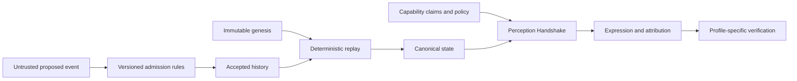

# Genesis Organism — Total Technical Specification

STATUS: RESEARCH / EXPERIMENTAL planning baseline. This is a specification of
work to be decided and delivered, not a frozen organism protocol. FACT / PRIOR
ART / DESIGN DECISION / HYPOTHESIS / OPEN QUESTION / SPECULATION retain their
meanings in docs/terminology.md. Normative invariants are inherited from
spec/README.md; proposed mechanisms below are not silently normative.

Planning task: `genesis_organism_origin_to_birth_total_planning`.
Baseline: `5f0076280ca4171d54bc9a25a6772d07a10a6d5a`.
Source requirements: [H00–H28](../../planning/genesis-organism/master-context.md).
Evidence: [complete baseline index](../../planning/genesis-organism/source-index.md).
Downstream output: `docs/features/genesis_organism/genesis_organism_phase_plan.md`.
Final planning review: `docs/features/genesis_organism/result.md`.

## Scope

Plan the path from Phase 0 origin to a possible Phase 8 birth while preserving
the artistic question and machine-first perception. The deliverable now is one
PlaySpec planning task, source traceability, total spec, detailed phase plan and
honest validation records. No organism runtime, dependency, external contribution,
child task, deployment, release, licence choice or birth is implemented here.

Future execution is split into bounded decision/specification work and conditional
implementation work. An unresolved protocol decision is an input dependency,
never permission for a later implementer to invent a convenient default. A
planning gate approves this decomposition, not an unresolved protocol option.

## Use Case Alignment

| Actor | Intended eventual outcome | Evidence of success, not assumed today |
| --- | --- | --- |
| Creator/researcher | Preserve an attributable origin and investigate machine encounters | Origin evidence, explicit non-claims, inspectable decision history |
| Independent engineer | Interpret the same rules without copying implementation accidents | Published byte vectors and independently matching replay results |
| Human/LLM/vision/embodied observer | Negotiate a permitted expression of one state | Profile-specific validity and receipt verification; no fixed observer mapping |
| Custodian | Exercise scoped permissions while preserving creator and ancestry | Authorization tests across custody/key changes |
| Archivist/verifier | Identify altered or incomplete history with stated trust limits | Validated commitments, retained heads and availability diagnostics |
| Future descendant | Trace authorized inheritance to parent states | New birth identity, traversable evidence, unchanged parents |

HYPOTHESIS: historical continuity may distinguish identity from state. HYPOTHESIS:
machines may find accumulated experience or mathematical structure meaningful.
Neither is an implementation acceptance test for sentience, preference or price.

## Main and Alternative Scenarios

1. A synthetic genesis and authorized events enter a future validator. Defined
   validity and ordering rules admit events; a deterministic reducer derives state;
   an archivist verifies the committed result against independent vectors.
2. Human, language and embodied mocks negotiate against the same synthetic state.
   Selection uses declared profiles/capabilities and access policy. Different
   outputs carry state/procedure/input/output attribution and profile validity.
3. Unknown or missing capabilities produce explicitly defined unsupported or
   permitted fallback behavior. No private raw data is exposed as a universal fallback.
4. Forged, duplicate, conflicting, out-of-order or unsupported-version proposals
   produce defined rejection/uncertainty; they do not silently alter canonical state.
5. A false environmental statement remains a claim. A policy-scoped attestation
   binds its evidence/issuer; a later correction preserves the accepted prior record.
6. An unavailable private input or dependency prevents the affected replay claim;
   it is distinguished from evidence of tampering. Public projections have their own scope.
7. A replica, divergent history and child are distinguished by accepted identity
   rules. Copying files or creating a Git branch is not automatic reproduction.
8. Failed child creation preserves parents and cannot accidentally produce two
   accepted origins on retry. Details depend on a future accepted birth model.
9. A restarted process rebuilds from authenticated history or a permitted checkpoint;
   clearing a cache never clears organism history. A token burn is not death.
10. Optional anchoring may be skipped with an explicit decision. Chain outage,
    transfer or reorganization cannot redefine the independent organism identity.

## Current Implementation Summary

FACT: the baseline contains 26 Markdown documents and two experimental JSON
schemas, with no package manifest, runtime, reducer, CLI, test suite, real
organism data or deployed adapter. The origin commit is real; genesis-0001
remains `STATUS: UNBORN`. Added PlaySpec files manage this task only.
No end-to-end organism behavior has been demonstrated. JSON parsing and local-link
checks do not establish schema conformance or protocol implementation.

## Relevant Files Reviewed

Every baseline file in the source index is attached individually. Root prose
establishes intent/history/licence boundaries; docs/ contains vocabulary, prior
art, questions, threats and the historical draft review; spec/ contains invariant
and research notes; schemas/ contains review-only structures; organisms/ contains
only an unborn placeholder. The inherited prior-art ledger records partial
source access; it is not a fresh comprehensive review or priority finding.

## Active Entry Points and Bypasses

| Path | Entry → update → propagation → reset → visible outcome |
| --- | --- |
| Existing documents | Reader opens file → no runtime update → no callbacks → no reset → statements of intent |
| Existing schemas | Consumer may read structure → no bundled validator → no state transition → no reset → no end-to-end validity claim |
| PlaySpec CLI | create/add-context/prompt/complete → tool-owned task records → workflow routing → tool-managed lifecycle → task progress only |
| Proposed organism runtime | Not implemented; adapter input → validation → accepted log → reducer → projections requires future decisions/tests |

No legacy organism API, mutable metadata endpoint, partial runtime migration or
alternate active implementation exists in the baseline. Potential future bypasses
include editing stored state directly, using raw LLM output, treating rendering
as mutation, and mutating state through an adapter without admission. Future
interfaces must funnel through the accepted rules, with explicit failure behavior.

## Current Architecture and Proposed Direction

Verified: a documentation repository and experimental structural schemas.
Proposed: philosophy → protocol decisions → canonical schemas/vectors → reference
core → adapters → instantiated organisms. Core validation/replay cannot depend
on UI, model service, robot vendor or blockchain. Capability negotiation is
separate from event authority. A phenotype view is not the canonical truth.

Proposed flow (not implemented):

No transport, hashing suite, identifier format, consensus, persistence engine,
signing key, programming language or signature algorithm is selected here.

## Verified Behavior and Constraints

Normative source: spec/README.md and spec/GENESIS.md. Preserve genesis/birth,
accepted history, creator attribution and parent identity. Reproduction creates
new identity. Machine observers are first-class. Expressions remain attributable
to their canonical source. Replay is a target requiring evidence. Wall-clock time
alone cannot order events. Blockchain, wallet and body cannot define identity.
Biological terms, machine preferences and novelty remain carefully qualified.

### Structured evidence — exact current literals

Artifact: `schemas/observer.schema.json`; subset: entire root object.

| Key path | Exact value / constraint | Treatment |
| --- | --- | --- |
| `$schema` | `https://json-schema.org/draft/2020-12/schema` | Reuse for current review artifact; future protocol encoding undecided |
| `$id` | `https://github.com/cksdnr1/genesis-organism/schemas/experimental/0.1/observer.schema.json` | Preserve; no network-resolution or frozen-profile claim |
| `properties.schemaVersion.const` | `0.1-experimental` | Reuse exactly; do not call it protocol v1 |
| `required` | `schemaVersion`, `observerType`, `capabilities` | Reuse all 3 field names; no rename/mapping |
| Optional root fields | `supportedProfiles`, `extensions` | Preserve optionality |
| `additionalProperties` | `false` | Root closure is current draft shape, not universal extension semantics |

Artifact: `schemas/phenotype.schema.json`; subset: entire root object.

| Key path | Exact value / constraint | Treatment |
| --- | --- | --- |
| `$schema` | `https://json-schema.org/draft/2020-12/schema` | Reuse for current review artifact; future protocol encoding undecided |
| `$id` | `https://github.com/cksdnr1/genesis-organism/schemas/experimental/0.1/phenotype.schema.json` | Preserve; no network-resolution or frozen-profile claim |
| `properties.schemaVersion.const` | `0.1-experimental` | Reuse exactly; do not call it protocol v1 |
| `required` | `schemaVersion`, `sourceStateRef`, `negotiationRef`, `expressionProfile`, `expressionProcedureRef`, `outputRef`, `mediaType` | Reuse all 7 field names; no rename/mapping |
| Optional root fields | `extensions` | Preserve optionality |
| `additionalProperties` | `false` | Root closure is current draft shape, not universal extension semantics |

Observer details: `observerType` is a string of length 1–128, no enum;
`capabilities` has at most 64 properties, names of length 1–128, boolean values;
`capabilities` may be empty. Missing capability is unknown, not false.
`supportedProfiles` has at most 32 unique strings of length 1–2048.
Phenotype's six non-version required values are strings of length 1–2048.
`mediaType` is not format-validated. References are opaque labels, not hashes/proofs.
Both `extensions` objects allow at most 32 properties, key length at most 256 with
pattern `^[A-Za-z][A-Za-z0-9+.-]*:.+$`, string values at most 4096 characters.
No default values, organism IDs, genesis values, event vocabularies, mutation
rules or floating-point consensus fields are defined in these artifacts.

The `STATUS: UNBORN` marker is Markdown, not a machine-validated lifecycle enum.
ALIVE / DORMANT / EXTINCT remain research terms. Do not invent a protocol status
mapping from PlaySpec's `active`/`completed` task states or its gate `approved`.
The source inventory's SHA-256 values cover source file bytes only. Paths, local
timestamps, absolute directories, Git metadata, prose and planning report scores
are not implied inputs to future organism identity or state commitments.

## Problems and Decision Register

Decision identifiers below are planning labels, not protocol field names. All
are OPEN QUESTION unless their record is later explicitly accepted with evidence.
Each decision record needs compared options, source evidence, constraints,
selection rationale, rejected options, exact affected contracts, verification
criteria, responsible acceptance and compatibility consequences. A research
phase may deliver a recommendation, but cannot invent missing acceptance.

| Decision | Questions / options to compare | Owner and closing evidence | Consumers |
| --- | --- | --- | --- |
| D01 Origin/governance/licensing | Attribution evidence; layered licences; contribution and freeze authority | Creator/rights holders accept scoped decisions; no default licence | All phases; licence required before licensed release |
| D02 Identity/authority | Origin-derived vs other identifiers; replica/child distinctions; one vs multiple writers; custody, recovery and compromise | Creator accepts trust model; threat cases for conflict, rotation and clones | Canonical schemas, admission and storage |
| D03 Canonical bytes/commitments | JCS vs defined deterministic CBOR profile; integer bounds; Unicode, duplicate keys; hash/signature domains and self-reference | Protocol review accepts exact byte policy and cross-language fixture design | Vectors, identifiers, signatures, replay |
| D04 Events/transitions | Minimal meaningful event vocabulary; ordering/causality; duplicates, invalid proposals and correction; deterministic input closure | Reviewed state-transition table with admission/rejection examples | Reducer, persistence, experience |
| D05 Privacy/version/retention | Public vs authorized replay; projections, keys, dependencies, snapshots/pruning, migration authority | Accepted data classification, replay-access and historical-version policy | Memory, archives, migrations |
| D06 Implementation boundary | Reference language/toolchain and independent verifier; small modules and CLI contracts | Accepted implementation spec after D02–D05; dependency review | Source layout and executable tests |
| D07 Perception validity | Vocabulary, profile selection, unsupported capabilities, read/write separation, attribution vs semantic validity | Accepted profile with counterexamples and mock test criteria | Handshake and expression verification |
| D08 Memory/synapse | Canonical/local/private partitions, consent, causal relation semantics, bounded retention | Accepted transition/effect tables without arbitrary scores | Experience components |
| D09 Evolution | Which state can evolve/inherit; deterministic randomness or no randomness; versioning | Accepted transition constraints and replay vectors | Evolution component |
| D10 Reproduction/lineage | Parent-state eligibility, contributions, authorization, failure/retry and ancestry verification | Accepted inheritance/birth contract and failure vectors | Child creation and ancestry |
| D11 Embodiment/evidence | Simultaneous bodies, body authority, witness/attestation scope, limits and safety | Accepted simulator boundaries; separate physical-operation authorization if ever requested | Simulated adapter, later real bodies |
| D12 Anchoring/freeze/birth | Whether to anchor; storage/chain split; profile freeze, release evidence and exact birth act | Creator accepts all prior birth evidence and explicit irreversible actions | Optional adapter, release and eventual birth |

The full-project planning task need not select these options. Its phase plan must
assign each decision before any dependent implementation and make blocked entry
conditions explicit. If a decision contradicts an invariant, stop and request
an explicit design revision instead of silently changing the total spec.

## Contract and Data Boundaries

- GenesisGenome remains immutable; EvolutionState and potential HeritableState
  are conceptual components until D02–D05 define their bytes and interpretations.
- Accepted events, proposed/rejected inputs and local audit material are separate.
  D04 chooses how an accepted allegation is corrected without erasing it.
- Deterministic input closure includes rule version, dependencies and all required
  input bytes. Unrecorded wall-clock calls, model responses and platform randomness
  cannot determine replay. D03/D04 define exact signature/hash exclusions and domains.
- A checkpoint links to validated history; it does not substitute for unspecified
  trust. D05 defines which parties can replay, verify a projection or only inspect
  a commitment. Missing data and invalid data require distinguishable outcomes.
- Expression selection can be deterministic while semantic fidelity remains
  profile-specific. D07 defines both and prevents output/state substitution.
- An environment claim, an attestation and a verification result have different
  evidence scopes; do not impose a universal linear truth score.
- Adapters propose inputs or expose permitted projections; they cannot bypass
  admission or reinterpret universal identity using their local IDs.

## Reset, Recovery and Compatibility

Proposed posture: clear transient caches, negotiation sessions and derived views
only under specified policies. Recover canonical projections by replay, not by
editing genesis or accepted events. Retry semantics must prevent double application;
D02/D04 decide how histories resume after conflict, process crash or lost authority.
Snapshots, key recovery and migrations preserve old validation rules and evidence.
A fixture reset is allowed only in an explicitly synthetic workspace unrelated
to #0001. No real-life reset, extinction transition or “burn means death” exists.

No existing deployed wire format requires migration. Preserve the two draft
schemas and their current `$id` values until an explicit versioned successor and
field-by-field compatibility decision is approved. Do not rewrite the initial
commit or historical draft-review narrative to make later decisions appear earlier.
New docs can explain current status without erasing the old record.

## File-By-File Plan

Existing files remain source evidence during this task. Future updates are
conditional on phase authorization and accepted decisions, not performed now.

| File / artifact | Future responsibility and boundary |
| --- | --- |
| README.md | Update demonstrated status and navigation only when milestones actually pass |
| ORIGIN.md | Preserve inception account; append later attributable milestones |
| MANIFESTO.md | Preserve artistic question and hypothesis language |
| CONTRIBUTING.md | Version review/conformance rules; respect origin history and licence decisions |
| LICENSE-DECISION.md | Close layered choices only with rights-holder acceptance |
| docs/prior-art.md | Primary-source verification and narrow comparison; no novelty conclusion |
| docs/terminology.md | Maintain exact agreed vocabulary; separate metaphors and mechanisms |
| docs/open-questions.md | Link decisions as resolved only with actual evidence |
| docs/threat-model.md | Convert threat cases into tested controls and residual risks |
| docs/draft-review.md | Keep historical pre-commit account; do not treat it as current status |
| spec/README.md | Index accepted profiles and invariant versions |
| spec/GENESIS.md | Birth evidence checklist; no gate waived silently |
| spec/identity.md | D02 identity, authority, custody, replicas and recovery |
| spec/genome.md | Immutable and heritable boundaries from D02–D05 |
| spec/event-model.md | D04 admission, rejection, ordering, correction and replay contracts |
| spec/canonicalization.md | D03 exact byte policy and test-vector references |
| spec/perception.md | D07 negotiation and supported/unsupported behavior |
| spec/phenotype.md | D07 attribution and profile-specific validity |
| spec/memory.md | D05/D08 memory classification and privacy |
| spec/synapse.md | D08 persistent causal relationship rules |
| spec/evolution.md | D09 explicit state changes and heritable consequences |
| spec/reproduction.md | D10 inheritance, new identity, failure/retry and authority |
| spec/lineage.md | D10 verified graph semantics and unavailable ancestors |
| spec/embodiment.md | D11 body/evidence/actuation boundaries |
| schemas/README.md | Draft-to-profile compatibility and validator scope |
| schemas/observer.schema.json | Preserve current fields; D07 determines successor schema |
| schemas/phenotype.schema.json | Preserve current fields; D07 determines receipt validation |
| organisms/genesis-0001/README.md | Remain UNBORN until separately authorized verified birth |
| docs/decisions/D01–D12 Markdown records (proposed) | Evidence, alternatives, acceptance and downstream contracts, not implicit approval |
| Future canonical schemas and test vectors (paths chosen at D06) | Created only after required contracts are accepted |
| Future source/CLI/adapter files (paths chosen at D06) | No speculative language/package layout fixed by this plan |

## Validation and Success Criteria

Planning checks now: complete H00–H28 coverage; all 28 baseline refs plus source
and inventory attached; schema literals match exactly; every conditional phase
has defined predecessors and decision gates; no runtime claims; no future phase
implementation or child task creation. Review gate scores are scoped to planning
quality and accompanied by findings, not protocol-conformance percentages.

Future conformance families:

| Family | Positive and negative evidence required |
| --- | --- |
| Identity/authority | Same authorized origin, clones/replicas, wrong actor, cross-organism event, rotation/recovery and conflicting writers |
| Canonicalization | Independent identical bytes; Unicode, duplicate keys, absent/null, number boundaries, negative zero, domain and self-reference tests |
| Replay | Same state/commitments across independent implementations, altered genesis, duplicate/out-of-order/conflicting inputs, unsupported versions |
| Persistence | Interrupted append, crash/retry, unavailable dependency, valid old prefix versus witnessed head, authenticated checkpoint |
| Perception | Three mock observers against one state, unknown/missing capabilities, denied disclosure, substitution and semantic counterexamples |
| Experience | Consent, causal influence, private input unavailable, correction history, relationship refusal/revocation without retroactive erasure |
| Evolution/lineage | Genesis invariant, deterministic mutation inputs, eligible inheritance, unchanged parents, partial/retried births, bad/cyclic ancestry |
| Embodiment/anchor | Forged/replayed sensor claim, concurrent bodies, bounded simulated action; optional-chain outage/reorganization without identity change |
| Birth | Every gate in spec/GENESIS.md demonstrated; exact frozen artifacts; independent recovery/replay and creator authorization |

No tests in this table have run. JSON Schema validation, cryptographic verification,
sensor authenticity, novelty and economic value cannot be inferred from this plan.

## Risks and Open Questions

Highest risks: a permissive schema misrepresented as validity; hidden authority
choices; frozen identity before canonical byte rules; private-memory commitments
misrepresented as public replay; attribution mistaken for phenotype fidelity;
false freshness claims from valid prefixes; birth requirements weakened by a
prototype. Avoid broad implementation tasks that combine several undecided
contracts. Research evidence may change the plan through explicit revision.

No real credentials, body, network topology or deployment destination is assumed.
Software licence and external contribution policy remain unselected. No chain
work proceeds merely because an SDK exists. All birth gates remain unmet.

## Reader Aids — Requirement Traceability

| Handoff section | Total-spec coverage | Roadmap ownership |
| --- | --- | --- |
| H00 | Scope, evidence labels, compatibility/history | All; Phase 0 |
| H01 | Use cases, scenarios, architecture | Phases 0, 2, 6 |
| H02 | Source review, non-claims, D01 | Phase 0 |
| H03 | Perception scenarios, D07, conformance | Phase 2 |
| H04 | Normative constraints and data boundaries | All |
| H05 | D02 identity/custody and D05 classification | Phases 1, 3 |
| H06 | D03–D05, replay and recovery | Phase 1 |
| H07 | D08 causal relations and consent | Phase 3 |
| H08 | D10 inheritance and retry | Phase 5 |
| H09 | Claims/evidence, D11 | Phases 3, 6 |
| H10 | D11 body authority and actuation | Phase 6 |
| H11 | Artistic hypotheses and non-economic success | All; Phase 0 |
| H12 | Reset/lifecycle non-goals | All; Phase 8 |
| H13 | UNBORN and unchanged birth gates | All; Phase 8 |
| H14 | Independent core and optional D12 anchoring | Phase 7 |
| H15 | Provenance, licence and Git metaphor limits | Phases 0, 8 |
| H16 | D01 layered licence decisions | Phases 0, 8 |
| H17 | Risks and adversarial test families | All |
| H18 | D03 bytes/numbers/commitments | Phase 1 |
| H19 | Layering, D06, independent conformance | Phases 1–7 |
| H20 | Baseline inventory and schema evidence | Phases 0–2 |
| H21 | ORIGIN preservation and source attribution | Phase 0 |
| H22 | Reader-facing docs and manifesto | Phase 0 |
| H23 | Labels, normative limits, decision gates | All |
| H24 | Phase 0–8 ownership retained in downstream plan | All |
| H25 | Future success evidence, not claimed now | All |
| H26 | Explicit non-goals and absence of implementation | All |
| H27 | Historical initial task and real baseline | Phase 0 |
| H28 | Longevity, delay birth until evidence | All |

## Initial validation status

Draft prepared for `total_spec_validate`. No workflow approval is claimed in
this initial text. Validation findings and any corrections are recorded below
as the workflow progresses.

## Validation outcome

Self-review 1: 96/100 for downstream planning; no planning blocker. See
[findings and scoped approval](total_spec_validation.md). Protocol decisions
remain OPEN QUESTION until their separate acceptance gates pass.
