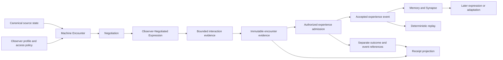

# Genesis Organism — Total Technical Specification

STATUS: RESEARCH / EXPERIMENTAL planning baseline. This is a specification of
work to be decided and delivered, not a frozen organism protocol. FACT / PRIOR
ART / DESIGN DECISION / HYPOTHESIS / OPEN QUESTION / SPECULATION retain their
meanings in docs/terminology.md. Normative invariants are inherited from
spec/README.md; proposed mechanisms below are not silently normative.

Revision task: `genesis_organism_machine_encounter_revision`.
Previous planning task: `genesis_organism_origin_to_birth_total_planning` (completed).
Revision baseline: `d5710fe987c0abc206a217a4aa95be61f94a2f3e`.
Origin baseline: `5f0076280ca4171d54bc9a25a6772d07a10a6d5a` (preserved).
Creator revision: [R01–R12](../../planning/genesis-organism/encounter-revision-source.md).
Primary-source review: [2026-09-20 ledger](../../research/2026-09-20-encounter-prior-art.md).
Source requirements: [H00–H28](../../planning/genesis-organism/master-context.md).
Evidence: [complete baseline index](../../planning/genesis-organism/source-index.md).
Downstream output: `docs/features/genesis_organism/genesis_organism_phase_plan.md`.
Final revision review: `docs/features/genesis_organism/encounter_revision_result.md`.
The original result.md and validation records describe the prior baseline.

## Scope

Center the project on Machine Encounter → Observer-Negotiated Expression →
Experience → Synapse → later expression/adaptation and eligible heritable change.
Identity, signatures and replay are supporting infrastructure. Do not turn the
project into a generic persistent AI identity protocol.

Plan the path from Phase 0 origin to a possible Phase 8 birth, with a post-lineage
5E Population/Ecology research extension, preserving the artistic question. The deliverable now is one
PlaySpec planning task, source traceability, total spec, detailed phase plan and
honest validation records. No organism runtime, dependency, external contribution,
child task, deployment, release, licence choice or birth is implemented here.

Future execution is split into bounded decision/specification work and conditional
implementation work. An unresolved protocol decision is an input dependency,
never permission for a later implementer to invent a convenient default. A
planning gate approves this decomposition, not an unresolved protocol option.

## Minimal Sufficiency — project-wide design principle

**DESIGN DECISION — creator-directed, 2026-09-21.** “The simplest thing is the
most beautiful.” Engineering interpretation: **The simplest mechanism that
preserves the organism is preferred.** This governs how we design the project;
it is not an additional numbered Genesis invariant or a biological property.

> MINIMAL SUFFICIENCY
>
> Genesis Organism SHOULD use the smallest mechanism that preserves the
> required identity, encounter, continuity, causal effect and verifiability.
>
> Additional complexity MUST justify itself through at least one of:
>
> 1. a required invariant,
> 2. a demonstrated capability,
> 3. a necessary security/privacy property,
> 4. interoperability that is actually required by an accepted profile, or
> 5. evidence required by an accepted experiment.
>
> A mechanism MUST NOT be added merely because it may be useful in the future.

This applies to protocol and organism design, canonical state, event vocabulary,
schemas, interfaces, algorithms, dependencies, adapters, storage, cryptography,
observer profiles, encounter semantics, memory, synapses, adaptation, reproduction,
ecology, embodiment, anchoring and birth. These review requirements do not select
unresolved protocol mechanisms. Correctness, deterministic replay, provenance,
privacy, security, independent verification and historical compatibility win any
conflict with minimality; existing normative invariants remain authoritative.

### Removal Test

If removing a component does not break an accepted invariant, demonstrated
capability, required security/privacy property, accepted interoperability
requirement, or required experiment, prefer removing it. Apply this to fields,
event types, schemas, abstractions, modules, dependencies, services, adapters,
stored state, cryptographic commitments, protocol layers, observer profiles,
algorithms and execution phases.

The test is not permission to remove provenance, historical evidence, compatibility
records, security/privacy boundaries, negative test coverage, independent
verification or already-published origin history. Minimalism must not weaken
correctness or evidence. Record the requirement and evidence preserved by any
simplification; use attributable revisions rather than rewriting historical records.

### Complexity Budget

Every accepted protocol addition SHOULD answer:

1. What exact requirement requires this?
2. What breaks if it is removed?
3. Why can an existing mechanism not satisfy the requirement?
4. What new state, dependency or failure mode does it introduce?
5. How will its necessity be demonstrated?

If these cannot be answered, default to **DEFER / OMIT**. This is a non-numeric
review discipline, not an organism score, consensus field, new subsystem or service.
A proposed demonstration needs an accepted requirement and bounded evidence plan;
it is not a licence to add speculative machinery before demonstrating the need.

### Simple origin, earned complexity

> Complexity is not designed into life.
> Complexity is earned through life.

This artistic principle rejects unnecessary preloaded complexity, not sophisticated
organisms emerging later through valid history. Apply it especially strongly to
GENESIS #0001: prefer a minimal sufficient genome and canonical birth state, no
prior experiences, empty/minimal memory, no synapses or children, origin-only
lineage, and no adaptation until caused. These are conceptual starting conditions,
not selected wire fields or fabricated birth data. Required birth evidence and
protocol semantics still need to be defined and verified; #0001 remains **UNBORN**.

Simple origin → encounter → experience → memory/synapse → causal change →
adaptation → reproduction → ecology → emergent complexity describes the intended
conditional research path, not a requirement to instantiate every later stage
in an initial single-organism demonstration.

Minimalism preserves the full Phase 22 product milestone: Encounter A →
Observer-Negotiated Expression → Authorized Experience → Memory/Synapse causal
effect → Encounter B → causally changed expression, with no-experience and
rejected-experience controls. Identity plus a signed log is insufficient. Reduce
supporting infrastructure only while verifiability and causal evidence survive.

## Core product acceptance — an encounter changes a later encounter

A historically continuous synthetic organism presents different permitted
expressions from one canonical state to human, language and embodied mocks.
A bounded interaction produces attributable evidence; authorized admission can
create experience with a specified memory/synapse effect. A later expression
changes for that explicit reason and replays from retained accepted bytes. A
control with the experience omitted lacks the effect. This loop is the first
product milestone, not merely a signed identity record or successful replay CLI.

This is a narrowly stated research direction, not a claim the combination is
unique. There is prior art for machine audiences, genetic art, identity/history,
capability negotiation and environment-dependent phenotype. No subjective
engineering ratings are turned into measured scientific or protocol results.

## Use Case Alignment

| Actor | Intended eventual outcome | Evidence of success, not assumed today |
| --- | --- | --- |
| Creator/researcher | Preserve an attributable origin and investigate machine encounters | Origin evidence, explicit non-claims, inspectable decision history |
| Independent engineer | Interpret the same rules without copying implementation accidents | Published byte vectors and independently matching replay results |
| Human/LLM/vision/embodied observer | Negotiate a permitted expression of one state | Profile-specific validity and receipt verification; no fixed observer mapping |
| Custodian | Exercise scoped permissions while preserving creator and ancestry | Authorization tests across custody/key changes |
| Archivist/verifier | Identify altered or incomplete history with stated trust limits | Validated commitments, retained heads and availability diagnostics |
| Future descendant | Trace authorized inheritance to parent states | New birth identity, traversable evidence, unchanged parents |

HYPOTHESIS: historical continuity may distinguish identity from state. HYPOTHESIS:
machines may find accumulated experience or mathematical structure meaningful.
Neither is an implementation acceptance test for sentience, preference or price.

## Main and Alternative Scenarios

1. A Machine Encounter binds source state, observer profile, access policy and
   negotiated expression to bounded interaction evidence. Only admitted experience
   can affect canonical memory/synapse state; a later expression demonstrates the
   defined effect against a no-experience control.
2. A synthetic genesis and authorized events enter a future validator. Defined
   validity and ordering rules admit events; a deterministic reducer derives state;
   an archivist verifies the committed result against independent vectors.
3. Human, language and embodied mocks negotiate against the same synthetic state.
   Selection uses declared profiles/capabilities and access policy. Different
   outputs carry state/procedure/input/output attribution and profile validity.
4. Unknown or missing capabilities produce explicitly defined unsupported or
   permitted fallback behavior. No private raw data is exposed as a universal fallback.
5. Forged, duplicate, conflicting, out-of-order or unsupported-version proposals
   produce defined rejection/uncertainty; they do not silently alter canonical state.
6. A false environmental statement remains a claim. A policy-scoped attestation
   binds its evidence/issuer; a later correction preserves the accepted prior record.
7. An unavailable private input or dependency prevents the affected replay claim;
   it is distinguished from evidence of tampering. Public projections have their own scope.
8. A replica, divergent history and child are distinguished by accepted identity
   rules. Copying files or creating a Git branch is not automatic reproduction.
9. Failed child creation preserves parents and cannot accidentally produce two
   accepted origins on retry. Details depend on a future accepted birth model.
10. A restarted process rebuilds from authenticated history or a permitted checkpoint;
   clearing a cache never clears organism history. A token burn is not death.
11. Optional anchoring may be skipped with an explicit decision. Chain outage,
    transfer or reorganization cannot redefine the independent organism identity.

## Current Implementation Summary

FACT: the origin baseline contains 26 Markdown documents and two experimental JSON
schemas, with no package manifest, runtime, reducer, CLI, test suite, real
organism data or deployed adapter. The origin commit is real; genesis-0001
remains `STATUS: UNBORN`. The prior planning commit added planning and PlaySpec evidence, not runtime.
This revision changes active prose and leaves both original JSON schemas byte-identical.
No end-to-end organism behavior has been demonstrated. JSON parsing and local-link
checks do not establish schema conformance or protocol implementation.

## Relevant Files Reviewed

Every baseline file in the source index is attached individually. Root prose
establishes intent/history/licence boundaries; docs/ contains vocabulary, prior
art, questions, threats and the historical draft review; spec/ contains invariant
and research notes; schemas/ contains review-only structures; organisms/ contains
only an unborn placeholder. The original ledger records partial source access. The linked 2026-09-20
revision review checks additional primary sources and explicitly bounds author
claims, draft status and unaudited implementation behavior; it is not a priority finding.

## Active Entry Points and Bypasses

| Path | Entry → update → propagation → reset → visible outcome |
| --- | --- |
| Existing documents | Reader opens file → no runtime update → no callbacks → no reset → statements of intent |
| Existing schemas | Consumer may read structure → no bundled validator → no state transition → no reset → no end-to-end validity claim |
| PlaySpec CLI | create/add-context/prompt/complete → tool-owned task records → workflow routing → tool-managed lifecycle → task progress only |
| Proposed organism runtime | Not implemented; adapter input → validation → accepted log → reducer → projections requires future decisions/tests |

No legacy organism API, mutable metadata endpoint, partial runtime migration or
alternate active implementation exists in the baseline. Potential future bypasses
include editing stored state directly, using raw LLM output, treating rendering
as mutation, and mutating state through an adapter without admission. Future
interfaces must funnel through the accepted rules, with explicit failure behavior.

## Current Architecture and Proposed Direction

Verified: a documentation repository and experimental structural schemas.
Preferred: philosophy → minimal protocol contracts → canonical schemas/vectors →
small deterministic core → optional adapters → organisms. Core validation/replay cannot depend
on UI, model service, robot vendor or blockchain. Capability negotiation is
separate from event authority. An observer expression is not canonical truth. PhenotypeState is a separate
conceptual trait/behavior layer; D07 decides canonical-versus-derived representation
before adding any stored state. Observer-Negotiated Expression is the current
term; old Observer-Dependent Phenotype prose and schema descriptors remain historical.

Keep the core's responsibilities smaller than those of optional integrations
wherever possible; this is a boundary discipline, not a line-count target. Keep
external adapter concerns outside canonical validation/replay.

Design heuristics, subordinate to accepted requirements and existing evidence gates:

- If local cryptographic commitment suffices, do not require blockchain.
- If one meaningful event type suffices, do not invent an event hierarchy.
- If deterministic code suffices, do not introduce an LLM.
- If one profile proves a required mechanism, do not create ten profiles. The
  existing human/language/embodied mock acceptance remains; mocks need no model service.
- If one synthetic organism proves a property, do not introduce a population.
  Reproduction/ecology experiments remain separately scoped with their own evidence.
- Reuse an existing contract when it expresses the requirement; avoid parallel abstractions.
- Keep an adapter external when it need not be part of the canonical core.

Proposed flow (not implemented):

The receipt projection must not introduce reciprocal hashes between its evidence
and resulting events. The precise acyclic binding graph is D03/D04/D13 work.
Interaction evidence alone does not authorize an event or prove physical truth.

No transport, hashing suite, identifier format, consensus, persistence engine,
signing key, programming language or signature algorithm is selected here.

## Verified Behavior and Constraints

Normative source: spec/README.md and spec/GENESIS.md. Preserve genesis/birth,
accepted history, creator attribution and parent identity. Reproduction creates
new identity. Machine observers are first-class. Expressions remain attributable
to their canonical source. Replay is a target requiring evidence. Wall-clock time
alone cannot order events. Blockchain, wallet and body cannot define identity.
Biological terms, machine preferences and novelty remain carefully qualified.

### Structured evidence — exact current literals

Artifact: `schemas/observer.schema.json`; subset: entire root object.

| Key path | Exact value / constraint | Treatment |
| --- | --- | --- |
| `$schema` | `https://json-schema.org/draft/2020-12/schema` | Reuse for current review artifact; future protocol encoding undecided |
| `$id` | `https://github.com/cksdnr1/genesis-organism/schemas/experimental/0.1/observer.schema.json` | Preserve; no network-resolution or frozen-profile claim |
| `properties.schemaVersion.const` | `0.1-experimental` | Reuse exactly; do not call it protocol v1 |
| `required` | `schemaVersion`, `observerType`, `capabilities` | Reuse all 3 field names; no rename/mapping |
| Optional root fields | `supportedProfiles`, `extensions` | Preserve optionality |
| `additionalProperties` | `false` | Root closure is current draft shape, not universal extension semantics |

Artifact: `schemas/phenotype.schema.json`; subset: entire root object.

| Key path | Exact value / constraint | Treatment |
| --- | --- | --- |
| `$schema` | `https://json-schema.org/draft/2020-12/schema` | Reuse for current review artifact; future protocol encoding undecided |
| `$id` | `https://github.com/cksdnr1/genesis-organism/schemas/experimental/0.1/phenotype.schema.json` | Preserve; no network-resolution or frozen-profile claim |
| `properties.schemaVersion.const` | `0.1-experimental` | Reuse exactly; do not call it protocol v1 |
| `required` | `schemaVersion`, `sourceStateRef`, `negotiationRef`, `expressionProfile`, `expressionProcedureRef`, `outputRef`, `mediaType` | Reuse all 7 field names; no rename/mapping |
| Optional root fields | `extensions` | Preserve optionality |
| `additionalProperties` | `false` | Root closure is current draft shape, not universal extension semantics |

Observer details: `observerType` is a string of length 1–128, no enum;
`capabilities` has at most 64 properties, names of length 1–128, boolean values;
`capabilities` may be empty. Missing capability is unknown, not false.
`supportedProfiles` has at most 32 unique strings of length 1–2048.
Phenotype's six non-version required values are strings of length 1–2048.
`mediaType` is not format-validated. References are opaque labels, not hashes/proofs.
Both `extensions` objects allow at most 32 properties, key length at most 256 with
pattern `^[A-Za-z][A-Za-z0-9+.-]*:.+$`, string values at most 4096 characters.
No default values, organism IDs, genesis values, event vocabularies, mutation
rules or floating-point consensus fields are defined in these artifacts.

The `STATUS: UNBORN` marker is Markdown, not a machine-validated lifecycle enum.
ALIVE / DORMANT / EXTINCT remain research terms. Do not invent a protocol status
mapping from PlaySpec's `active`/`completed` task states or its gate `approved`.
The source inventory's SHA-256 values cover source file bytes only. Paths, local
timestamps, absolute directories, Git metadata, prose and planning report scores
are not implied inputs to future organism identity or state commitments.

## Proposed EncounterReceipt and successor evidence

The creator's candidate responsibilities are `organismStateRef`,
`observerProfileCommitment`, `negotiationProtocolVersion`, `expressionProcedureRef`,
`expressionInputCommitment`, `expressionOutputDigest`, `interactionDigest`, and
`resultingEventRefs`. They are proposed names, not fields in an existing schema.
[Machine Encounter](../../../spec/encounter.md) specifies their interpretation
questions, privacy boundaries, replay inputs and acyclic admission/outcome model.

The current phenotype.schema.json remains an old expression descriptor, not
PhenotypeState or EncounterReceipt. [Successor design](../../../schemas/successor-design.md)
records explicit non-equivalences: sourceStateRef is not automatically the new
organismStateRef; negotiationRef is not negotiationProtocolVersion; outputRef is
not an output digest. Preserve old JSON bytes and IDs. Select a distinct version
and acceptance/migration mapping before implementing a typed profile.

Typed successor profiles encode only semantics required by an accepted D07 profile.
Units, modality, resolution/rates, coordinate frames, robot limits and evidence
need explicit representation when used; unused descriptors are deferred, not
placeholder fields. Never invent precision from historical booleans.
Separate claims, issuer attestations and scoped verifier evaluations. Capability
declaration grants neither event authority nor actuation. D03 controls any
consensus-relevant numerical encoding; D07/D13 define byte/depth/resource limits.

## Problems and Decision Register

Decision identifiers below are planning labels, not protocol field names. All
are OPEN QUESTION unless their record is later explicitly accepted with evidence.
Each decision record needs compared options, source evidence, constraints,
selection rationale, rejected options, exact affected contracts, verification
criteria, responsible acceptance and compatibility consequences. A research
phase may deliver a recommendation, but cannot invent missing acceptance.

Minimal Sufficiency applies across **D01–D14**, without a new decision number.
Every new or revised accepted decision record MUST contain a **Minimality /
Complexity Justification** section documenting the minimum mechanism considered,
alternatives rejected for unnecessary complexity, the requirement justifying
retained complexity, the Removal Test result and new failure modes introduced.
Answer the Complexity Budget questions, including how necessity will be demonstrated.
Apply this prospectively; historical accepted records are not rewritten, and these
requirements do not claim any unresolved D-record has been accepted.

| Decision | Questions / options to compare | Owner and closing evidence | Consumers |
| --- | --- | --- | --- |
| D01 Origin/governance/licensing | Attribution evidence; layered licences; contribution and freeze authority | Creator/rights holders accept scoped decisions; no default licence | All phases; licence required before licensed release |
| D02 Identity/authority | Origin-derived vs other identifiers; replica/child distinctions; one vs multiple writers; custody, recovery and compromise | Creator accepts trust model; threat cases for conflict, rotation and clones | Canonical schemas, admission and storage |
| D03 Canonical bytes/commitments | JCS vs defined deterministic CBOR profile; integer bounds; Unicode, duplicate keys; hash/signature domains and self-reference | Protocol review accepts exact byte policy and cross-language fixture design | Vectors, identifiers, signatures, replay |
| D04 Events/transitions | Minimal meaningful event vocabulary; ordering/causality; duplicates, invalid proposals and correction; deterministic input closure | Reviewed state-transition table with admission/rejection examples | Reducer, persistence, experience |
| D05 Privacy/version/retention | Public vs authorized replay; projections, keys, dependencies, snapshots/pruning, migration authority | Accepted data classification, replay-access and historical-version policy | Memory, archives, migrations |
| D06 Implementation boundary | Reference language/toolchain and independent verifier; small modules and CLI contracts | Accepted implementation spec after D02–D05; dependency review | Source layout and executable tests |
| D07 Perception validity | PhenotypeState versus expression; typed capability successor, units/frames/evidence; selection/policy; historical schema compatibility | Accepted profile, exact mappings/rejections, claim/attestation boundaries and counterexamples | Negotiation and expression verification |
| D08 Memory/synapse | Canonical/local/private partitions, consent, causal relation semantics, bounded retention; D13 Meaningful Consequence in later expression | Accepted observable transition/effect criteria, matched controls and rule ablation; counter-only differences do not suffice | Experience components and causal-loop demonstration |
| D09 Individual change/adaptation | What changes within one organism, what is heritable; deterministic inputs and justified adaptation measures | Accepted transition rules and replay/control vectors; no population-evolution claim from individual change | Individual transitions and D14 research |
| D10 Reproduction/lineage | Parent-state eligibility, contributions, authorization, failure/retry and ancestry verification | Accepted inheritance/birth contract and failure vectors | Child creation and ancestry |
| D11 Embodiment/evidence | Simultaneous bodies, body authority, witness/attestation scope, limits and safety | Accepted simulator boundaries; separate physical-operation authorization if ever requested | Simulated adapter, later real bodies |
| D12 Anchoring/freeze/birth | Whether to anchor; storage/chain split; profile freeze, release evidence and exact birth act | Creator accepts all prior birth evidence and explicit irreversible actions | Optional adapter, release and eventual birth |
| D13 Encounter contract | Evidence/receipt/outcome, eight candidate fields (not a frozen field set), explicit Encounter Idempotency and Policy Binding questions, admission authority, refusal/pending distinction, acyclic commitments, retained bytes | Creator-directed encounter concept; exact contract still requires accepted D02–D05/D07-compatible record and retry/policy adversarial vectors; downstream D08 defines Meaningful Consequence before the causal-loop demonstration | Encounter admission and causal-loop demonstration |
| D14 Population/Ecology | Heritable variation, differential reproduction, environment/resource constraints, controls, measurement/uncertainty and open-endedness limits; long-term Niche Construction question, separately scoped | Accepted bounded synthetic study design before experiments; no arbitrary fitness/death mechanism | Post-lineage roadmap 5E; evidence for limited evolution claims |

The full-project planning task need not select these options. Its phase plan must
assign each decision before any dependent implementation and make blocked entry
conditions explicit. If a decision contradicts an invariant, stop and request
an explicit design revision instead of silently changing the total spec.

## Four-question follow-up — 2026-09-21

**DESIGN DECISION:** Retain the encounter-centered architecture and all 38 execution
phases. This scoped clarification adds questions and closing evidence, not accepted
protocol mechanisms or a new implementation gate.

| Question | Decision / execution phases | Required clarification or evidence |
| --- | --- | --- |
| Encounter Idempotency | D13 with D02/D04; 15, 18 | Same-encounter timeout/concurrent/restart retries cannot duplicate admission or causal effect; reject conflicting reuse while preserving distinct genuine encounters. Compare `encounterId` and deterministic commitment without selecting either. |
| Policy Binding | D13 with D05/D07; 15, 18 | Bind the historical negotiation/disclosure policy and decision inputs to evidence; compare `policyRef`, `accessPolicyCommitment` and existing input binding. Define policy changes before admission, test substitution/unavailable policy, and preserve private-data boundaries. Integrity alone does not prove enforcement. |
| Meaningful Consequence | D13 with D07/D08; 19, 22 | Define an observable later-expression/behavior effect before implementation; matched no-experience and rejected-experience controls, rule ablation and replay isolate the causal rule. Counter/timestamp/digest-only differences are insufficient. |
| Niche Construction | D14; 28 research question, 29 scope boundary | Can organisms create new ecological niches that alter the future selection pressures of other organisms? Future studies would isolate organism-caused environmental feedback; no implementation or early/birth gate is added. |

Detailed question boundaries are in [Encounter](../../../spec/encounter.md) and
[Ecology](../../../spec/ecology.md). Finite experiments do not establish open-ended
evolution. The next roadmap step remains Phase 0 closure against its existing
criteria, followed by Phase 1's minimal synthetic deterministic organism; these
additions neither declare those gates passed nor authorize GENESIS #0001's birth.

## Contract and Data Boundaries

- GenesisGenome remains immutable; EvolutionState and potential HeritableState
  are conceptual components until D02–D05 define their bytes and interpretations.
- Accepted events, proposed/rejected inputs and local audit material are separate.
  D04 chooses how an accepted allegation is corrected without erasing it.
- Machine Encounter is the first-class experience context. Refused, read-only,
  incomplete and rejected encounters may yield no admitted event. D13 separates
  immutable evidence from accepted-event outcomes; corrections never mutate
  earlier hashed receipts or create invented successful experiences.
- LLM-generated content is captured as exact accepted bytes or a retrievable,
  integrity-checked reference. Replay never re-calls the model. A digest cannot
  replace unavailable input bytes; failure must be scoped as unavailable or
  unauthorized rather than silently regenerated.
- Deterministic input closure includes rule version, dependencies and all required
  input bytes. Unrecorded wall-clock calls, model responses and platform randomness
  cannot determine replay. D03/D04 define exact signature/hash exclusions and domains.
- A checkpoint links to validated history; it does not substitute for unspecified
  trust. D05 defines which parties can replay, verify a projection or only inspect
  a commitment. Missing data and invalid data require distinguishable outcomes.
- Expression selection can be deterministic while semantic fidelity remains
  profile-specific. D07 defines both and prevents output/state substitution.
- An environment claim, an attestation and a verification result have different
  evidence scopes; do not impose a universal linear truth score.
- Adapters propose inputs or expose permitted projections; they cannot bypass
  admission or reinterpret universal identity using their local IDs.

## Ontogeny, phylogeny and population evidence

Within-individual state change is ontogeny; adaptation requires a specified
improvement criterion. Phylogeny records lineage. Heritable variation plus
reproduction permits research, but a selection claim additionally needs evidence
of differential reproductive success in a defined ecology. D14 adds matched
controls, resource/encounter scheduling, replicated bounded runs and uncertainty
reporting. [Population/Ecology](../../../spec/ecology.md) defines the research scope.

No arbitrary fitness score, token-price objective, organism death or automatic
extinction is implied. Population-selection evidence can use reproductive
opportunities while retaining all participant histories. Finite experiments do
not establish open-ended evolution or machine preferences. Ecology evidence is
required before a profile claims demonstrated Darwinian selection; original birth
gates are not waived and open-endedness is not silently made a birth prerequisite.

## Scale and standards strategy

Bound encounter bytes/depth, evidence references, computation and retained data.
D05/D13/D14 compare replay from genesis with validated checkpoints and archival
retrieval, including public projection versus authorized private replay. Merkle
inclusion/consistency designs do not retain unavailable bytes or prove the latest
head without witnesses/trust assumptions. Do not promise fifty-year operation
from a small synthetic fixture; measure budgets and failure/recovery behavior.

Treat MCP/A2A transport/capability exchange, DID resolution, PROV evidence
relations, C2PA asset claims and CT/Merkle constructions as deferred integration
candidates. Compare one only when an accepted profile or measured requirement
needs its property; do not implement a standards-adapter suite in advance.
Append-only replay retains the event-sourcing principle without requiring a
framework. Checkpoint/index/Merkle machinery needs a justified recovery, proof or
measured scale requirement; durable history and required recovery evidence remain.
None is a mandatory dependency or substitute for the encounter contract. See the
primary-source ledger for versions and limits.

## Reset, Recovery and Compatibility

Proposed posture: clear transient caches, negotiation sessions and derived views
only under specified policies. Recover canonical projections by replay, not by
editing genesis or accepted events. Retry semantics must prevent double application;
D02/D04 decide how histories resume after conflict, process crash or lost authority.
Snapshots, key recovery and migrations preserve old validation rules and evidence.
A fixture reset is allowed only in an explicitly synthetic workspace unrelated
to #0001. No real-life reset, extinction transition or “burn means death” exists.

No existing deployed wire format requires migration. Preserve the two draft
schemas and their current `$id` values until an explicit versioned successor and
field-by-field compatibility decision is approved. Do not rewrite the initial
commit or historical draft-review narrative to make later decisions appear earlier.
New docs can explain current status without erasing the old record.

## File-By-File Plan

Existing files remain source evidence during this task. Future updates are
conditional on phase authorization and accepted decisions, not performed now.

| File / artifact | Future responsibility and boundary |
| --- | --- |
| README.md | Update demonstrated status and navigation only when milestones actually pass |
| ORIGIN.md | Preserve inception account; append later attributable milestones |
| MANIFESTO.md | Preserve artistic question and hypothesis language |
| CONTRIBUTING.md | Version review/conformance rules; respect origin history and licence decisions |
| LICENSE-DECISION.md | Close layered choices only with rights-holder acceptance |
| docs/prior-art.md | Link expanded review without changing earlier evidence claims |
| docs/research/2026-09-20-encounter-prior-art.md | Primary sources, version/date limits and five-axis assessment |
| docs/terminology.md | Maintain exact agreed vocabulary; separate metaphors and mechanisms |
| docs/open-questions.md | Link decisions as resolved only with actual evidence |
| docs/threat-model.md | Convert threat cases into tested controls and residual risks |
| docs/draft-review.md | Keep historical pre-commit account; do not treat it as current status |
| spec/README.md | Index accepted profiles and invariant versions |
| spec/GENESIS.md | Birth evidence checklist; no gate waived silently |
| spec/identity.md | D02 identity, authority, custody, replicas and recovery |
| spec/genome.md | Immutable and heritable boundaries from D02–D05 |
| spec/event-model.md | D04 admission, rejection, ordering, correction and replay contracts |
| spec/canonicalization.md | D03 exact byte policy and test-vector references |
| spec/encounter.md | D13 first-class encounter, receipt/evidence/outcome and causal-loop demonstration |
| spec/perception.md | D07 typed profiles, negotiation and supported/unsupported behavior |
| spec/phenotype.md | D07 attribution and profile-specific validity |
| spec/memory.md | D05/D08 memory classification and privacy |
| spec/synapse.md | D08 persistent causal relationship rules |
| spec/evolution.md | D09 within-individual change/adaptation versus heritable effects |
| spec/ecology.md | D14 population/selection and bounded research criteria |
| spec/reproduction.md | D10 inheritance, new identity, failure/retry and authority |
| spec/lineage.md | D10 verified graph semantics and unavailable ancestors |
| spec/embodiment.md | D11 body/evidence/actuation boundaries |
| schemas/README.md | Historical artifact scope |
| schemas/successor-design.md | Typed descriptor and receipt prerequisites; explicit incompatible field mappings |
| schemas/observer.schema.json | Preserve current fields; D07 determines successor schema |
| schemas/phenotype.schema.json | Preserve current fields; D07 determines receipt validation |
| organisms/genesis-0001/README.md | Remain UNBORN until separately authorized verified birth |
| docs/decisions/D01–D14 Markdown records (proposed) | Evidence, alternatives, acceptance and downstream contracts, not implicit approval |
| Future canonical schemas and test vectors (paths chosen at D06) | Created only after required contracts are accepted |
| Future source/CLI/adapter files (paths chosen at D06) | No speculative language/package layout fixed by this plan |

## Validation and Success Criteria

Planning checks now: complete H00–H28 coverage; all 28 baseline refs plus source
and inventory attached; schema literals match exactly; every conditional phase
has defined predecessors and decision gates; no runtime claims; no future phase
implementation or child task creation. Review gate scores are scoped to planning
quality and accompanied by findings, not protocol-conformance percentages.

Future conformance families:

| Family | Positive and negative evidence required |
| --- | --- |
| Identity/authority | Same authorized origin, clones/replicas, wrong actor, cross-organism event, rotation/recovery and conflicting writers |
| Canonicalization | Independent identical bytes; Unicode, duplicate keys, absent/null, number boundaries, negative zero, domain and self-reference tests |
| Replay | Same state/commitments across independent implementations, altered genesis, duplicate/out-of-order/conflicting inputs, unsupported versions |
| Persistence | Interrupted append, crash/retry, unavailable dependency, valid old prefix versus witnessed head, authenticated checkpoint |
| Perception | Three mock observers against one state, unknown/missing capabilities, denied disclosure, substitution and semantic counterexamples |
| Encounter/Experience | Acyclic receipt/event binding, exact LLM bytes, pending vs no-event, consent, timeout/concurrent/restart retries and conflicting identifier reuse, historical policy substitution, duplicate/forged outcomes, private input unavailable, specified later-expression effect versus matched controls/rule ablation; counter-only negative case |
| Individual change/lineage | Genesis invariant, deterministic mutation inputs, eligible inheritance, unchanged parents, partial/retried births, bad/cyclic ancestry |
| Population/Ecology | Matched no-selection/no-experience controls, heritable variation, actual offspring counts, resource bounds, uncertainty; no claim of open-endedness |
| Embodiment/anchor | Forged/replayed sensor claim, concurrent bodies, bounded simulated action; optional-chain outage/reorganization without identity change |
| Birth | Every gate in spec/GENESIS.md demonstrated; exact frozen artifacts; independent recovery/replay and creator authorization |

No tests in this table have run. JSON Schema validation, cryptographic verification,
sensor authenticity, novelty and economic value cannot be inferred from this plan.

## Risks and Open Questions

Highest risks: generic identity scope displacing encounters; confusing individual
change with Darwinian/open-ended evolution; digest-only LLM replay or cyclic receipt
commitments; capability spoofing; unbounded/private history; a permissive schema misrepresented as validity; hidden authority
choices; frozen identity before canonical byte rules; private-memory commitments
misrepresented as public replay; attribution mistaken for phenotype fidelity;
false freshness claims from valid prefixes; birth requirements weakened by a
prototype. Avoid broad implementation tasks that combine several undecided
contracts. Research evidence may change the plan through explicit revision.

No real credentials, body, network topology or deployment destination is assumed.
Software licence and external contribution policy remain unselected. No chain
work proceeds merely because an SDK exists. All birth gates remain unmet.

## Reader Aids — Requirement Traceability

| Handoff section | Total-spec coverage | Roadmap ownership |
| --- | --- | --- |
| H00 | Scope, evidence labels, compatibility/history | All; Phase 0 |
| H01 | Use cases, scenarios, architecture | Phases 0, 2, 6 |
| H02 | Source review, non-claims, D01 | Phase 0 |
| H03 | Perception scenarios, D07, conformance | Phase 2 |
| H04 | Normative constraints and data boundaries | All |
| H05 | D02 identity/custody and D05 classification | Phases 1, 3 |
| H06 | D03–D05, replay and recovery | Phase 1 |
| H07 | D08/D13 encounter-derived causal relations and consent | Phase 3 |
| H08 | D10 inheritance and retry; D14 distinct population research | Phase 5 and 5E |
| H09 | Claims/evidence, D11 | Phases 3, 6 |
| H10 | D11 body authority and actuation | Phase 6 |
| H11 | Artistic hypotheses and non-economic success | All; Phase 0 |
| H12 | Reset/lifecycle non-goals | All; Phase 8 |
| H13 | UNBORN and unchanged birth gates | All; Phase 8 |
| H14 | Independent core and optional D12 anchoring | Phase 7 |
| H15 | Provenance, licence and Git metaphor limits | Phases 0, 8 |
| H16 | D01 layered licence decisions | Phases 0, 8 |
| H17 | Risks and adversarial test families | All |
| H18 | D03 bytes/numbers/commitments | Phase 1 |
| H19 | Layering, D06, independent conformance | Phases 1–7 |
| H20 | Baseline inventory and schema evidence | Phases 0–2 |
| H21 | ORIGIN preservation and source attribution | Phase 0 |
| H22 | Reader-facing docs and manifesto | Phase 0 |
| H23 | Labels, normative limits, decision gates | All |
| H24 | Phase 0–8 ownership retained in downstream plan | All |
| H25 | Future success evidence, not claimed now | All |
| H26 | Explicit non-goals and absence of implementation | All |
| H27 | Historical initial task and real baseline | Phase 0 |
| H28 | Longevity, delay birth until evidence | All |

## Creator-revision traceability

| Revision | Active design coverage |
| --- | --- |
| R01 | Encounter/effect loop leads Scope, product acceptance, scenarios and architecture |
| R02 | Narrow differentiation and cited component prior art; no first claims |
| R03 | PhenotypeState/expression separation and historical terminology mapping |
| R04 | D13 first-class encounter, admission boundary and later causal effect |
| R05 | Eight candidate receipt names and acyclic evidence/event/outcome binding |
| R06 | D02/D04 authority; exact retained LLM bytes; missing input is not regenerated |
| R07 | Historical JSON preserved; typed successor units/frames and claim/evidence scope |
| R08 | D09 ontogeny/adaptation; D14 Population/Ecology and open-endedness limits |
| R09 | D05/D13/D14 budgets, checkpoint/Merkle comparison, archives and privacy |
| R10 | Expanded primary-source ledger with cutoff/version/claim boundaries |
| R11 | Reuse evaluation for MCP/A2A/DID/PROV/C2PA/Event Sourcing/CT |
| R12 | Linked revision workflow, updated active artifacts, draft PR; no implementation or birth |

## Revision validation status

Prepared for the revision task's total_spec_validate. Original validation reports
remain historical records of d5710fe, not approval of this revised specification.

Scoped revision review: 96/100; see [validation](encounter_total_spec_validation.md).
No unresolved protocol decision is approved by this score.
